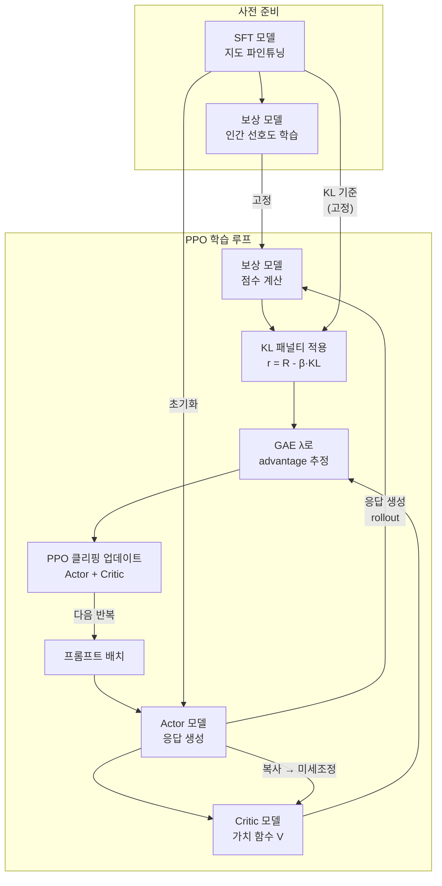
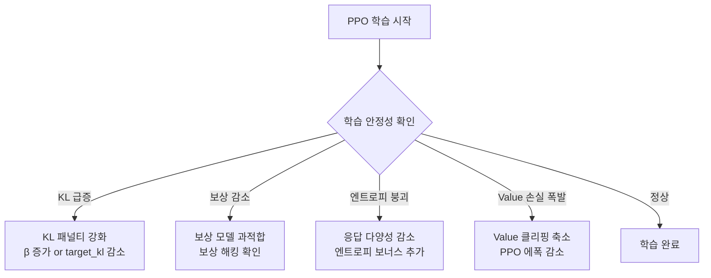

# PPO RLHF 구현 디테일

PPO(Proximal Policy Optimization)를 사용한 RLHF(Reinforcement Learning from Human Feedback)는 LLM 정렬의 핵심 기법이다. 이 문서는 실무 구현에 필요한 핵심 컴포넌트인 Value Head, GAE λ, KL 계수 튜닝을 중심으로 trl, Open-RLHF 등 오픈소스 프레임워크 관점에서 정리한다.

## 전체 파이프라인



## 핵심 컴포넌트 1 - Value Head

PPO에서는 정책(Actor)과 가치 함수(Critic)가 필요하다. LLM RLHF에서는 주로 **단일 LLM 위에 Value Head를 추가**하는 방식을 사용한다.

```python
import torch
import torch.nn as nn
from transformers import AutoModelForCausalLM

class ActorCriticLLM(nn.Module):
    """LLM에 Value Head를 추가한 Actor-Critic 구조"""

    def __init__(self, model_name: str):
        super().__init__()
        self.base_model = AutoModelForCausalLM.from_pretrained(model_name)
        hidden_size = self.base_model.config.hidden_size

        # Value Head: 스칼라 가치 함수 출력
        self.value_head = nn.Sequential(
            nn.Linear(hidden_size, hidden_size),
            nn.ReLU(),
            nn.Linear(hidden_size, 1),
        )

    def forward_actor(self, input_ids, attention_mask=None):
        """정책 로짓 반환"""
        outputs = self.base_model(
            input_ids=input_ids,
            attention_mask=attention_mask,
            output_hidden_states=True,
        )
        return outputs.logits

    def forward_critic(self, input_ids, attention_mask=None):
        """각 토큰 위치의 가치 추정값 반환"""
        outputs = self.base_model(
            input_ids=input_ids,
            attention_mask=attention_mask,
            output_hidden_states=True,
        )
        # 마지막 은닉 상태에서 Value Head 적용
        last_hidden = outputs.hidden_states[-1]  # (B, T, H)
        values = self.value_head(last_hidden).squeeze(-1)  # (B, T)
        return values
```

### trl 프레임워크에서의 Value Head

```python
from trl import AutoModelForCausalLMWithValueHead

# trl이 Value Head를 자동으로 추가
model = AutoModelForCausalLMWithValueHead.from_pretrained(
    "meta-llama/Llama-2-7b-hf",
    torch_dtype=torch.bfloat16,
)
# model.v_head: Value Head 레이어
# model.pretrained_model: 기반 LLM
```

## 핵심 컴포넌트 2 - GAE (Generalized Advantage Estimation)

GAE는 분산(variance)과 편향(bias)의 트레이드오프를 λ 파라미터로 제어하는 Advantage 추정 방법이다.

### 수식

TD 잔차(Temporal Difference residual):
$$\delta_t = r_t + \gamma V(s_{t+1}) - V(s_t)$$

GAE(λ):
$$\hat{A}_t^{\text{GAE}(\lambda)} = \sum_{l=0}^{T-t-1} (\gamma \lambda)^l \delta_{t+l}$$

- $\gamma$: 할인 계수 (RLHF에서는 보통 1.0, 텍스트는 에피소드형)
- $\lambda$: 편향-분산 트레이드오프 파라미터
  - $\lambda = 0$: TD(0), 낮은 분산, 높은 편향
  - $\lambda = 1$: Monte Carlo return, 높은 분산, 낮은 편향

### RLHF에서의 보상 구조

LLM RLHF에서 보상은 주로 **에피소드 끝(마지막 토큰)**에만 부여된다:

$$r_t = \begin{cases} R(x, y) - \beta \cdot \text{KL}(t) & \text{if } t = T \\ -\beta \cdot \text{KL}(t) & \text{otherwise} \end{cases}$$

```python
import torch

def compute_gae(
    rewards: torch.Tensor,    # (B, T)
    values: torch.Tensor,     # (B, T)
    gamma: float = 1.0,
    lam: float = 0.95,
) -> tuple[torch.Tensor, torch.Tensor]:
    """
    GAE-λ Advantage 및 리턴 계산.
    RLHF 설정에서 보상은 마지막 토큰에만 있다고 가정.
    """
    B, T = rewards.shape
    advantages = torch.zeros_like(rewards)
    lastgaelam = 0.0

    # 역순으로 TD 잔차 누적 (GAE 공식)
    for t in reversed(range(T)):
        if t == T - 1:
            next_value = 0.0  # 에피소드 종료
        else:
            next_value = values[:, t + 1]

        delta = rewards[:, t] + gamma * next_value - values[:, t]
        lastgaelam = delta + gamma * lam * lastgaelam
        advantages[:, t] = lastgaelam

    returns = advantages + values   # 리턴 = Advantage + Value
    return advantages, returns
```

## 핵심 컴포넌트 3 - KL 발산 패널티

RLHF에서 KL 발산 패널티는 정책이 SFT 참조 모델에서 너무 벗어나는 것을 방지한다.

### KL 계산

```python
def compute_kl_penalty(
    logprobs: torch.Tensor,         # 현재 Actor의 로그 확률 (B, T)
    ref_logprobs: torch.Tensor,     # 참조 모델(SFT)의 로그 확률 (B, T)
    kl_coef: float = 0.1,
) -> torch.Tensor:
    """
    토큰별 KL 발산 패널티 계산.
    KL(π_actor || π_ref) ≈ logprob_actor - logprob_ref (단순 근사)
    """
    kl = logprobs - ref_logprobs  # 근사: D_KL ≈ log(p/q)
    kl_penalty = -kl_coef * kl   # 패널티로 보상에 차감
    return kl_penalty
```

### KL 계수 적응적 제어

PPO RLHF에서 KL 계수 $\beta$를 고정하면 학습이 불안정해질 수 있다. 적응적 KL 제어가 표준적이다:

```python
class AdaptiveKLController:
    """
    목표 KL에 따라 계수를 동적으로 조정.
    (Ziegler et al. 2019, InstructGPT 논문 방식)
    """

    def __init__(self, init_kl_coef: float = 0.1, target_kl: float = 6.0, horizon: int = 10000):
        self.value = init_kl_coef
        self.target = target_kl
        self.horizon = horizon

    def update(self, current_kl: float, n_steps: int) -> None:
        proportional_error = np.clip(current_kl / self.target - 1, -0.2, 0.2)
        mult = 1 + proportional_error * n_steps / self.horizon
        self.value *= mult
```

## PPO 클리핑 업데이트

```python
def ppo_loss(
    logprobs: torch.Tensor,       # 현재 정책 로그 확률 (B, T)
    old_logprobs: torch.Tensor,   # rollout 당시 로그 확률 (B, T)
    advantages: torch.Tensor,     # GAE Advantage (B, T)
    clip_eps: float = 0.2,
) -> torch.Tensor:
    """PPO 클리핑 정책 손실"""

    # 중요도 비율 (Importance Ratio)
    ratio = torch.exp(logprobs - old_logprobs)

    # 클리핑된 목적 함수
    pg_loss1 = -advantages * ratio
    pg_loss2 = -advantages * torch.clamp(ratio, 1.0 - clip_eps, 1.0 + clip_eps)
    pg_loss = torch.max(pg_loss1, pg_loss2).mean()

    return pg_loss


def value_loss(
    values: torch.Tensor,         # 현재 가치 추정 (B, T)
    old_values: torch.Tensor,     # rollout 당시 가치 (B, T)
    returns: torch.Tensor,        # 실제 리턴 (B, T)
    clip_eps: float = 0.2,
) -> torch.Tensor:
    """클리핑된 Value 손실"""
    values_clipped = torch.clamp(values, old_values - clip_eps, old_values + clip_eps)
    vf_loss1 = (values - returns) ** 2
    vf_loss2 = (values_clipped - returns) ** 2
    return 0.5 * torch.max(vf_loss1, vf_loss2).mean()
```

## trl PPOTrainer 사용 예시

```python
from trl import PPOTrainer, PPOConfig, AutoModelForCausalLMWithValueHead
from trl import create_reference_model

# 설정
ppo_config = PPOConfig(
    model_name="sft-llama-7b",
    learning_rate=1.41e-5,
    batch_size=16,
    mini_batch_size=4,
    gradient_accumulation_steps=1,
    ppo_epochs=4,               # PPO 에폭 수 (rollout당 업데이트)
    max_grad_norm=0.5,
    adap_kl_ctrl=True,         # 적응적 KL 제어 활성화
    init_kl_coef=0.1,          # 초기 KL 계수
    target_kl=6.0,             # 목표 KL
    gamma=1.0,                  # 할인 계수 (NLP는 보통 1.0)
    lam=0.95,                   # GAE λ
    cliprange=0.2,              # PPO epsilon
    vf_coef=0.1,               # Value 손실 가중치
)

# 모델 초기화
model = AutoModelForCausalLMWithValueHead.from_pretrained("sft-checkpoint")
ref_model = create_reference_model(model)   # 참조 모델 (고정)

# PPO 학습
trainer = PPOTrainer(
    config=ppo_config,
    model=model,
    ref_model=ref_model,
    tokenizer=tokenizer,
    dataset=dataset,
    reward_model=reward_model,
)

trainer.train()
```

## 하이퍼파라미터 튜닝 가이드

| 파라미터 | 기본값 | 역할 | 문제 시 조정 |
|---------|--------|------|------------|
| KL coef (β) | 0.1 | KL 발산 억제 강도 | KL 폭발 → 증가, KL 너무 낮음 → 감소 |
| target KL | 6.0 | 적응적 KL 목표값 | 발산 많으면 3.0, 안정적이면 9.0 |
| GAE λ | 0.95 | 편향-분산 트레이드오프 | 불안정 → 0.9, 느린 학습 → 1.0 |
| clip ε | 0.2 | 정책 변화 제한 | 발산 → 0.1 |
| PPO 에폭 | 4 | rollout당 업데이트 | 발산 → 1-2 |
| Value coef | 0.1 | Critic 손실 가중치 | 편차 크면 0.5 |

## Open-RLHF 구조 참고

Open-RLHF는 분산 학습 최적화에 초점을 맞춘 오픈소스 구현이다:

- **vLLM 통합**: rollout 생성을 vLLM으로 병렬화 (10x 처리량)
- **모델 분리**: Actor, Critic, Reward, Reference를 별도 GPU에 배치
- **Ray 분산**: Ray로 다중 노드 학습 조율

```
# Open-RLHF 실행 예시 (ray 클러스터)
deepspeed --num_gpus 8 train_ppo.py \
    --pretrain meta-llama/Llama-2-7b-chat-hf \
    --reward_pretrain reward-model-checkpoint \
    --save_path ./ckpt/ppo \
    --micro_train_batch_size 2 \
    --train_batch_size 128 \
    --micro_rollout_batch_size 4 \
    --rollout_batch_size 1024 \
    --max_epochs 1 \
    --prompt_max_len 1024 \
    --generate_max_len 1024 \
    --kl_target 6 \
    --init_kl_coef 0.1 \
    --use_wandb True
```

## 일반적인 실패 패턴



## 관련 문서

- [[rlhf-pipeline]] - RLHF 전체 파이프라인 개요
- [[rlhf-and-alignment]] - RLHF와 정렬 이론
- [[kl-divergence-penalty]] - KL 발산 패널티 이론
- [[magpie-synthetic-instruction]] - 합성 데이터로 RLHF 강화
- [[iterative-magpie-instruction]] - 반복 부트스트래핑 지시문
