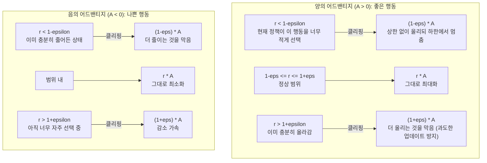
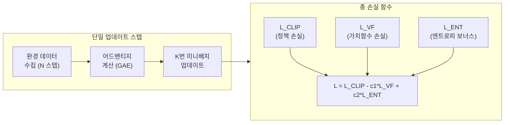
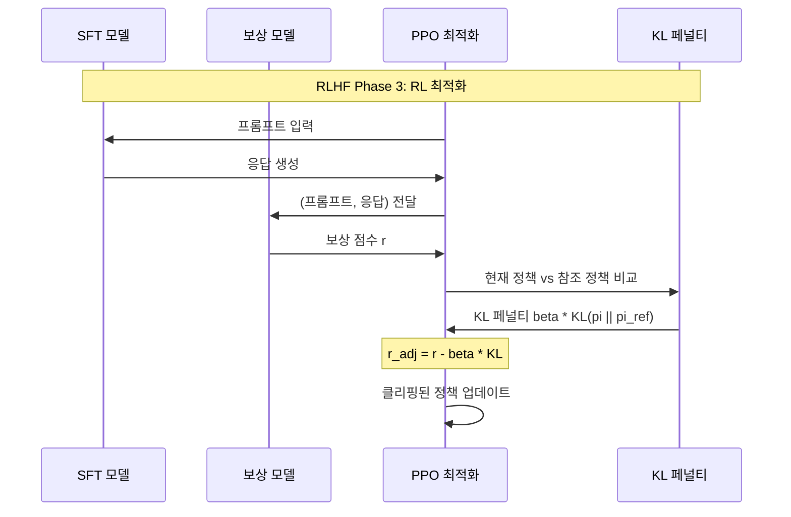

# 근접 정책 최적화 (Proximal Policy Optimization, PPO)

## 개요

**PPO(Proximal Policy Optimization, 근접 정책 최적화)**는 John Schulman 등 OpenAI 연구팀이 2017년에 제안한 정책 그래디언트 강화학습 알고리즘이다. 클리핑된 대리 목적 함수(clipped surrogate objective)를 사용하여 정책 업데이트의 크기를 제한함으로써 **학습 안정성**과 **샘플 효율**을 동시에 달성한다.

PPO는 복잡한 구현 없이도 TRPO(Trust Region Policy Optimization)에 필적하는 성능을 내어, 로봇 제어부터 LLM RLHF까지 광범위하게 채택된 사실상의 RL 표준 알고리즘이다.

> "PPO strikes a favorable balance between ease of implementation, sample complexity, and wall-time."
> (PPO는 구현 용이성, 샘플 복잡도, 실행 시간 사이의 유리한 균형을 달성한다.)
> - Schulman et al., 2017

## 배경: 왜 PPO가 필요한가

### 기존 정책 그래디언트의 문제

기본 정책 그래디언트(REINFORCE, Vanilla PG)는 업데이트 크기에 민감하다.

- **너무 큰 업데이트**: 정책이 급격히 변해 이전 경험(데이터)이 무의미해지고 성능이 갑자기 폭락
- **너무 작은 업데이트**: 학습이 느리고 샘플 비효율적

### TRPO의 한계

TRPO는 KL 발산 제약을 추가하여 이를 해결했지만:
- 2차 미분(Hessian)이 필요하여 구현이 복잡
- 메모리와 계산 비용이 높음
- 분산 학습에 적용하기 어려움

PPO는 TRPO의 신뢰 영역(trust region) 아이디어를 **단순한 클리핑**으로 근사하여 이 모든 단점을 해결한다.

## 핵심 알고리즘

### 중요도 샘플링 비율 (Importance Sampling Ratio)

현재 정책 $\pi_\theta$와 데이터 수집 시 정책 $\pi_{\theta_\text{old}}$의 행동 확률 비율:

$$r_t(\theta) = \frac{\pi_\theta(a_t | s_t)}{\pi_{\theta_\text{old}}(a_t | s_t)}$$

- $r_t = 1$: 두 정책이 동일한 행동 확률
- $r_t > 1$: 현재 정책이 해당 행동을 더 선호
- $r_t < 1$: 현재 정책이 해당 행동을 덜 선호

### 클리핑된 대리 목적 함수 (Clipped Surrogate Objective)

$$\mathcal{L}^{CLIP}(\theta) = \mathbb{E}_t \left[ \min\left( r_t(\theta) \hat{A}_t, \, \text{clip}(r_t(\theta), 1-\epsilon, 1+\epsilon) \hat{A}_t \right) \right]$$

- $\hat{A}_t$: 어드밴티지 추정값 (이 행동이 평균보다 얼마나 좋은가)
- $\epsilon$: 클리핑 범위, 보통 0.1 또는 0.2



핵심 직관: 클리핑은 "정책을 너무 많이 바꾸려는 것을 막는 안전장치"다. 잘 된 방향으로 너무 많이 가지도, 잘못된 방향으로 너무 빠르게 가지도 않도록 한다.

### PPO-Clip 업데이트 시각화



### GAE (Generalized Advantage Estimation)

어드밴티지 $\hat{A}_t$는 GAE로 추정한다. 바이어스-분산 트레이드오프를 $\lambda$로 조절:

$$\hat{A}_t^{GAE(\gamma, \lambda)} = \sum_{l=0}^{\infty} (\gamma\lambda)^l \delta_{t+l}^V$$

$$\delta_t^V = r_t + \gamma V(s_{t+1}) - V(s_t) \quad \text{(TD 잔차)}$$

- $\lambda = 0$: 1-step TD (낮은 분산, 높은 바이어스)
- $\lambda = 1$: Monte Carlo (높은 분산, 낮은 바이어스)
- 실용 설정: $\lambda = 0.95$, $\gamma = 0.99$

## 구현 코드

```python
import torch
import torch.nn as nn
import numpy as np


class ActorCritic(nn.Module):
    """PPO를 위한 액터-크리틱 네트워크"""

    def __init__(self, obs_dim: int, action_dim: int, hidden_dim: int = 64):
        super().__init__()
        # 공유 백본
        self.backbone = nn.Sequential(
            nn.Linear(obs_dim, hidden_dim),
            nn.Tanh(),
            nn.Linear(hidden_dim, hidden_dim),
            nn.Tanh(),
        )
        self.policy_head = nn.Linear(hidden_dim, action_dim)  # 액터
        self.value_head = nn.Linear(hidden_dim, 1)            # 크리틱

    def forward(self, obs: torch.Tensor) -> tuple[torch.Tensor, torch.Tensor]:
        features = self.backbone(obs)
        logits = self.policy_head(features)
        value = self.value_head(features).squeeze(-1)
        return logits, value


def ppo_update(
    model: ActorCritic,
    optimizer: torch.optim.Optimizer,
    observations: torch.Tensor,
    actions: torch.Tensor,
    old_log_probs: torch.Tensor,
    advantages: torch.Tensor,
    returns: torch.Tensor,
    clip_eps: float = 0.2,
    value_coef: float = 0.5,
    entropy_coef: float = 0.01,
    n_epochs: int = 10,
    batch_size: int = 64,
) -> dict[str, float]:
    """PPO 업데이트 루프"""
    dataset_size = observations.shape[0]
    metrics = {"policy_loss": 0.0, "value_loss": 0.0, "entropy": 0.0}

    for _ in range(n_epochs):
        # 미니배치 셔플
        indices = torch.randperm(dataset_size)
        for start in range(0, dataset_size, batch_size):
            idx = indices[start:start + batch_size]
            obs_b = observations[idx]
            act_b = actions[idx]
            old_lp_b = old_log_probs[idx]
            adv_b = advantages[idx]
            ret_b = returns[idx]

            # 어드밴티지 정규화 (안정성)
            adv_b = (adv_b - adv_b.mean()) / (adv_b.std() + 1e-8)

            logits, values = model(obs_b)
            dist = torch.distributions.Categorical(logits=logits)
            new_log_probs = dist.log_prob(act_b)
            entropy = dist.entropy().mean()

            # 중요도 샘플링 비율
            ratio = torch.exp(new_log_probs - old_lp_b)

            # 클리핑된 정책 손실 (min of unclipped vs clipped)
            policy_loss_unclipped = ratio * adv_b
            policy_loss_clipped = torch.clamp(ratio, 1 - clip_eps, 1 + clip_eps) * adv_b
            policy_loss = -torch.min(policy_loss_unclipped, policy_loss_clipped).mean()

            # 가치 함수 손실 (MSE)
            value_loss = 0.5 * (values - ret_b).pow(2).mean()

            # 총 손실
            loss = policy_loss + value_coef * value_loss - entropy_coef * entropy

            optimizer.zero_grad()
            loss.backward()
            torch.nn.utils.clip_grad_norm_(model.parameters(), max_norm=0.5)  # 그래디언트 클리핑
            optimizer.step()

            metrics["policy_loss"] += policy_loss.item()
            metrics["value_loss"] += value_loss.item()
            metrics["entropy"] += entropy.item()

    return metrics
```

## PPO vs TRPO vs 기타 정책 그래디언트

| 알고리즘 | 제약 방법 | 구현 복잡도 | 계산 비용 | 성능 |
|---------|---------|-----------|---------|------|
| Vanilla PG (REINFORCE) | 없음 | 낮음 | 낮음 | 낮음 (불안정) |
| TRPO | KL 제약 (2차 최적화) | 높음 | 높음 | 높음 |
| PPO-Clip | 클리핑 | **낮음** | **낮음** | TRPO와 유사 |
| PPO-Penalty | KL 페널티 (적응형 beta) | 중간 | 중간 | TRPO와 유사 |
| SAC | 엔트로피 최대화 + 소프트 Q | 중간 | 중간 | 높음 (연속 행동) |
| TD3 | 목표 정책 스무딩 | 낮음 | 낮음 | 높음 (연속 행동) |

[[trpo]] 참조, [[sac-soft-actor-critic]] 참조.

## PPO 하이퍼파라미터 가이드

| 파라미터 | 권장 범위 | 설명 |
|---------|---------|------|
| `clip_eps` ($\epsilon$) | 0.1 ~ 0.3 | 클리핑 범위. 0.2가 기본 |
| `n_epochs` | 3 ~ 10 | 같은 데이터로 몇 번 업데이트 |
| `batch_size` | 32 ~ 256 | 미니배치 크기 |
| `gamma` ($\gamma$) | 0.99 | 할인 인수 |
| `lambda` ($\lambda$) | 0.95 | GAE 람다 |
| `lr` | 3e-4 | 학습률 (AdamW) |
| `value_coef` | 0.5 | 가치 손실 가중치 |
| `entropy_coef` | 0.01 | 엔트로피 보너스 (탐색 장려) |
| `max_grad_norm` | 0.5 | 그래디언트 클리핑 상한 |

## RLHF에서의 PPO 역할

현대 LLM 정렬의 핵심 단계인 RLHF(Reinforcement Learning from Human Feedback)는 PPO를 사용한다.



RLHF에서 PPO를 사용할 때 추가되는 KL 페널티:

$$r_\text{adj}(x, y) = r_\phi(x, y) - \beta \cdot D_{KL}(\pi_\theta(y|x) \| \pi_\text{ref}(y|x))$$

- $r_\phi$: 보상 모델 점수
- $\beta$: KL 페널티 강도 (보통 0.01 ~ 0.1)
- $\pi_\text{ref}$: 참조 정책 (SFT 모델, 고정)

KL 페널티는 PPO가 언어 모델을 너무 많이 변형시켜 일관성 있는 텍스트를 생성하지 못하게 되는 것을 방지한다.

[[rlhf]] 참조, [[ppo-rlhf-implementation]] 참조.

## 실용 팁

1. **어드밴티지 정규화**: 미니배치 내에서 어드밴티지를 평균 0, 분산 1로 정규화하면 학습이 안정된다.
2. **그래디언트 클리핑**: `max_norm=0.5`로 설정하면 정책 붕괴를 방지한다.
3. **학습률 스케줄링**: PPO-RLHF에서 선형 감소 스케줄을 사용하면 성능이 향상된다.
4. **n_epochs 조절**: RLHF에서 `n_epochs`를 줄이면 (1~4) 과적합을 방지한다.
5. **early stopping**: KL 발산이 임계값 초과 시 조기 종료하는 구현 패턴이 있다.

## 관련 문서

- [[ppo-rlhf-implementation]] - LLM RLHF에 특화된 PPO 구현 패턴
- [[rlhf]] - RLHF 전체 파이프라인
- [[trpo]] - PPO의 전신, 신뢰 영역 정책 최적화
- [[sac-soft-actor-critic]] - 연속 행동 공간에서의 대안 알고리즘
- [[reward-model]] - RLHF 보상 모델
- [[dpo]] - PPO 없이 직접 선호 학습
