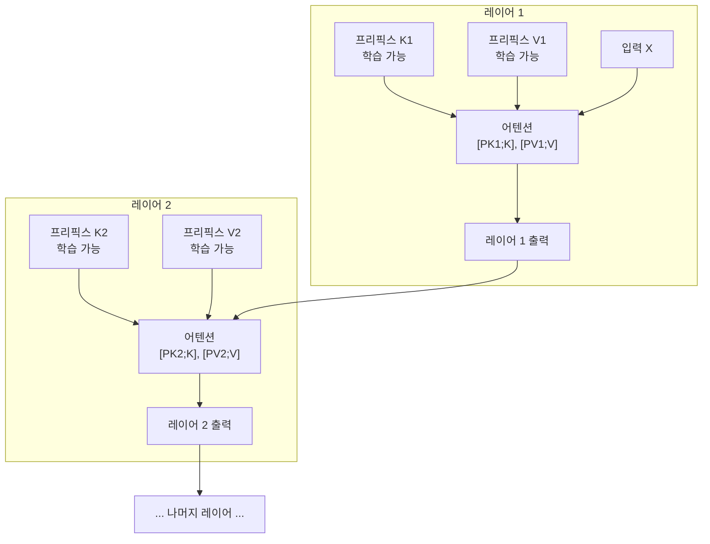
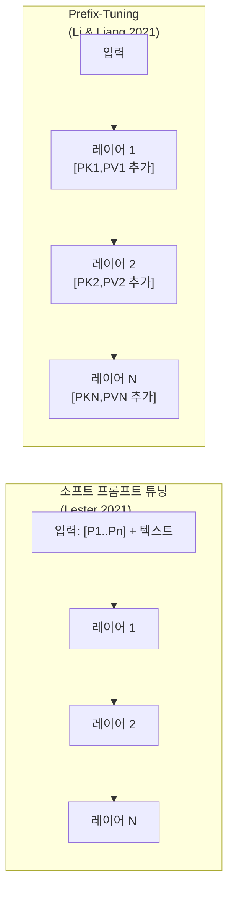

# Prefix-Tuning - 딥 프롬프트 주입 (Prefix-Tuning)

## 배경

**Prefix-Tuning(Li & Liang, 2021, Stanford)**은 소프트 프롬프트 계열 PEFT의 선구자 중 하나다. Prompt Tuning이 입력 임베딩 레이어에만 소프트 토큰을 삽입하는 것과 달리, Prefix-Tuning은 **모든 트랜스포머 레이어의 키(K)와 값(V)에 학습 가능한 프리픽스 벡터를 직접 주입**한다.

핵심 직관: 입력 레이어에만 프롬프트를 넣으면 깊은 레이어에서 영향이 희석된다. 모든 레이어에서 직접 어텐션 맥락을 조종하면 훨씬 강력하게 모델 동작을 제어할 수 있다.

Prefix-Tuning은 특히 **자연어 생성(NLG) 태스크**에서 두드러진 성능을 보이며, 전체 파인튜닝의 0.1% 파라미터만으로 경쟁력 있는 결과를 낸다.

## 핵심 메커니즘

### 어텐션 레이어에 프리픽스 주입

각 트랜스포머 레이어 $l$에서 어텐션 계산 시 학습 가능한 프리픽스 키-값 쌍을 추가한다:

$$\text{head} = \text{Attn}(Q, [P_K^{(l)}; K], [P_V^{(l)}; V])$$

- $P_K^{(l)} \in \mathbb{R}^{n \times d_k}$: 레이어 $l$의 프리픽스 키
- $P_V^{(l)} \in \mathbb{R}^{n \times d_v}$: 레이어 $l$의 프리픽스 값
- $n$: 프리픽스 길이 (하이퍼파라미터)
- $[;]$: 시퀀스 차원 연결(concatenation)



각 레이어가 독립적인 프리픽스 파라미터를 학습한다. 하위 레이어는 문법/구문, 상위 레이어는 의미/태스크 관련 패턴을 프리픽스로 제어한다.

### 재파라미터화 트릭

초기 실험에서 프리픽스를 직접 최적화하면 불안정하다는 것이 발견됐다. Prefix-Tuning 논문은 이를 해결하기 위해 MLP 재파라미터화를 사용한다:

$$P^{(l)} = \text{MLP}_\theta(P'_l)$$

학습 시에는 더 작은 $P'_l$과 MLP를 학습하고, 추론 시에는 $P^{(l)}$만 저장한다.

```python
class PrefixEncoder(nn.Module):
    """Prefix-Tuning 인코더 (MLP 재파라미터화 포함)"""

    def __init__(self, config):
        super().__init__()
        self.prefix_projection = config.prefix_projection

        if self.prefix_projection:
            # MLP 재파라미터화
            self.embedding = nn.Embedding(config.pre_seq_len, config.hidden_size)
            self.trans = nn.Sequential(
                nn.Linear(config.hidden_size, config.prefix_hidden_size),
                nn.Tanh(),
                nn.Linear(config.prefix_hidden_size, config.num_layers * 2 * config.hidden_size)
            )
        else:
            # 직접 최적화 (불안정하지만 단순)
            self.embedding = nn.Embedding(
                config.pre_seq_len,
                config.num_layers * 2 * config.hidden_size
            )

    def forward(self, prefix: torch.Tensor) -> torch.Tensor:
        if self.prefix_projection:
            prefix_tokens = self.embedding(prefix)
            past_key_values = self.trans(prefix_tokens)
        else:
            past_key_values = self.embedding(prefix)
        return past_key_values
```

`num_layers * 2 * hidden_size`: 모든 레이어 × (키 + 값) × 은닉 차원

## 입력 레이어 프롬프트 vs 딥 프리픽스 비교



| 특성 | 소프트 프롬프트 | Prefix-Tuning |
|-----|--------------|--------------|
| 주입 위치 | 입력 임베딩만 | 모든 레이어 KV |
| 표현력 | 낮음 | 높음 |
| 파라미터 수 | 매우 적음 | 적음 (소프트보다 많음) |
| 소형 모델 효과 | 약함 | 상대적으로 강함 |
| 생성 태스크 | 보통 | 우수 |

## 파라미터 수 계산

GPT-2 Large (36레이어, $d=1280$), 프리픽스 길이 $n=10$:

- 레이어당: $2 \times n \times d_k \times h = 2 \times 10 \times 64 \times 20 = 25,600$ (20 헤드)
- 전체: $36 \times 25,600 = 921,600 \approx 0.1\%$ of 774M

소프트 프롬프트(입력 레이어만)보다는 많지만, LoRA 대비 여전히 적은 편이다.

## 생성 태스크 성능

논문의 주요 실험은 GPT-2 기반 자연어 생성 태스크다:

### 테이블-텍스트 생성 (E2E, WebNLG)

| 방법 | BLEU | ROUGE-L |
|------|------|---------|
| Full FT GPT-2 Medium | 68.2 | 71.0 |
| Adapter (AdapterH) | 66.3 | 70.5 |
| **Prefix-Tuning** | **69.7** | **71.4** |
| Fine-Tuning GPT-2 Large | 68.9 | 71.3 |

전체 파인튜닝 GPT-2 Large를 파라미터 0.1%만으로 능가했다.

### 요약 태스크 (XSUM)

ROUGE-2 기준, Prefix-Tuning이 전체 파인튜닝의 약 97% 성능을 0.1% 파라미터로 달성했다.

## 데이터 부족 환경에서의 강점

Prefix-Tuning의 중요한 특성: **저자원(low-resource) 환경에서 전체 파인튜닝보다 유리하다.**

훈련 예시가 수백 개 이하일 때:
- 전체 파인튜닝: 수억 파라미터를 소수 예시로 학습 → 과적합
- Prefix-Tuning: 수십만 파라미터만 학습 → 과적합 저항성

이 성질이 few-shot 생성 태스크에 특히 유용하다.

## 도메인 외 일반화

논문에서 검증한 또 다른 강점: **테스트 시 보지 않은 주제(unseen topics)에 대한 일반화**

학습: 특정 테이블 도메인 → 테스트: 다른 도메인

Prefix-Tuning이 전체 파인튜닝보다 일관되게 높은 일반화 성능을 보인다. 동결된 사전학습 지식을 보존하면서 적응하므로 새 도메인에서 덜 취약하다.

## 실무 적용

### P-Tuning v2와의 수렴

Prefix-Tuning이 제안한 "모든 레이어 KV에 프리픽스 주입" 방식은 이후 P-Tuning v2에서 NLU 태스크로 확장되었다. 두 방법은 메커니즘이 거의 동일하나:
- Prefix-Tuning: GPT-2 계열 NLG 태스크에서 검증
- P-Tuning v2: BERT/T5 계열 NLU 태스크에서 검증

### HuggingFace PEFT 구현

```python
from peft import PrefixTuningConfig, get_peft_model, TaskType

config = PrefixTuningConfig(
    task_type=TaskType.CAUSAL_LM,
    num_virtual_tokens=30,        # 프리픽스 길이
    prefix_projection=True,        # MLP 재파라미터화 활성화
)
model = get_peft_model(model, config)
model.print_trainable_parameters()
# trainable params: 983,040 || all params: 124,475,648 || trainable%: 0.79%
```

### 적합한 사용 사례
- 자연어 생성 태스크 (요약, 대화, 데이터-텍스트)
- 저자원 환경 (훈련 예시 수백~수천 개)
- 다수 태스크 동시 서빙 (프리픽스만 교체)

### 주의사항
- 추론 시 어텐션 시퀀스 길이가 $n$만큼 늘어남 → 미세한 속도 저하
- 병합이 어려움: KV에 동적으로 연결하므로 가중치 병합 불가
- LoRA에 비해 구현 복잡성 높음

## 관련 문서

- [[prompt-tuning-soft-only]] - 입력 레이어에만 소프트 토큰 (Lester)
- [[p-tuning-soft-prompts]] - LSTM 인코더 + 연속 프롬프트 (P-Tuning)
- [[lora-qlora-finetuning]] - 가중치 행렬 저랭크 업데이트 방식
- [[ia3-injection-adapters]] - 활성값 스케일링으로 더 적은 파라미터
- [[peft-adapter-survey]] - PEFT 방법론 전체 비교
- [[fine-tuning-overview]] - 파인튜닝 전략 개요
