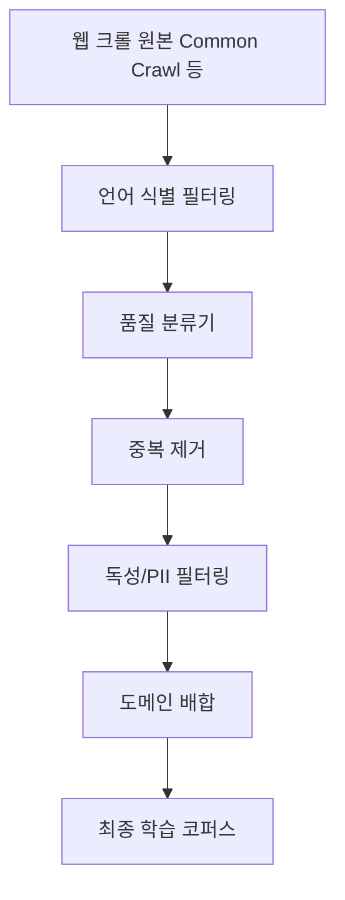

# 사전 학습 데이터 큐레이션 (Pretraining Data Curation)

## 개요

사전 학습 데이터 큐레이션은 웹 크롤 원본에서 고품질 학습 코퍼스를 추출하는 전 과정 -- 필터링, 중복 제거, 품질 분류, 독성/PII 제거, 도메인 배합 -- 을 포괄한다. [[superposition-neural-scaling]]에서 Chinchilla가 보여주었듯 모델 크기만큼 데이터 양도 중요하며, 데이터의 질은 양보다 더 큰 영향을 미칠 수 있다. phi-1("Textbooks Are All You Need", Gunasekar et al., 2023)은 7B 토큰의 고품질 데이터만으로 HumanEval 50.6%를 달성하여 데이터 품질의 힘을 실증했다.

## 핵심 개념

### 파이프라인 단계

### 1. 언어 식별 및 기본 필터링

웹 크롤 데이터에서 대상 언어를 식별하고, 최소 품질 기준을 충족하지 못하는 문서를 제거한다.

| 필터 유형 | 기준 예시 |
|-----------|-----------|
| 언어 식별 | fastText langid, CLD3 |
| 길이 필터 | 최소 토큰 수 (예: 50 토큰 이하 제거) |
| 반복 필터 | 동일 n-gram 과도 반복 문서 제거 |
| URL/도메인 필터 | 스팸 도메인, 성인 사이트 차단 목록 |
| 텍스트 비율 | HTML 대비 실제 텍스트 비율 기준 |

### 2. 품질 분류 (Quality Classification)

고품질 참조 코퍼스(Wikipedia, 교과서, 학술 문서 등)를 양성 샘플로, 무작위 웹 크롤을 음성 샘플로 학습한 이진 분류기를 사용한다. GPT-3의 학습 데이터 구축에서 이 방식이 사용되었으며, phi-1은 "교과서 품질(textbook quality)"이라는 더 엄격한 기준을 적용했다.

분류기 기반 필터링의 핵심 트레이드오프는 다음과 같다.
- **recall 우선**: 많은 데이터를 유지하지만 노이즈 포함 증가
- **precision 우선**: 적은 데이터로 고품질 유지, 다양성 손실 위험

### 3. 중복 제거 (Deduplication)

중복 데이터는 학습 효율을 저하시키고, 모델이 특정 문서를 암기(memorization)할 위험을 높인다.

| 방식 | 설명 | 특징 |
|------|------|------|
| 정확 중복 제거 | 해시 기반 (SHA-256 등) 동일 문서 제거 | 빠르지만 유사 문서 미감지 |
| 근사 중복 제거 | MinHash + LSH (Locality-Sensitive Hashing) | 유사 문서 탐지 가능, 연산 비용 높음 |
| 서브스트링 중복 제거 | Suffix Array 기반 반복 구문 제거 | 문서 내/간 중복 구문 제거 |
| URL 중복 제거 | 동일 URL 소스 문서 제거 | 크롤 시점 간 중복 방지 |

RefinedWeb(Penedo et al., 2023)은 CommonCrawl에 엄격한 중복 제거와 품질 필터링을 적용하여, 큐레이트된 코퍼스만으로 큐레이션된 데이터셋과 동등한 성능을 달성할 수 있음을 보여주었다.

### 4. 독성 및 개인정보 필터링

- **독성 필터**: Perspective API, 전용 분류기를 사용한 혐오 발언, 폭력, 성적 콘텐츠 제거
- **PII 제거**: 이메일, 전화번호, 주민등록번호 등 개인 식별 정보의 정규식 및 NER 기반 제거
- **저작권 필터**: 특정 저작권 보호 콘텐츠(뉴스 기사, 서적 등) 제거 또는 사용 제한

### 5. 도메인 배합 (Domain Mixing)

최종 코퍼스의 도메인 비율이 모델 성능에 직접적 영향을 미친다. 웹 텍스트, 코드, 학술 논문, 서적, 대화 데이터 등의 비율을 조정하며, DoReMi(Xie et al., 2023) 등의 방법이 데이터 배합 비율을 자동으로 최적화한다.

| 도메인 | 일반적 비율 범위 | 영향 |
|--------|-----------------|------|
| 웹 텍스트 | 60-80% | 일반 언어 능력의 기반 |
| 코드 | 5-15% | 추론 능력 향상에도 기여 |
| 학술/위키 | 5-10% | 사실 지식, 정확성 |
| 서적 | 5-15% | 장문 문맥 이해 |
| 대화 | 1-5% | 대화형 상호작용 |

## 주요 사전 학습 코퍼스

| 코퍼스 | 토큰 수 | 특징 |
|--------|---------|------|
| C4 (T5) | ~750B | Common Crawl 필터링, 영어 중심 |
| The Pile | ~825B | 22개 고품질 서브셋, 다양성 중시 |
| RefinedWeb | ~5T | 엄격한 중복 제거, 품질 필터링 |
| RedPajama | ~1.2T | LLaMA 학습 데이터 재구성 시도 |
| FineWeb | ~15T | HuggingFace의 대규모 오픈 코퍼스 |
| Dolma | ~3T | AI2의 오픈 사전 학습 코퍼스 |

## 데이터 큐레이션과 학습 파이프라인의 연결

데이터 큐레이션은 독립된 단계가 아니라 전체 학습 파이프라인과 밀접하게 연결된다.

- [[tokenizer-training]]: 토크나이저는 학습 코퍼스의 토큰 분포에 맞춰 학습되므로, 코퍼스의 언어/도메인 구성이 토크나이저 품질을 결정
- [[causal-language-modeling]]: CLM의 학습 손실은 데이터 품질에 직접적으로 의존
- [[superposition-neural-scaling]]: Chinchilla 법칙의 "데이터 토큰 수" D는 큐레이션된 고품질 토큰을 전제
- [[synthetic-data-training]]: 자연 데이터의 한계를 합성 데이터로 보완하는 전략이 부상 중

## 대표 자료

- [Textbooks Are All You Need (Gunasekar et al., 2023)](https://arxiv.org/abs/2306.11644)
- [The RefinedWeb Dataset for Falcon LLM (Penedo et al., 2023)](https://arxiv.org/abs/2306.01116)
- [Scaling Data-Constrained Language Models (Muennighoff et al., 2023)](https://arxiv.org/abs/2305.16264)

## 관련 문서

- [[superposition-neural-scaling]] -- 데이터 크기의 중요성을 정량적으로 보여준 법칙
- [[tokenizer-training]] -- 코퍼스 구성에 따라 달라지는 토크나이저 학습
- [[synthetic-data-training]] -- 자연 데이터 큐레이션의 보완 전략
- [[causal-language-modeling]] -- 큐레이션된 코퍼스가 투입되는 학습 목적 함수
- [[supervised-fine-tuning]] -- 사전 학습 이후 파인튜닝 데이터의 품질 관리
- [[knowledge-distillation]] -- 데이터 효율을 높이는 또 다른 축
