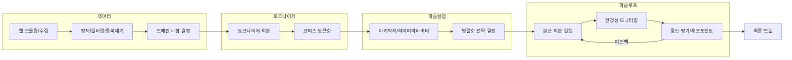
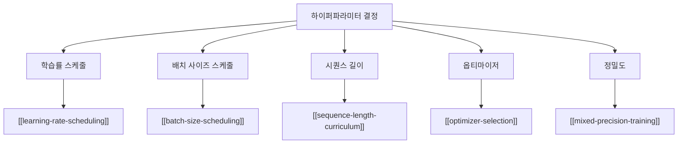

# LLM 사전학습 파이프라인 전체 흐름

## 개요

LLM 사전학습(pretraining)은 대규모 텍스트 코퍼스에서 다음 토큰 예측(next-token prediction)을 통해 언어의 통계적 구조를 학습하는 과정이다. 이 파이프라인은 데이터 수집/정제, 토크나이저 학습, 모델 아키텍처 설정, 분산 학습, 중간 평가까지 여러 단계가 유기적으로 연결된다. 2026년 현재 프론티어 모델의 사전학습 비용은 수천만 달러에 달하므로, 각 단계의 설계 결정이 최종 성능에 미치는 영향을 사전에 이해하는 것이 필수적이다.

## 파이프라인 전체 구조

## 1단계: 데이터 수집과 정제

사전학습 데이터는 모델 성능을 결정짓는 가장 중요한 요소다. 최근 연구에서도 학습 데이터가 모델 크기나 옵티마이저 선택보다 성능에 더 큰 영향을 미친다는 결과가 반복적으로 확인된다.

### 주요 처리 단계

| 단계 | 목적 | 대표 도구/기법 |
|------|------|----------------|
| 웹 크롤링 | 원시 텍스트 확보 | CommonCrawl, 자체 크롤러 |
| 언어 필터링 | 대상 언어 선별 | fastText langid |
| 품질 필터링 | 저품질 문서 제거 | 분류기 기반, 휴리스틱 규칙 |
| 중복 제거 | 중복/준중복 문서 제거 | MinHash, SimHash, Exact dedup |
| PII 제거 | 개인정보 마스킹 | 정규식, NER 기반 |
| 독성 필터링 | 유해 콘텐츠 제거 | 독성 분류기 |

[[pretraining-data-curation]]에서 데이터 품질 관리의 세부 기법을 다룬다. 최근 FineWeb(15T 토큰), RedPajama-v2(30T+ 토큰), DCLM 등 대규모 오픈 데이터셋이 공개되면서 데이터 접근성이 크게 향상되었다.

### 도메인 배합

코퍼스를 구성하는 도메인(웹, 도서, 코드, 학술 논문, Wikipedia 등)의 혼합 비율은 다운스트림 성능에 결정적인 영향을 미친다. DoReMi와 같은 자동 최적화 기법이 수동 휴리스틱을 대체하고 있으며, [[data-mixing-laws]]에서 이 주제를 상세히 다룬다.

## 2단계: 토크나이저 학습

토크나이저는 텍스트를 모델이 처리할 수 있는 정수 시퀀스로 변환하는 구성 요소다. 토크나이저의 어휘 크기, 서브워드 분할 방식이 모델의 언어 이해 능력에 직접적으로 영향을 미친다.

- **BPE(Byte Pair Encoding)**: GPT 계열, Llama 등 대부분의 LLM이 채택
- **SentencePiece**: 언어 비의존적 전처리, 다국어 모델에 적합
- **Byte-level BPE**: 미지 토큰(UNK) 없이 모든 입력 처리 가능

어휘 크기는 통상 32K-128K 범위이며, 코드/수학 토큰 전용 할당이 일반화되고 있다. [[tokenizer-training]]에서 토크나이저 학습의 세부 사항을 다룬다.

## 3단계: 모델 아키텍처와 하이퍼파라미터

### 아키텍처 결정

현대 LLM은 거의 대부분 Transformer 디코더 아키텍처를 기반으로 하되, 세부적으로 다양한 변형이 존재한다.

- **어텐션**: Multi-Head Attention(MHA), Grouped Query Attention(GQA), Multi-Latent Attention(MLA)
- **위치 인코딩**: RoPE(Rotary Position Embedding)가 사실상 표준
- **정규화**: Pre-LayerNorm, RMSNorm
- **활성화 함수**: SwiGLU가 ReLU/GELU를 대체하는 추세

### 핵심 하이퍼파라미터

[[neural-scaling-laws]]에 기반한 계산 예산 배분이 모델 크기와 학습 토큰 수를 결정하는 출발점이다. Chinchilla 스케일링 법칙에 따르면 모델 파라미터 수와 학습 토큰 수를 균등하게 스케일링하는 것이 연산 효율적이나, 추론 비용을 고려하면 더 작은 모델을 더 많은 데이터로 학습하는 "over-training" 전략이 실무에서 선호된다.

## 4단계: 분산 학습

수십~수백 억 파라미터 모델은 단일 GPU에 적재할 수 없으므로, 복수의 병렬화 기법을 조합한다.

| 병렬화 기법 | 분할 대상 | 대표 구현 |
|------------|----------|----------|
| 데이터 병렬(DP) | 배치 | [[data-parallelism-fsdp]] (FSDP, DDP) |
| 텐서 병렬(TP) | 레이어 내부 | [[tensor-pipeline-parallelism]] (Megatron-LM) |
| 파이프라인 병렬(PP) | 레이어 간 | GPipe, Interleaved 1F1B |
| 시퀀스 병렬(SP) | 시퀀스 차원 | Ring Attention, Ulysses |
| 전문가 병렬(EP) | MoE 전문가 | DeepSeek-V3, Mixtral |

[[deepspeed-zero]]는 옵티마이저 상태, 그래디언트, 파라미터를 단계적으로 샤딩하여 메모리 효율을 극대화한다. Llama 3 405B는 4D 병렬화(TP+PP+DP+SP)를 사용하여 16,000개 H100 GPU에서 학습되었다.

## 5단계: 학습 안정성과 모니터링

대규모 학습에서는 loss spike, gradient explosion, NaN/Inf 발생 등이 빈번하다. [[training-stability]]에서 z-loss, QK-Norm, SPAM 옵티마이저 등 안정화 기법을 상세히 다룬다.

핵심 모니터링 지표:

- **학습 손실(training loss)**: 스파이크 탐지, 추세 분석
- **그래디언트 노름(gradient norm)**: 레이어별 추적, 폭발/소실 감지
- **MFU(Model FLOPs Utilization)**: 하드웨어 활용률 (프론티어 모델은 30-45% MFU 달성)
- **학습률/배치 사이즈**: 스케줄 준수 확인

[[gradient-accumulation-checkpointing]]을 통한 메모리 최적화와 안전한 체크포인트 관리도 필수 요소다.

## 6단계: 중간 평가

학습 중 주기적으로 모델을 평가하여 학습 진행 상황을 확인하고, 데이터 배합이나 하이퍼파라미터를 조정한다.

- **퍼플렉시티(perplexity)**: 검증 세트에서의 언어 모델링 능력
- **다운스트림 벤치마크**: MMLU, HellaSwag, ARC, HumanEval 등
- **도메인별 손실**: 각 도메인의 검증 손실을 개별 추적

[[evaluation-during-training]]에서 중간 평가 전략과 조기 종료 판단 기준을 다룬다.

## 실제 사례: 프론티어 모델 비교

| 항목 | Llama 3 405B | DeepSeek-V3 671B | Qwen 2.5 72B |
|------|-------------|-----------------|-------------|
| 학습 토큰 | 15.6T | 14.8T | 18T |
| 병렬화 | 4D (TP+PP+DP+SP) | DP+TP+PP+EP | DP+TP+PP |
| 학습률 스케줄 | Cosine decay | WSD 변형 | Cosine decay |
| 배치 사이즈 | 4M->8M->16M 토큰 | 3072->15360 | 가변 |
| 학습 비용 | ~$100M+ (추정) | $5.6M | 비공개 |

## 파이프라인 최적화의 핵심 교훈

1. **데이터 우선**: 모델 크기보다 데이터 품질과 배합이 성능에 더 큰 영향
2. **점진적 확장**: 배치 사이즈, 시퀀스 길이를 점진적으로 증가시키는 커리큘럼이 효율적
3. **안정성 확보**: loss spike 방지를 위한 다층 방어(z-loss, QK-Norm, gradient clipping)
4. **유연한 스케줄**: WSD 학습률 스케줄처럼 학습 종료 시점에 유연한 설계
5. **비용 효율**: 스케일링 법칙 기반 사전 계획으로 불필요한 실험 비용 절감

## 관련 페이지

- [[pretraining-data-curation]] -- 데이터 수집/정제 세부 기법
- [[tokenizer-training]] -- 토크나이저 학습 방법론
- [[neural-scaling-laws]] -- 스케일링 법칙 기반 계획
- [[learning-rate-scheduling]] -- 학습률 스케줄링 전략
- [[mixed-precision-training]] -- 혼합 정밀도 학습
- [[data-parallelism-fsdp]] -- FSDP 분산 학습
- [[tensor-pipeline-parallelism]] -- 텐서/파이프라인 병렬화
- [[deepspeed-zero]] -- ZeRO 메모리 최적화
- [[evaluation-during-training]] -- 학습 중 평가
- [[training-stability]] -- 학습 안정성 기법
- [[batch-size-scheduling]] -- 배치 사이즈 스케줄링
- [[sequence-length-curriculum]] -- 시퀀스 길이 커리큘럼
- [[data-mixing-laws]] -- 데이터 배합 법칙
