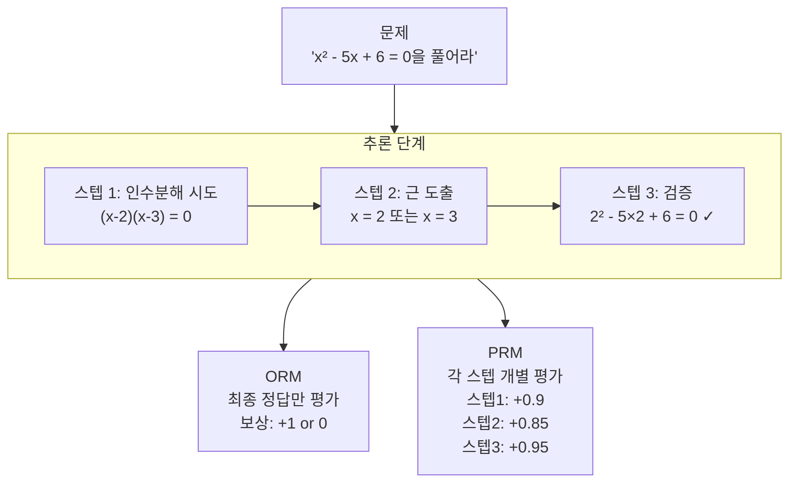
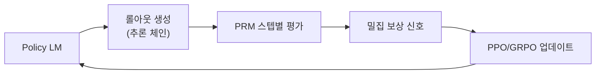

# Process Reward Model (PRM) 상세

## 개요

Process Reward Model(PRM, 프로세스 보상 모델)은 최종 답변의 정오(正誤)만 평가하는 Outcome Reward Model(ORM)과 달리, 추론 과정의 **각 중간 스텝**에 대해 독립적으로 보상 신호를 부여하는 보상 모델이다. 수학 문제 풀이, 코드 디버깅 등 다단계 추론이 필요한 태스크에서 ORM보다 훨씬 세밀한 학습 신호를 제공한다.

## ORM vs PRM 비교



ORM에서는 마지막 스텝만 보상을 받으므로 중간에 오류가 발생해도 피드백이 즉각적이지 않다. PRM은 오류 스텝에서 즉시 낮은 보상을 줘 에이전트가 잘못된 방향을 조기에 교정할 수 있도록 한다.

## PRM 훈련 방법

### 데이터 수집 전략

PRM 훈련의 핵심 병목은 스텝 레벨 레이블 확보다. 세 가지 접근이 있다:

**1. 인간 주석 (가장 정확, 비용 높음)**
- 전문가가 각 추론 스텝의 정확성을 직접 판정
- OpenAI의 PRM800K 데이터셋이 대표 사례 (약 80만 스텝 레이블)

**2. 몬테카를로 트리 탐색 (MCTS) 기반 자동 레이블**
- 각 중간 스텝에서 다수의 완성 경로를 샘플링
- 해당 스텝에서 출발해 최종 정답에 도달한 비율 = 스텝 가치 추정
- Math-Shepherd, OmegaPRM 등에서 채용

**3. 경험적 필터링**
- 올바른 최종 답에 도달한 경로의 모든 스텝을 양성(positive) 레이블
- 틀린 최종 답의 경로에서 처음 오류 발생 스텝을 음성(negative) 레이블

### 모델 구조

PRM은 일반적으로 토큰 분류(token classification) 형태로 구현된다. 각 스텝의 마지막 토큰(또는 특수 구분자)에서 스칼라 보상값을 출력한다:

```python
# PRM 구조 개요 (의사 코드)
class ProcessRewardModel(nn.Module):
    def __init__(self, base_lm):
        self.backbone = base_lm
        self.value_head = nn.Linear(hidden_dim, 1)

    def forward(self, tokens, step_boundary_indices):
        hidden = self.backbone(tokens)
        # 스텝 경계 위치에서 보상값 추출
        step_values = self.value_head(hidden[:, step_boundary_indices])
        return step_values  # shape: [batch, n_steps]
```

## [[rlvr]]과의 통합

RLVR(Reinforcement Learning with Verifiable Rewards)에서 PRM은 두 가지 역할로 활용된다:

**1. 훈련 신호 (Dense Reward)**
PPO 또는 GRPO 훈련 시 각 스텝에서 보상을 부여해 희소 보상(sparse reward) 문제를 완화한다.



**2. Best-of-N 선택**
추론 시 N개 후보 추론 체인을 샘플링하고, PRM 점수가 가장 높은 체인을 최종 답으로 선택한다. ORM 기반 선택보다 더 신뢰성 높은 추론 체인을 고를 수 있다.

## [[reward-model-training]] 대비 특수 고려사항

일반 RLHF 보상 모델 훈련과 달리 PRM에는 추가 주의사항이 있다:

| 항목 | 일반 ORM | PRM |
|------|---------|-----|
| 레이블 단위 | 응답 전체 | 각 스텝 |
| 데이터 수집 비용 | 낮음 | 높음 (스텝 레이블 필요) |
| 보상 해킹 위험 | 답변 길이 등 | 스텝 수 최소화 등 |
| 적용 태스크 | 범용 | 다단계 추론 특화 |
| 모델 크기 | 정책 모델보다 작아도 OK | 추론 이해 위해 충분히 커야 |

## 수학·코딩 추론에서의 벤치마크 효과

- **MATH 데이터셋**: PRM 기반 Best-of-N이 ORM 기반 대비 동일 샘플 수에서 일관되게 우수
- **GSM8K**: 스텝 수가 적어 PRM 효과 제한적이나 오류 스텝 식별에 유용
- **코드 디버깅**: 컴파일 에러 vs 논리 에러를 스텝 단위로 구분해 더 정교한 피드백 가능

## 실무 구현 팁

1. **스텝 경계 정의**: 수학에서는 줄바꿈, 코드에서는 함수 호출 단위가 일반적 기준
2. **레이블 노이즈**: 자동 레이블 방식은 노이즈가 많으므로 충분한 롤아웃 수(N≥16)를 샘플링해 몬테카를로 추정 분산을 줄임
3. **보상 스케일**: 스텝 수가 다른 경로 간 보상 합산 시 스텝 수로 정규화 필요
4. **ORM과 앙상블**: 최종 선택 단계에서 PRM + ORM 앙상블이 단독보다 강건한 경우 많음

## 관련 문서

- [[reward-model-training]] - 보상 모델 일반론 (ORM 위주)
- [[rlvr]] - 검증 가능한 보상을 활용한 강화학습
- [[process-reward-models]] - PRM 개요 (이 문서의 요약 버전)
- [[ppo-for-llms]] - PPO 기반 RLHF 훈련 파이프라인
- [[reward-hacking-overoptimization]] - PRM 보상 해킹 패턴
