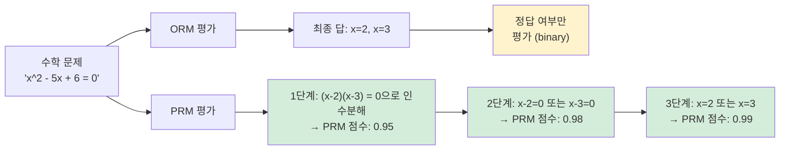
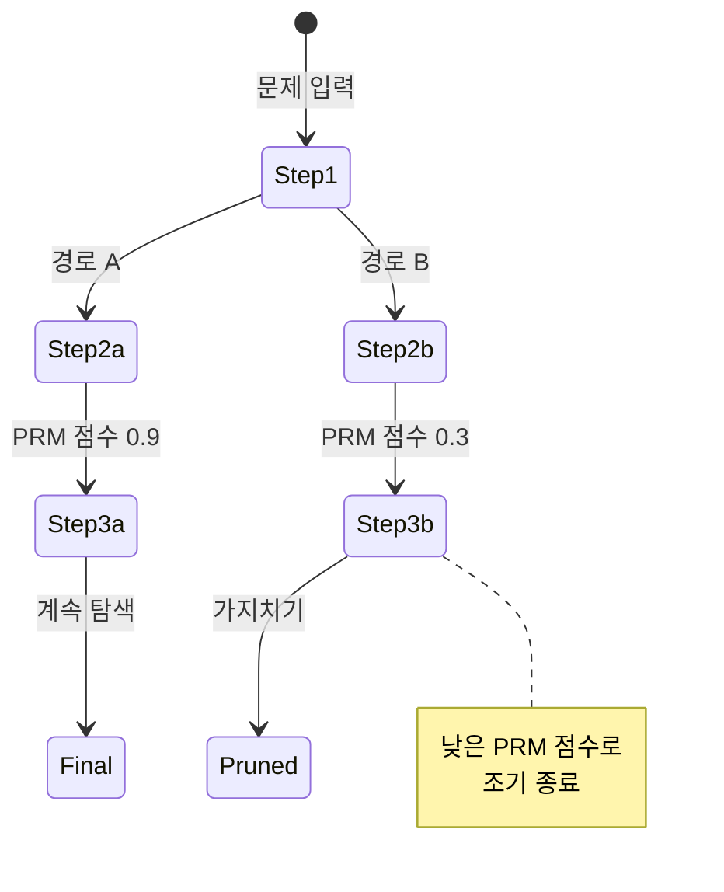

# 프로세스 보상 모델 (PRM)

## 개요

**프로세스 보상 모델(Process Reward Model, PRM)** 은 언어 모델의 추론 과정에서 최종 답변이 아닌 **각 중간 단계**의 정확성을 평가하는 검증 모델이다. 특히 수학 문제 풀이, 코드 디버깅, 다단계 논리 추론에서 기존 결과 기반 검증보다 훨씬 강력한 성능을 보인다.

PRM의 핵심 직관: 틀린 과정을 거쳐도 우연히 맞는 답을 얻을 수 있다. 반대로 맞는 과정을 거쳤다면 답이 틀렸더라도 그 과정은 가치 있다.

## ORM vs PRM: 근본적 차이

**결과 보상 모델(Outcome Reward Model, ORM)** 은 최종 답변만 평가한다. "정답인가?" 하나의 질문만 묻는다.

| 특성 | ORM | PRM |
|------|-----|-----|
| 평가 단위 | 최종 답변 | 각 추론 단계 |
| 레이블 필요 | 정답/오답 | 단계별 정확성 |
| 데이터 효율 | 높음 | 낮음 (레이블 비용 큼) |
| 오류 위치 파악 | 불가 | 가능 |
| 추론 품질 개선 | 간접적 | 직접적 |
| 수학 추론 성능 | 중간 | 높음 |

## Lightman et al. 2023: PRM800K

OpenAI의 연구 "Let's Verify Step by Step" (Lightman et al. 2023)은 PRM의 중요성을 실증적으로 증명한 핵심 논문이다.

**핵심 실험**: MATH 데이터셋에서 PRM과 ORM의 best-of-N 샘플링 성능 비교.

- **ORM best-of-100**: 정확도 ~56%
- **PRM best-of-100**: 정확도 ~78%

같은 샘플 예산으로 PRM이 약 22%p 더 높은 정확도를 달성했다.

**PRM800K 데이터셋**:
- 800K+ 단계별 인간 레이블
- MATH 데이터셋 7,500문제에서 생성된 추론 체인
- 각 단계를 "긍정(positive)", "부정(negative)", "중립(neutral)"으로 레이블
- 현재까지 단계별 수학 추론 레이블의 가장 큰 공개 데이터셋

## PRM 학습 방식

### 인간 레이블 기반

각 추론 단계를 인간 평가자가 직접 채점. 비용이 크지만 가장 신뢰도 높은 방법.

레이블 스키마 예시:
- 단계가 논리적으로 올바른가?
- 이전 단계에서 정확히 이어지는가?
- 수학적으로 정확한가?

### 자동 레이블 (Monte Carlo Estimation)

단계 이후 여러 번 샘플링해 최종 정답 도달 확률을 단계 점수로 사용. 인간 레이블 없이 PRM 학습 가능.

$$\text{score}(s_t) \approx P(\text{correct final answer} \mid s_1, ..., s_t)$$

Wang et al. (2023) "Math-Shepherd"가 이 방법을 체계화했다.

### Process Supervision vs Outcome Supervision

|  | 데이터 획득 | 학습 신호 | 적용 범위 |
|--|-------------|-----------|-----------|
| Outcome Supervision | 쉬움 | 희소 | 광범위 |
| Process Supervision | 어려움 | 밀도 높음 | 추론 특화 |

## 자기 일관성 + PRM

**자기 일관성(self-consistency)** (Wang et al. 2022)은 동일 문제에 여러 추론 경로를 생성하고 다수결 투표로 답변을 선택하는 방법이다.

PRM과 결합 시 시너지 효과:
1. N개의 추론 체인 생성 (자기 일관성)
2. 각 체인의 PRM 점수 계산
3. 단순 다수결 대신 PRM 가중 투표

이 방식은 단순 다수결보다 더 정확하고, 오류 단계를 식별해 부분적으로 올바른 경로도 활용할 수 있다.

## 테스트 타임 컴퓨팅과 PRM

최근 **테스트 타임 컴퓨팅(test-time compute)** 의 핵심 구성 요소로 PRM이 부상했다.

OpenAI o1/o3 시리즈, DeepSeek-R1 등 "추론 모델(reasoning model)"들은 답변 전에 긴 내부 추론 체인(chain-of-thought)을 생성하고, PRM이 이 과정을 안내한다.

- **탐색 알고리즘**: 빔 서치, MCTS (몬테카를로 트리 탐색)와 PRM을 결합
- **단계별 가지치기**: 낮은 점수의 추론 경로를 조기 종료
- **최적 경로 선택**: 여러 경로 중 PRM 점수 합이 높은 경로 선택

## 비평가 모델과의 관계

PRM은 더 넓은 **검증자/비평가 모델(verifier/critic model)** 범주에 속한다. 차이점:

- **PRM**: 수학·추론 특화, 단계별 점수
- **ORM**: 결과만 평가, 더 범용
- **LLM-as-judge**: 자연어 비평, 유연하지만 일관성 낮음
- **코드 실행기**: 코드에 특화된 객관적 검증자

## 관련 문서

- [[RLHF]] - PRM을 보상 신호로 사용하는 강화학습
- [[보상 해킹]] - ORM이 취약한 고유 문제
- [[자기 일관성]] - PRM과 결합해 추론 성능 향상
- [[검증자 비평가 모델]] - PRM을 포함하는 더 넓은 범주
- [[테스트 타임 컴퓨팅]] - PRM이 핵심 역할을 하는 추론 시간 확장
