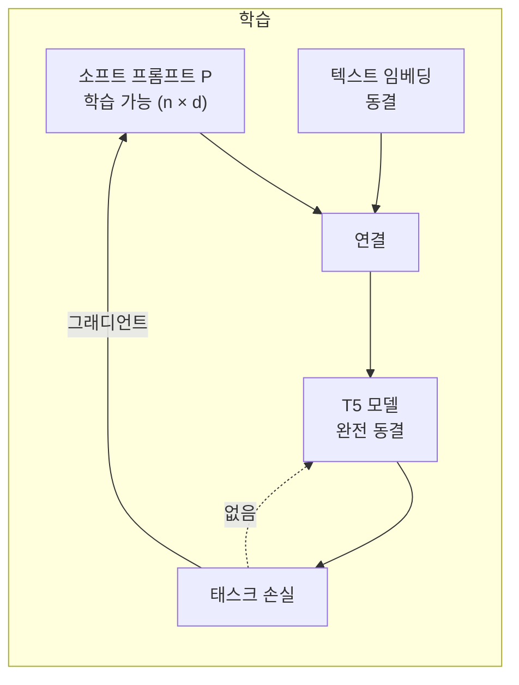
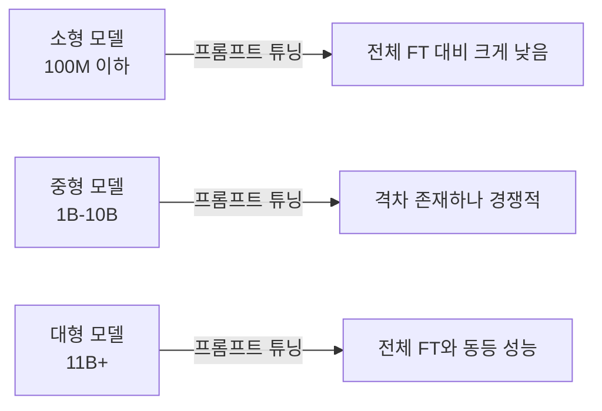

# 소프트 프롬프트 튜닝 - 학습 가능 토큰만 추가하기 (Lester et al., 2021)

## 배경

**Prompt Tuning(Lester et al., 2021, "The Power of Scale for Parameter-Efficient Prompt Tuning")**은 GPT-3의 few-shot in-context learning이 낭비적이라는 관찰에서 시작한다.

In-context learning의 문제점:
- 추론 시 컨텍스트 길이가 길어져 계산 비용 증가
- 예시 선택에 민감, 순서 변경 시 성능 변동
- 모델 내부 파라미터는 일절 변경 불가

P-Tuning과 달리 Lester et al.의 Prompt Tuning은 **더 단순하다**: 프롬프트 인코더(LSTM 등) 없이 순수하게 입력 시퀀스 앞에 붙는 **학습 가능한 소프트 토큰(soft token)**만 학습한다. 모델 가중치는 완전히 동결한다.

## 핵심 메커니즘

### 소프트 토큰 삽입

입력 텍스트 $X$에 대해 학습 가능한 임베딩 행렬 $P \in \mathbb{R}^{n \times d}$를 앞에 연결한다:

$$\text{Input} = [P; \text{embed}(X)]$$

- $n$: 소프트 프롬프트 길이 (일반적으로 1-100 토큰)
- $d$: 모델 임베딩 차원 ($d_{model}$)
- $P$는 완전히 학습 가능, 모델 $\theta$는 완전히 동결



### P-Tuning과의 차이

| 특성 | P-Tuning (Liu 2021) | Prompt Tuning (Lester 2021) |
|-----|--------------------|-----------------------------|
| 프롬프트 위치 | 임의 위치 삽입 가능 | 입력 시작 부분 고정 |
| 인코더 | LSTM 프롬프트 인코더 사용 | 직접 임베딩 (인코더 없음) |
| 이산 토큰 혼합 | 이산+연속 혼합 | 순수 연속 소프트 토큰 |
| 대상 모델 | GPT-3 등 단방향 LM | T5 등 인코더-디코더 |

Lester et al.의 방법이 더 단순하지만, 대신 **모델 규모에 크게 의존**한다.

## 모델 규모와 성능의 관계

이 논문의 핵심 발견: **모델이 충분히 크면 소프트 프롬프트 튜닝만으로 전체 파인튜닝과 동등한 성능을 낸다.**



T5 실험 결과 (SuperGLUE 기준):

| 모델 크기 | 전체 FT | 프롬프트 튜닝 | 격차 |
|---------|---------|------------|------|
| T5-Small (60M) | 83.8 | 54.1 | -29.7 |
| T5-Base (220M) | 87.1 | 72.4 | -14.7 |
| T5-Large (770M) | 88.7 | 83.0 | -5.7 |
| T5-XL (3B) | 89.4 | 87.9 | -1.5 |
| **T5-XXL (11B)** | **90.8** | **90.0** | **-0.8** |

11B 모델에서 프롬프트 튜닝이 실질적으로 전체 파인튜닝과 동등해진다.

## 프롬프트 길이의 영향

소프트 프롬프트 토큰 수 $n$에 따른 성능:

| 프롬프트 길이 | 성능 수준 |
|------------|---------|
| 1 | 크게 저하 |
| 5 | 나쁨 |
| 20 | 경쟁력 있음 |
| 100 | 최적 근접 |
| 100 이상 | 수익 감소 |

$n=20$~$100$이 실용적 범위다. 길수록 표현력은 늘지만 추론 비용도 증가한다.

## 초기화 전략

소프트 프롬프트 초기화 방법에 따른 성능 차이:

| 초기화 방법 | 성능 | 비고 |
|-----------|------|------|
| 랜덤 균일 분포 | 낮음 | 기준선 |
| 어휘 샘플링 | 중간 | 기존 토큰 임베딩에서 샘플링 |
| **클래스 레이블 초기화** | **최고** | 태스크의 출력 레이블 단어 임베딩으로 초기화 |

태스크 관련 단어(예: 감성 분류라면 "positive", "negative")의 임베딩으로 초기화하면 수렴이 빠르고 최종 성능도 높다.

## 프롬프트 앙상블

전체 파인튜닝과 달리, 동일 모델에 다양한 소프트 프롬프트를 동시에 탑재할 수 있다:

```python
# 개념적 코드: 다중 태스크 프롬프트 앙상블
prompts = {
    "sentiment": SoftPrompt(n=100, d=1024),
    "summarization": SoftPrompt(n=100, d=1024),
    "qa": SoftPrompt(n=100, d=1024),
}

# 추론 시 태스크에 맞는 프롬프트만 교체
def infer(task: str, text: str) -> str:
    soft_prefix = prompts[task]
    return model.generate(soft_prefix + embed(text))
```

모델 가중치 하나로 수백 개 태스크를 지원할 수 있다. 각 태스크당 추가 저장 비용은 소프트 프롬프트 임베딩 행렬 ($n \times d$)뿐이다.

## 프롬프트 전이(Prompt Transfer)

학습된 소프트 프롬프트를 다른 태스크의 초기화로 재사용할 수 있다:
- 관련 태스크 간 프롬프트 전이: 수렴 속도 개선
- 다국어 모델에서 언어 간 프롬프트 전이 실험 사례 있음
- 단, 프롬프트는 특정 모델 아키텍처에 종속됨 (다른 모델로 직접 전이 불가)

## 실무 적용

### Hugging Face PEFT로 구현

```python
from peft import PromptTuningConfig, PromptTuningInit, get_peft_model, TaskType

config = PromptTuningConfig(
    task_type=TaskType.SEQ_2_SEQ_LM,
    prompt_tuning_init=PromptTuningInit.TEXT,
    num_virtual_tokens=20,          # 소프트 토큰 수
    prompt_tuning_init_text="Classify if positive or negative: ",  # 초기화 텍스트
    tokenizer_name_or_path="t5-large",
)
model = get_peft_model(model, config)

# 학습 가능한 파라미터 확인
model.print_trainable_parameters()
# trainable params: 20,480 || all params: 770,098,176 || trainable%: 0.003%
```

### 적합한 사용 사례

- **단일 모델 다중 태스크 서빙**: 모델 1개 + 태스크별 소프트 프롬프트
- **API 제공 모델 커스터마이징**: 가중치 접근 없이 임베딩 레이어만 조작
- **대형 모델(7B+)의 특수 태스크 적응**: 전체 파인튜닝 불가 환경

### 부적합한 사용 사례

- 소형 모델(1B 이하) 적응
- 복잡한 추론·수학 문제 (LoRA가 더 적합)
- 최신 디코더 전용 모델(LLaMA 계열)의 일반 파인튜닝

## 관련 문서

- [[p-tuning-soft-prompts]] - LSTM 인코더 기반 연속 프롬프트 (P-Tuning)
- [[prefix-tuning-deep-prompts]] - 모든 레이어에 프리픽스 삽입
- [[lora-qlora-finetuning]] - 가중치 직접 업데이트 방식
- [[ia3-injection-adapters]] - 활성값 스케일링 어댑터
- [[peft-adapter-survey]] - PEFT 방법론 전체 비교
- [[fine-tuning-overview]] - 파인튜닝 전략 개요
