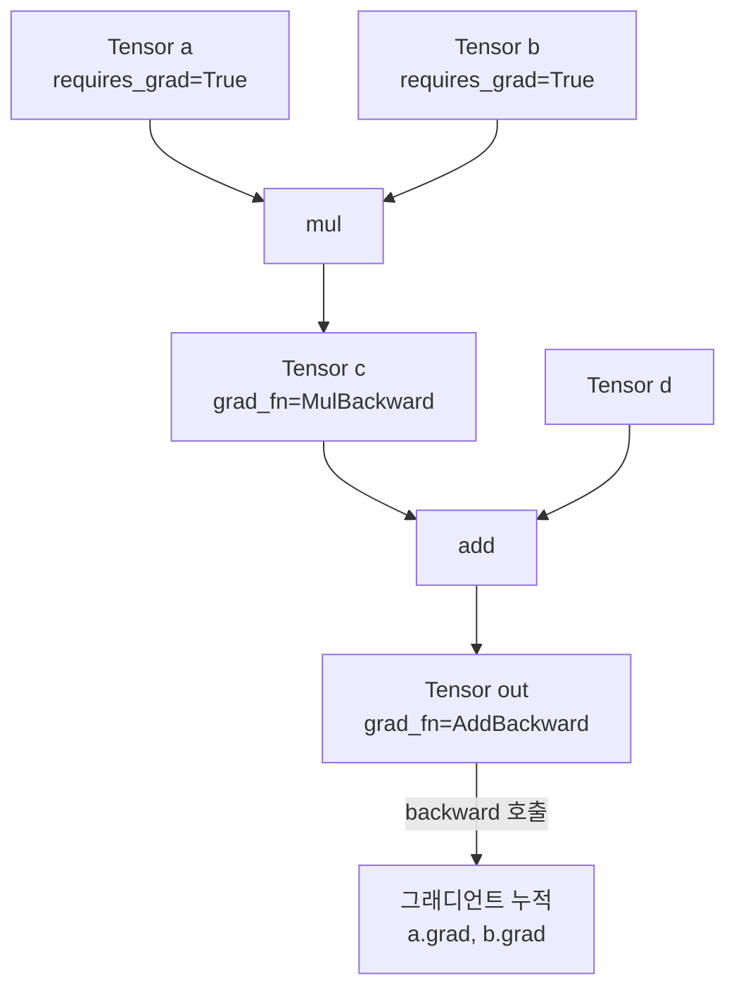
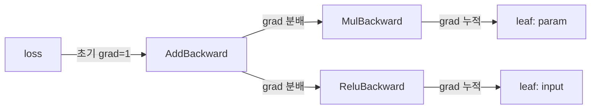

# PyTorch Autograd 내부 구조

PyTorch의 자동 미분(autograd) 엔진은 동적 계산 그래프(dynamic computation graph)를 실시간으로 구축하고, `backward()` 호출 시 그래프를 역방향으로 순회하며 그래디언트를 누적한다. 이 문서는 `torch.Tensor`, `Function`, `Node` 수준에서 autograd가 어떻게 동작하는지 설명한다.

## 핵심 개념: 동적 계산 그래프

PyTorch의 계산 그래프는 실행 시점(eager mode)에 생성된다. TensorFlow 1.x처럼 선언형 그래프를 미리 컴파일하지 않고, 파이썬 코드가 실행되는 순간 각 연산(op)마다 노드(Node)가 그래프에 추가된다. 이 방식은 동적 제어 흐름(if/for)을 자연스럽게 지원한다.



그래프 순회는 위에서 아래(forward)로 구축되고, `backward()`는 아래에서 위로 역순회하며 체인 룰을 적용한다.

## Tensor와 grad_fn

`requires_grad=True`로 생성된 텐서에 연산을 적용하면, 결과 텐서의 `grad_fn` 속성에 해당 연산의 `Function` 객체가 자동으로 연결된다.

- `leaf tensor`: `requires_grad=True`이지만 어떤 연산의 결과가 아닌 텐서. `grad_fn=None`. 역전파 후 `.grad`에 그래디언트가 누적됨
- `non-leaf tensor`: 중간 연산 결과. `grad_fn`을 가지며 기본적으로 `.grad`를 보존하지 않음 (메모리 절약)
- `retain_graph=True`: 한 번의 `backward()` 후 그래프를 유지해 재사용 가능

## Function 클래스: forward와 backward

`torch.autograd.Function`을 상속하여 커스텀 연산을 정의할 수 있다. `forward`와 `backward`를 정적 메서드로 구현하며, `ctx`(context) 객체를 통해 forward 중 backward에 필요한 값을 저장한다.

```python
class SigmoidFunction(torch.autograd.Function):
    @staticmethod
    def forward(ctx, x):
        out = 1 / (1 + torch.exp(-x))
        ctx.save_for_backward(out)  # backward에서 재사용할 값 저장
        return out

    @staticmethod
    def backward(ctx, grad_output):
        (out,) = ctx.saved_tensors
        grad_input = grad_output * out * (1 - out)
        return grad_input
```

내장 연산들(예: `torch.mm`, `torch.relu`)은 C++ 레벨에서 `Function` 서브클래스로 구현되며, 파이썬에서는 `MmBackward`, `ReluBackward` 같은 이름으로 `grad_fn`에 노출된다.

## backward 체이닝 메커니즘

`loss.backward()` 호출 시 내부적으로 다음이 진행된다:

1. 초기 그래디언트(`gradient=torch.ones(...)`)를 출력 노드에 할당
2. 위상 정렬(topological sort)로 노드 실행 순서를 결정
3. 각 노드의 `backward` 함수를 역순으로 호출
4. 각 노드는 자신의 입력 텐서에 그래디언트를 누적(`+=`)



그래디언트 누적은 `+=` 방식이므로, 같은 텐서가 여러 경로에서 사용되면(multi-use variable) 모든 경로의 그래디언트가 합산된다.

## 그래디언트 체크포인팅 (Gradient Checkpointing)

메모리와 연산량 사이의 트레이드오프 기법. `torch.utils.checkpoint.checkpoint(fn, *args)` 사용 시 forward 중 중간 활성값(activation)을 저장하지 않고, backward 중 해당 구간을 재계산한다. 메모리를 O(n)에서 O(sqrt(n))으로 줄일 수 있다.

## no_grad와 inference_mode

| 컨텍스트 | 그래프 구축 | 결과 텐서 | 용도 |
|----------|------------|-----------|------|
| `torch.no_grad()` | 비활성화 | `requires_grad=False` | 추론/평가 |
| `torch.inference_mode()` | 완전 비활성화 | view 불가 | 추론 최적화 |
| 기본 (grad 활성) | 활성화 | `requires_grad=True` | 학습 |

`inference_mode`는 `no_grad`보다 오버헤드가 낮지만, 해당 텐서로 추가 연산 후 자동 미분 그래프에 연결할 수 없다.

## 실무 디버깅 팁

- `loss.backward(retain_graph=True)`: 동일 그래프로 여러 번 backward 가능 (RNN BPTT, meta-learning)
- `torch.autograd.set_detect_anomaly(True)`: NaN 그래디언트 발생 위치 추적
- `tensor.register_hook(fn)`: 특정 텐서의 그래디언트 값 로깅/수정 가능
- `.grad.zero_()`: 각 step 전 그래디언트 누적 방지 (옵티마이저가 자동 처리하지 않는 경우)

## 왜 중요한가

Autograd 내부 구조를 이해하면 커스텀 연산 작성(CUDA 확장), 그래디언트 흐름 디버깅, 메모리 최적화(체크포인팅), 2차 미분(Hessian) 계산 등 고급 학습 기법을 올바르게 구현할 수 있다. 특히 [[automatic-differentiation]] 이론과 [[pytorch-internals]] 구현 세부사항을 연결하는 핵심 레이어다.

## 관련 문서

- [[automatic-differentiation]] - 자동 미분의 수학적 기반 (역방향 모드 AD, 체인 룰)
- [[pytorch-internals]] - PyTorch C++ 코어, Dispatcher, 연산자 등록
- [[cuda-memory-management]] - Autograd 텐서의 GPU 메모리 할당 전략
- [[model-parallelism-strategies]] - 분산 환경에서 autograd 그래프 분할
