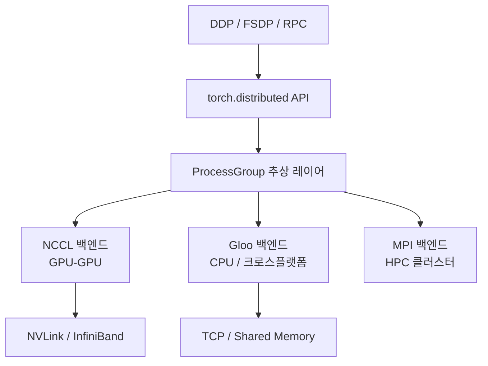
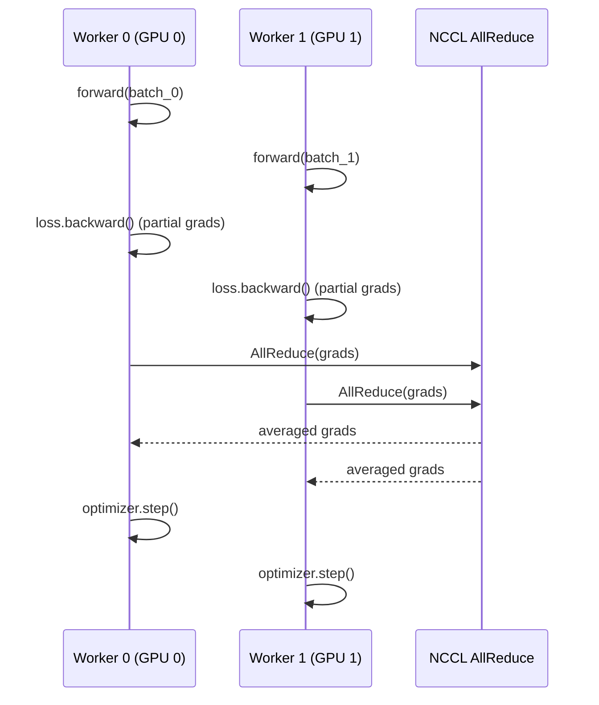
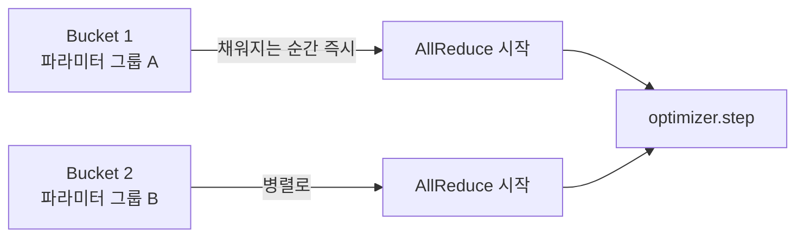

# PyTorch 분산 학습 내부 구조

PyTorch의 분산 학습 스택은 `torch.distributed` 패키지를 중심으로 구축된다. `ProcessGroup` 추상화 위에 NCCL/Gloo/MPI 백엔드가 위치하고, 그 위에 `DistributedDataParallel(DDP)`, `FullyShardedDataParallel(FSDP)`, `RPC` 등이 올라간다. 이 문서는 각 레이어의 내부 동작을 설명한다.

## 전체 스택 구조



## ProcessGroup: 통신 추상화

`ProcessGroup`은 분산 학습에서 통신 집합 연산(collective operation)을 실행하는 객체다. `dist.init_process_group(backend="nccl")` 호출로 글로벌 ProcessGroup이 초기화되고, `dist.new_group(ranks=[...])` 으로 서브그룹을 만들 수 있다.

핵심 집합 연산:

| 연산 | 설명 | 주요 사용처 |
|------|------|------------|
| `all_reduce` | 모든 rank에 합산값 배포 | DDP 그래디언트 동기화 |
| `all_gather` | 각 rank의 텐서를 모두 수집 | FSDP 파라미터 복원 |
| `reduce_scatter` | 합산 후 분산 저장 | FSDP 그래디언트 처리 |
| `broadcast` | 한 rank에서 나머지로 복사 | 모델 초기 가중치 배포 |
| `barrier` | 모든 rank 동기화 대기 | 체크포인트 저장 전 |

## NCCL 백엔드

NCCL(NVIDIA Collective Communications Library)은 GPU 간 집합 통신에 특화된 라이브러리다. PyTorch는 C++ 레벨에서 NCCL 라이브러리를 직접 호출하며, CUDA 스트림과 통합되어 연산과 통신을 겹쳐(overlap) 실행할 수 있다.

NCCL 통신은 NVLink(노드 내) 또는 InfiniBand(노드 간)를 자동으로 선택한다. 환경 변수 `NCCL_DEBUG=INFO`로 실제 사용 중인 토폴로지와 알고리즘을 확인할 수 있다.

## DDP(DistributedDataParallel) 내부 구현

DDP는 데이터 병렬(data parallelism) 구현체로, 각 GPU에 모델 전체를 복제하고 서로 다른 미니배치를 처리한 뒤 그래디언트를 동기화한다.



### DDP의 핵심 최적화: Bucket AllReduce

DDP는 파라미터를 일정 크기(기본 25MB)의 버킷(bucket)으로 묶어서 AllReduce를 배치 실행한다. backward 중 버킷이 채워지면 즉시 AllReduce를 시작하여 나머지 backward와 통신을 겹친다(communication-computation overlap).



### DDP 사용 시 주의사항

- `find_unused_parameters=True`: 일부 파라미터가 forward에서 사용되지 않을 때 필요. 성능 오버헤드 있음
- `static_graph=True`: 매 iteration 같은 그래프 구조라면 활성화하여 최적화
- `SyncBatchNorm`: 멀티 GPU에서 BatchNorm 통계를 동기화. `nn.SyncBatchNorm.convert_sync_batchnorm(model)` 적용

## FSDP(FullyShardedDataParallel)

DDP와 달리 파라미터, 그래디언트, 옵티마이저 상태를 모든 rank에 분산 저장한다. 단일 GPU 메모리 한계를 넘는 초대형 모델 학습에 사용한다.

| | DDP | FSDP |
|-|-----|------|
| 파라미터 복제 | 전체 복제 | rank별 샤딩 |
| 메모리 | N배 필요 | 1/N |
| 통신 | AllReduce (그래디언트만) | AllGather + ReduceScatter |
| 적합 모델 규모 | 수십억 파라미터 이하 | 수백억 파라미터 이상 |

## 환경 설정: world_size, rank, local_rank

- `world_size`: 전체 프로세스(GPU) 수
- `rank`: 전역 프로세스 번호 (0 ~ world_size-1)
- `local_rank`: 현재 노드 내 GPU 번호 (0 ~ GPU_per_node-1)

일반적인 초기화 패턴:

```python
dist.init_process_group(backend="nccl")
local_rank = int(os.environ["LOCAL_RANK"])
torch.cuda.set_device(local_rank)
model = DDP(model.cuda(), device_ids=[local_rank])
```

## torchrun 런처

`torchrun`(구 `torch.distributed.launch`)은 멀티 노드/멀티 GPU 프로세스를 자동으로 생성하고 환경 변수(`MASTER_ADDR`, `MASTER_PORT`, `RANK`, `LOCAL_RANK`, `WORLD_SIZE`)를 설정한다.

## 실무 디버깅

- `NCCL_DEBUG=INFO NCCL_DEBUG_SUBSYS=ALL`: NCCL 통신 상세 로그
- `TORCH_DISTRIBUTED_DEBUG=DETAIL`: DDP 버킷 구성, unused parameter 경고
- `dist.barrier()` 전후 타임스탬프로 rank 간 불균형(stragglers) 진단

## 왜 중요한가

[[distributed-training-overview]]에서 설명하는 데이터/모델 병렬화 전략은 결국 ProcessGroup 위에서 구현된다. NCCL 백엔드([[nccl-collective-communication]])와 DDP/FSDP의 내부 동작을 이해하면 통신 병목을 진단하고 [[pytorch-internals]] 수준에서 최적화할 수 있다.

## 관련 문서

- [[distributed-training-overview]] - 분산 학습 전반 개요 (데이터/모델/파이프라인 병렬)
- [[pytorch-internals]] - PyTorch C++ 코어 및 Dispatcher 구조
- [[nccl-collective-communication]] - NCCL AllReduce/AllGather 알고리즘 상세
- [[model-parallelism-strategies]] - TP/PP/EP 전략 선택 가이드
- [[pytorch-autograd-internals]] - 그래디언트 계산과 autograd 그래프
