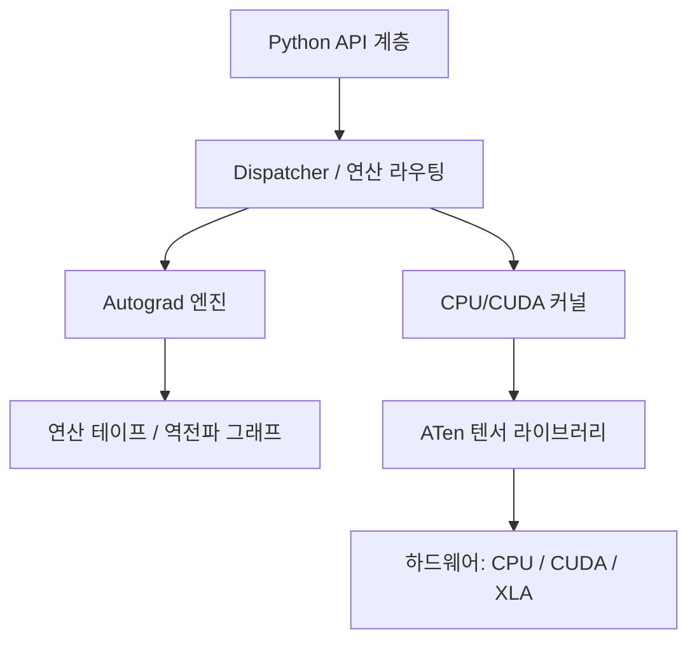
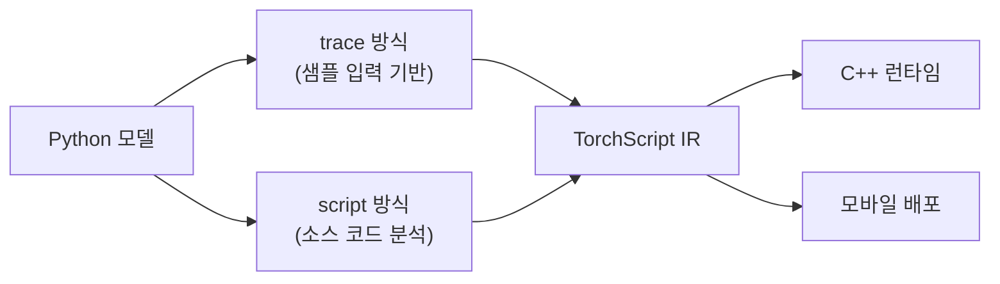

# PyTorch 내부 구조

PyTorch는 단순한 딥러닝 프레임워크 이상으로, 동적 계산 그래프(Dynamic Computation Graph)와 강력한 자동 미분(autograd) 엔진을 핵심으로 설계된 시스템이다. 내부 구조를 이해하면 성능 최적화와 커스텀 연산 구현이 훨씬 용이해진다.

## 핵심 구성 요소

PyTorch 내부는 크게 세 층으로 구성된다:



Python API가 연산을 호출하면 Dispatcher가 가장 적합한 커널로 라우팅하며, Autograd가 역전파를 위한 계산 그래프를 실시간으로 구축한다.

## Autograd 엔진

Autograd는 PyTorch의 자동 미분([[automatic-differentiation]]) 핵심으로, **define-by-run** 방식을 채택한다. 즉, 순전파(forward pass) 실행 중에 역전파에 필요한 연산 그래프가 동적으로 만들어진다.

### 계산 그래프의 구성 요소

- **Tensor**: `requires_grad=True`일 때 gradient 추적 활성화
- **Function (grad_fn)**: 각 텐서에 연결된 역전파 함수. `AddBackward`, `MulBackward` 등
- **grad**: `backward()` 호출 후 `.grad` 속성에 gradient가 누적됨

```python
x = torch.tensor([2.0], requires_grad=True)
y = x ** 2 + 3 * x   # 계산 그래프 동적 구성
y.backward()
print(x.grad)         # dy/dx = 2x + 3 = 7
```

### 커스텀 Autograd 함수

`torch.autograd.Function`을 상속하면 순전파와 역전파를 직접 정의할 수 있다. 이는 수치적으로 불안정한 연산(log-sum-exp 등)을 안정적으로 구현하거나, 역전파 로직 자체를 수정해야 할 때 유용하다.

## Dispatcher 시스템

Dispatcher는 PyTorch 1.7부터 도입된 연산 라우팅 레이어로, 단일 Python 함수 호출이 실제로 어느 커널을 실행할지 결정하는 디스패치 테이블을 관리한다.

디스패치 키(dispatch key)는 다음 정보를 기반으로 결정된다:

| 키 예시 | 역할 |
|---------|------|
| `CPU` | CPU 상의 Dense 텐서 |
| `CUDA` | GPU 상의 Dense 텐서 |
| `Autograd` | 자동 미분 활성화 여부 |
| `SparseCPU` | 희소 텐서 |
| `NestedTensor` | 가변 길이 시퀀스 |

이 구조 덕분에 동일한 `torch.add()` 호출이 CPU/GPU/희소 텐서 등 다양한 백엔드에서 올바른 구현을 실행할 수 있다. [[distributed-training-overview]]에서 다루는 분산 환경에서도 디스패처가 통신 연산을 투명하게 삽입한다.

## TorchScript

TorchScript는 PyTorch 모델을 Python 인터프리터 없이 실행 가능한 **정적 중간 표현(IR)**으로 컴파일하는 도구다. 두 가지 방식이 있다:



- **torch.jit.trace**: 샘플 입력으로 모델을 실행해 연산 시퀀스를 기록. 동적 제어 흐름(if/for)이 있으면 올바르게 작동하지 않을 수 있다.
- **torch.jit.script**: 소스 코드를 파싱해 타입 추론과 제어 흐름 분석 수행. 더 범용적이지만 일부 Python 문법은 지원 불가.

TorchScript IR은 C++ 런타임에서 실행되므로 Python GIL의 영향을 받지 않으며, 프로덕션 서빙과 모바일 배포에 활용된다.

## ATen 텐서 라이브러리

ATen(A Tensor library)은 PyTorch의 C++ 텐서 연산 기반 라이브러리다. Python API 아래에서 실제 수치 연산을 수행하며, BLAS/LAPACK, cuBLAS, cuDNN 등 하드웨어 가속 라이브러리와 인터페이스한다.

## 메모리 관리와 최적화 팁

- **`torch.no_grad()`**: 추론 시 gradient 추적을 끄면 계산 그래프가 생성되지 않아 메모리와 연산량 절감
- **`tensor.detach()`**: gradient 추적에서 텐서를 분리. 일부 연산만 역전파에서 제외할 때 사용
- **`torch.compile()`**: PyTorch 2.0에서 도입된 컴파일러. Triton 기반 커널 생성으로 추론/학습 모두 가속

## 관련 문서

- [[automatic-differentiation]] - 자동 미분의 이론적 기반 (역전파, 연쇄 법칙)
- [[distributed-training-overview]] - 분산 학습에서 PyTorch의 역할 (DDP, FSDP)
- [[flash-attention]] - 커스텀 CUDA 커널이 Dispatcher와 통합되는 사례
