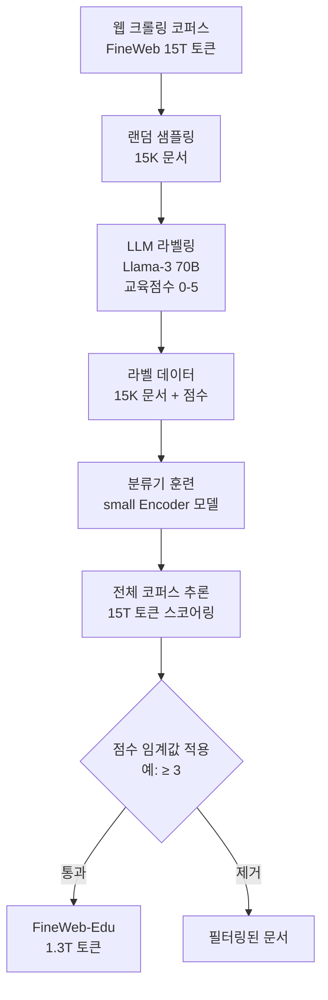
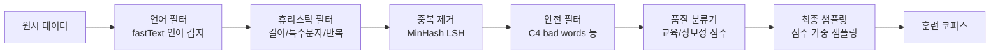
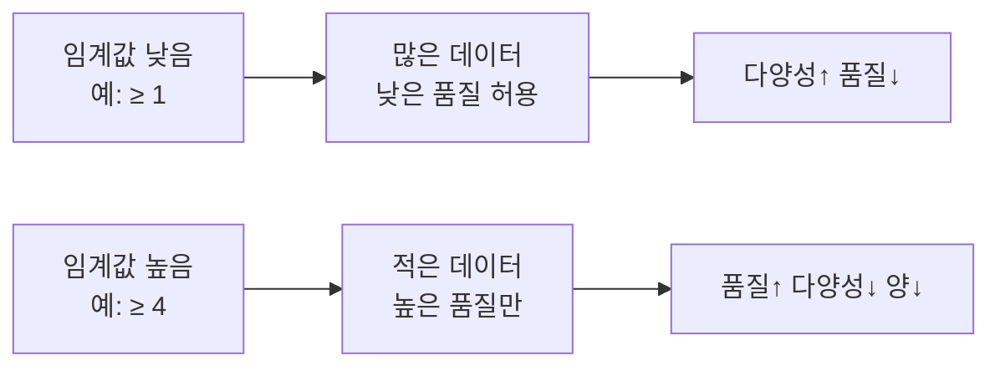

# 품질 분류기 필터링

## 개요

품질 분류기 필터링(quality classifier filtering)은 대규모 웹 크롤링 코퍼스에서 교육적으로 유용하거나 고품질인 문서만 선별하는 데이터 큐레이션 기법이다. 단순 휴리스틱(글자 비율, 문장 수 등)보다 정교하며, LLM을 레이블러로 활용해 소량의 라벨 데이터를 생성한 뒤 경량 분류기를 학습시키는 방식이 주류다. [[fineweb-dataset]](FineWeb-Edu)이 이 방식을 대중화했다.

## 품질 기준의 정의

필터링의 전제는 "고품질"의 정의다. 목적에 따라 기준이 달라진다.

| 목적 | 품질 기준 | 대표 사례 |
|------|-----------|-----------|
| 일반 언어 능력 | 자연스러운 문장, 정보 밀도, 표준 문법 | C4 heuristics |
| 교육적 유용성 | 개념 설명, 단계별 풀이, 예시 포함 | FineWeb-Edu |
| 코드 품질 | 함수 정의, 주석, 실행 가능성 | StarCoder |
| 안전성 | 유해 콘텐츠 부재, 개인정보 없음 | Dolma 안전 필터 |

## FineWeb-Edu 방식

HuggingFace의 FineWeb-Edu는 LLM 기반 라벨링 + 경량 분류기 훈련의 대표 사례다.

**LLM 라벨링 프롬프트 설계**:
- "이 문서가 초등학생부터 대학원생까지 학습에 얼마나 유용한가?"
- 0(완전 무가치)~5(매우 교육적) 점수 + 간단한 이유 요청
- 소수 응답이면 거부 → 모델에 다시 요청 (JSON 형식 강제)

**분류기 선택**: `snowflake-arctic-embed` 같은 소형 인코더 모델을 회귀 헤드와 함께 파인튜닝. 속도(초당 수천 문서)와 정확도(LLM 라벨과 0.7+ 상관관계) 균형이 중요하다.

## 다단계 필터링 파이프라인

실제 파이프라인은 분류기 하나가 아니라 여러 필터가 순차 적용된다.

각 단계의 역할:
1. **언어 필터**: 목표 언어(들)로 한정, 신뢰도 임계값 적용
2. **휴리스틱 필터**: 문서 길이, 줄바꿈 비율, 알파벳 비율, 반복 n-gram 비율
3. **중복 제거**: [[data-deduplication-minhash]] 참조
4. **안전 필터**: 성인 콘텐츠, 혐오 표현, 개인정보 관련 단어 목록 기반
5. **품질 분류기**: 학습된 모델로 연속 점수 산출

## 분류기 설계 고려사항

### 라벨 편향 방지

LLM 라벨러의 편향(bias)이 분류기로 전파된다.

- **모델 편향**: GPT-4가 자신과 유사한 스타일의 글을 높게 평가하는 경향
- **길이 편향**: 긴 문서를 선호하는 경향 (길이를 특성으로 추가해 통제)
- **형식 편향**: 마크다운, 목록 형식을 선호하는 경향

**보완책**: 여러 LLM의 평균 점수 사용 (앙상블 라벨링), 명시적으로 길이를 통제하는 프롬프트 설계.

### 점수 임계값 선택

실제로는 점수 분포를 확인하고 **"무릎점(elbow point)"**에서 임계값을 설정하거나, 점수를 확률로 변환해 가중 샘플링한다.

## [[pretraining-data-curation]]에서의 위치

품질 필터링은 단독으로 사용되기보다 전체 데이터 큐레이션 파이프라인의 일부로 작동한다. [[fineweb-dataset]] 리포트에 따르면 품질 필터링 단독으로도 MMLU, ARC 등 벤치마크에서 의미 있는 성능 향상이 확인되었다.

**실무 팁**:
- 분류기는 도메인/언어별로 별도 학습이 더 정확하다
- 점수 임계값보다 **상위 N%만 사용**하는 방식이 더 재현성이 높다
- 다운스트림 벤치마크에서 실제 검증 전까지 임계값을 고정하지 않는다

## 관련 문서
- [[perplexity-based-filtering]] -- 퍼플렉시티 기반 필터링 (Perplexity-Based Filtering)

- [[pretraining-data-curation]] - 데이터 큐레이션 전체 파이프라인
- [[fineweb-dataset]] - FineWeb-Edu 품질 필터링 상세 사례
- [[data-deduplication-minhash]] - 필터링 전 단계의 중복 제거
- [[data-quality-scoring]] - 품질 점수화 방법론 전반
- [[dclm-datacomp]] - 데이터 믹싱과 품질 필터링 비교 연구
