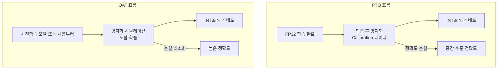
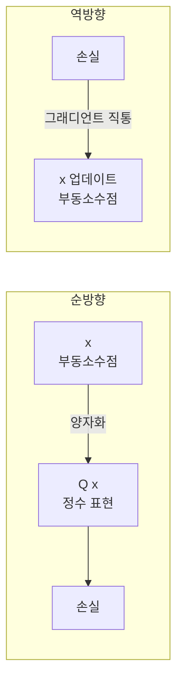
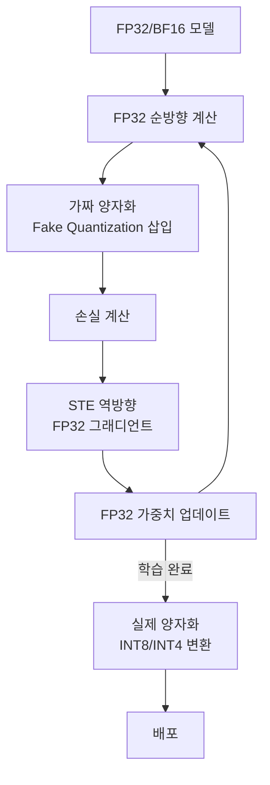
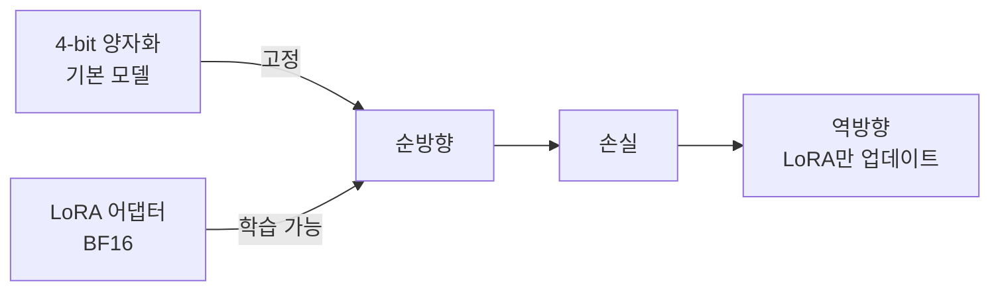

# 양자화 인식 학습 (Quantization-Aware Training, QAT)

## 핵심 개념

**양자화 인식 학습(QAT)**은 모델을 학습하는 동안 양자화(quantization) 연산을 **시뮬레이션**하여, 실제 양자화 후에도 성능 저하가 최소화되도록 가중치와 활성화를 조정하는 기법이다. 학습 후에 양자화하는 **PTQ(Post-Training Quantization)**와 달리, QAT는 양자화의 영향을 학습 과정에 반영하여 더 높은 정확도를 달성한다.

## PTQ vs QAT 비교

| 항목 | PTQ | QAT |
|------|-----|-----|
| 학습 필요 여부 | 없음 (캘리브레이션만) | 있음 (파인튜닝 포함) |
| 구현 복잡도 | 낮음 | 높음 |
| 정확도 | 중간 (INT8) / 낮음 (INT4) | 높음 |
| 시간 비용 | 수 분 ~ 수 시간 | 수 시간 ~ 수 일 |
| 적합한 상황 | 빠른 배포, 대형 모델 | 정확도 중요, 소형 모델 |

## 핵심 원리: Straight-Through Estimator (STE)

양자화 함수 $Q(x) = \text{round}(x / s) \cdot s$는 거의 어디서나 미분이 0이고 불연속점에서 정의되지 않는다. 역전파(Backpropagation)가 불가능한 문제다.

**STE(Straight-Through Estimator)**(Bengio et al. 2013)는 이를 우회하는 근사법이다:

$$\frac{\partial L}{\partial x} \approx \frac{\partial L}{\partial Q(x)}$$

순방향에서는 실제 양자화 값을 사용하고, 역방향에서는 양자화 연산을 마치 항등 함수처럼 취급하여 그래디언트를 통과시킨다.

이 근사는 이론적으로 부정확하지만 실제로 잘 동작한다. 양자화 오류의 분포가 가중치 학습을 통해 보정되기 때문이다.

## QAT 학습 흐름

가중치는 학습 내내 FP32로 유지되고, **가짜 양자화(Fake Quantization)** 노드가 양자화의 오류를 시뮬레이션한다. 실제 배포 시 가짜 양자화 노드를 실제 INT 연산으로 교체한다.

## GPTQ와의 차이

| 항목 | GPTQ | QAT |
|------|------|-----|
| 분류 | PTQ (학습 후 양자화) | QAT (학습 중 양자화) |
| 원리 | 헤시안 기반 최적 반올림 | STE 역전파 |
| 속도 | 빠름 (수 시간) | 느림 (파인튜닝 수준) |
| 정확도 | 좋음 (INT4 SOTA) | 더 좋음 (특히 INT4 이하) |
| 대형 LLM | 주로 사용됨 | 비용 문제로 드물게 사용 |

## INT8 / INT4에서의 QAT 효과

- **INT8**: PTQ로도 충분한 경우가 많음. LLM.int8()이나 GPTQ로 거의 무손실 가능
- **INT4**: PTQ에서 눈에 띄는 성능 저하. QAT는 약 0.5-1 퍼플렉서티 포인트 개선 가능
- **2-bit 이하**: QAT 없이는 실용적 배포 어려움

## 최신 기법들

### QLoRA - 양자화 + LoRA 결합

QLoRA는 엄밀히 QAT는 아니지만, 양자화된 기본 모델 위에서 어댑터를 학습한다는 점에서 유사한 아이디어를 공유한다. 메모리 효율과 성능의 균형을 잘 맞춘 접근이다.

### AQLM (Additive Quantization for LLM)

- 가중치를 코드북(codebook)의 합으로 표현
- 2-bit 수준에서 PTQ보다 높은 정확도
- 코드북 학습은 QAT의 형태를 띰

### QuIP# (Quantization with Incoherence Processing)

- 직교 변환으로 가중치를 "인코헤런트"하게 만든 후 양자화
- 2-4 bit QAT 수준의 성능을 PTQ로 달성

## LLM에서 QAT의 어려움과 해결책

**어려움 1**: LLM 파인튜닝 비용이 매우 큼 - 70B 모델 QAT는 수백 GPU-일 필요

**해결**: 일부 레이어만 QAT 적용, 나머지는 PTQ (mixed precision)

**어려움 2**: 이상치 활성화(outlier activation) - 일부 채널에서 극단적으로 큰 값 발생 (LLM.int8 논문이 발견)

**해결**: SmoothQuant - 이상치를 가중치 쪽으로 이동시켜 활성화 범위를 균일하게

**어려움 3**: 양자화 에러의 레이어 간 누적

**해결**: 순차적(layer-by-layer) QAT 또는 GPTQ 스타일의 블록별 최적화

## 실무 권장 사항

1. **INT8 배포 목표**: GPTQ나 AWQ 같은 PTQ로 시작. QAT는 마지막 수단
2. **INT4 이하 고품질**: QAT 또는 QuIP# 고려
3. **소형 모델 (7B 이하)**: QAT 비용 대비 효과 좋음
4. **대형 모델 (70B+)**: 전체 QAT는 비실용적. QLoRA나 부분 QAT 고려
5. **에지 배포**: 목표 하드웨어(ARM, NPU)에서 지원하는 양자화 포맷 먼저 확인

## 관련 문서

- [[post-training-quantization]] - PTQ 기법: GPTQ, AWQ, LLM.int8
- [[lora-qlora-finetuning|qlora]] - 양자화 + LoRA 결합 파인튜닝
- [[quantization-model-compression|model-compression]] - 모델 압축 전반 개요
- [[mixed-precision-training]] - FP16/BF16 학습
- [[activation-recomputation]] - 메모리 최적화 관련 기법
