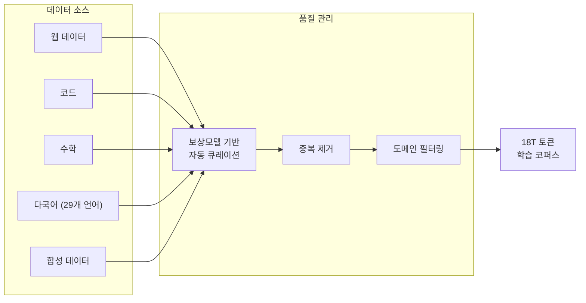
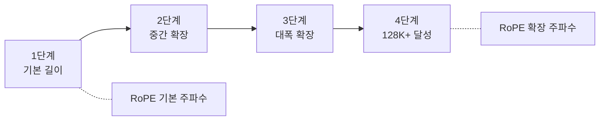
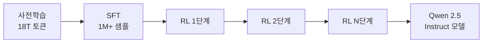

# Qwen 2.5 학습

## 개요

Qwen 2.5는 알리바바 Qwen 팀이 2024년 9월 공개한 대규모 언어 모델 패밀리다. 전작 Qwen 2의 7조 토큰에서 18조 토큰으로 사전학습 데이터를 2.5배 이상 확대했으며, 0.5B부터 72B까지 7개 크기의 모델을 제공한다. 29개 언어를 지원하는 다국어 능력, 128K 토큰 컨텍스트 처리를 위한 4단계 장문맥 확장(long-context extension), 100만 이상의 SFT 샘플과 다단계 강화학습을 통한 정교한 후속 학습이 핵심 특징이다.

## 모델 패밀리

| 모델 크기 | 레이어 | Q 헤드 | KV 헤드 | 컨텍스트 |
|----------|--------|--------|---------|---------|
| 0.5B | 24 | 14 | 2 | 128K |
| 1.5B | 28 | 12 | 2 | 128K |
| 3B | 36 | 16 | 2 | 128K |
| 7B | 28 | 28 | 4 | 128K |
| 14B | 48 | 40 | 8 | 128K |
| 32B | 64 | 40 | 8 | 128K |
| 72B | 80 | 64 | 8 | 128K |

모든 크기에서 GQA(Grouped Query Attention), RoPE 위치 인코딩, SwiGLU 활성화 함수를 공통 채택한다.

## 아키텍처 특징

### Grouped Query Attention (GQA)

Qwen 2.5는 전 모델에 GQA를 적용하여 추론 효율성을 확보한다. Query 헤드를 그룹화하여 공유 Key-Value 캐시를 사용함으로써, 장문맥 처리 시 메모리 요구량을 대폭 절감한다. 모델 크기별로 Q 헤드와 KV 헤드 비율이 다르게 설정되어 있으며(0.5B: 14Q/2KV, 72B: 64Q/8KV), 크기에 따라 효율과 표현력의 균형점을 조정한다.

### RoPE와 SwiGLU

회전 위치 인코딩(RoPE)으로 상대 위치 정보를 인코딩하고, SwiGLU 활성화 함수로 FFN 레이어를 구성한다. 이 조합은 2024-2025년 시점의 Transformer 기반 LLM 아키텍처에서 사실상 표준이 되었다.

## 사전학습

### 데이터 규모와 구성

18조 토큰 규모의 사전학습 코퍼스는 웹 데이터, 코드, 수학, 다국어 텍스트, 합성 데이터로 구성된다. Qwen 2 대비 기술, 연구, 코드, 수학 도메인이 집중적으로 업샘플링되었으며, 보상 모델(reward model) 기반 자동 큐레이션으로 데이터 품질을 관리한다.

### 다국어 지원

29개 언어를 지원하며, 중국어와 영어가 핵심 언어이고 한국어, 일본어, 프랑스어, 독일어, 스페인어, 아랍어 등 주요 언어까지 광범위하게 커버한다. 다국어 데이터는 사전학습 코퍼스에 자연스럽게 통합되어 별도의 다국어 미세조정 없이도 다국어 능력을 확보한다.

## 4단계 장문맥 확장 (Long-Context Extension)

Qwen 2.5는 기본 128K 토큰 컨텍스트를 지원하며, Qwen2.5-Turbo는 100만 토큰까지 처리 가능하다. 이를 위해 4단계에 걸친 점진적 시퀀스 길이 확장 전략을 사용한다:

| 단계 | 시퀀스 길이 | 목적 |
|------|-----------|------|
| 1단계 | 기본 길이 | 일반 사전학습 |
| 2단계 | 중간 확장 | 위치 인코딩 적응 |
| 3단계 | 대폭 확장 | 장문맥 패턴 학습 |
| 4단계 | 최종 목표 길이 (128K+) | 완전한 장문맥 능력 확보 |

단계별로 시퀀스 길이를 점진적으로 늘리면서 RoPE의 주파수 기저(frequency base)를 조정하는 방식으로, 모델이 긴 컨텍스트에 점진적으로 적응하도록 한다. 이 접근법은 한 번에 긴 시퀀스로 학습하는 것보다 안정적이고 효율적이다.

## 후속 학습 (Post-training)

### 지도 미세조정 (SFT)

100만 개 이상의 고품질 SFT 샘플로 정교한 [[supervised-fine-tuning|지도 미세조정]]을 수행한다. 이 데이터셋은 장문 생성, 구조화 데이터 분석, 지시 따르기(instruction following) 등 다양한 태스크를 포함한다.

### 다단계 강화학습

SFT 이후 다단계 강화학습(multistage reinforcement learning)을 적용하여 인간 선호도에 맞춘 정렬을 수행한다. [[direct-preference-optimization|DPO]]와 온라인 RL을 조합하여, 단일 단계 정렬보다 세밀한 행동 조정이 가능하다.

## 특화 모델

Qwen 2.5 패밀리는 범용 모델 외에 도메인 특화 변형도 제공한다:

| 변형 | 특화 영역 | 데이터 구성 |
|------|----------|-----------|
| Qwen2.5-Coder | 코드 생성 | 5.5T 토큰 (코드 70%, 텍스트 20%, 수학 10%) |
| Qwen2.5-Math | 수학 추론 | 수학 도메인 집중 |
| Qwen2.5-Turbo | 장문맥 처리 | 1M 토큰 컨텍스트 |

## Qwen 2 대비 주요 개선점

| 항목 | Qwen 2 | Qwen 2.5 |
|------|--------|----------|
| 사전학습 토큰 | 7T | 18T (2.5배) |
| 모델 크기 | 5개 | 7개 (3B, 32B 추가) |
| 컨텍스트 길이 | 32K-128K | 128K (전 모델) |
| 다국어 | 제한적 | 29개 언어 |
| SFT 샘플 | - | 1M+ |
| 후속 학습 | 단일 단계 | 다단계 RL |

## 의의

Qwen 2.5는 18T 토큰이라는 대규모 사전학습 데이터와 체계적인 후속 학습 파이프라인의 조합으로, 오픈 가중치 모델 중 최상위 성능을 달성했다. 특히 [[data-mixing-curriculum-learning|데이터 배합]]과 [[pretraining-data-curation|데이터 큐레이션]]에 보상 모델을 활용한 자동화된 품질 관리 체계가 주목할 만하다. 4단계 장문맥 확장은 시퀀스 길이 커리큘럼의 실용적 사례로서 다른 모델 학습에도 참고가 된다.

## 관련 문서

- [[data-mixing-curriculum-learning]] -- 도메인 배합과 커리큘럼 학습 전략
- [[pretraining-data-curation]] -- 사전학습 데이터 큐레이션
- [[supervised-fine-tuning]] -- SFT 단계 상세
- [[direct-preference-optimization]] -- 후속 학습 DPO 기법
- [[rlhf-pipeline]] -- 강화학습 기반 정렬 파이프라인
- [[neural-scaling-laws]] -- 데이터 규모 확장의 이론적 근거
