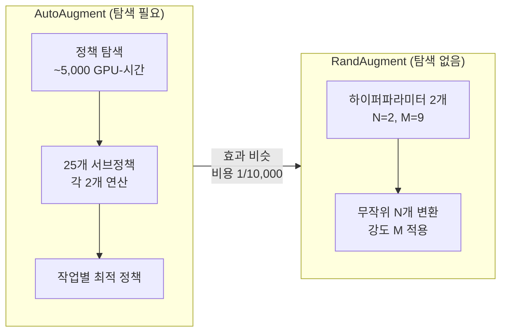
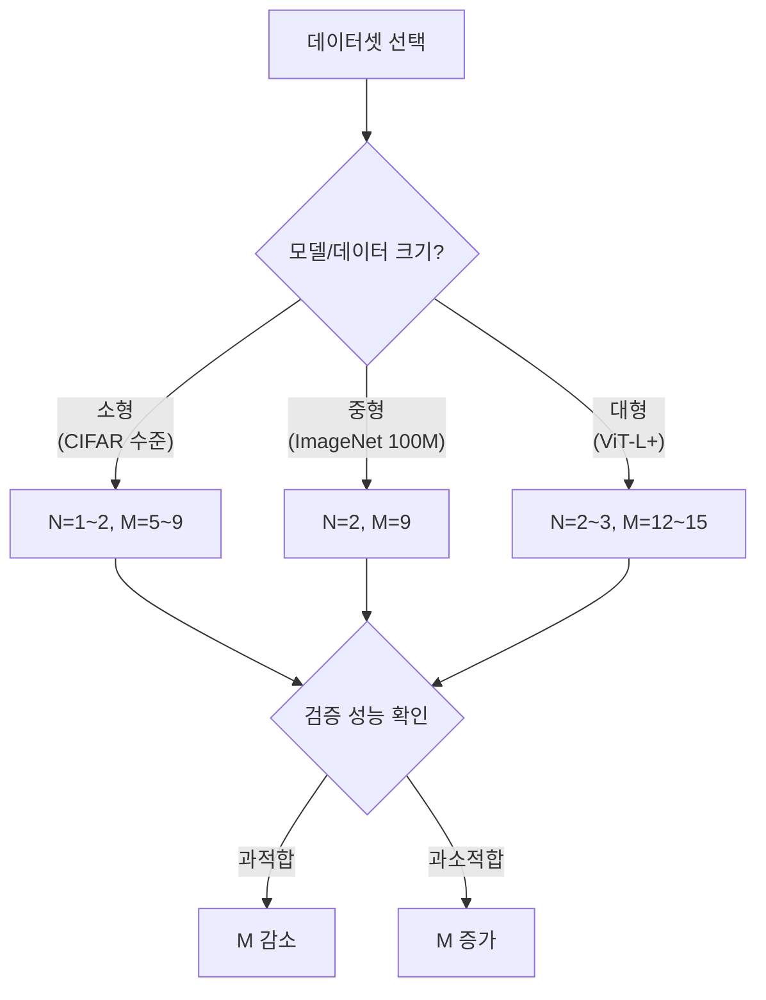

# RandAugment 자동 증강

RandAugment는 Cubuk et al. (2019, NeurIPS)이 제안한 데이터 증강 기법으로, [[autoaugment-search]]의 복잡한 정책 탐색 없이 두 개의 하이퍼파라미터(N, M)만으로 강력한 증강을 달성한다. "탐색 없는 자동 증강(search-free augmentation)"이라 불린다.

## 배경 - AutoAugment의 비용 문제

[[autoaugment-search]]는 강화학습으로 최적 증강 정책을 탐색하지만, GPU 수천 개-시간의 비용이 든다. RandAugment는 이 탐색 과정을 완전히 제거하면서도 비슷하거나 더 좋은 성능을 얻는다.



## 핵심 알고리즘

### 증강 연산 목록 (K = 14개)

| 연산명 | 설명 | 범위 |
|--------|------|------|
| AutoContrast | 히스토그램 스트레칭 | - |
| Equalize | 히스토그램 평활화 | - |
| Rotate | 회전 | -30 ~ +30도 |
| Solarize | 임계값 이상 픽셀 반전 | 0-256 |
| Color | 채도 조정 | 0.1-1.9 |
| Posterize | 비트 감소 (포스터화) | 4-8 bits |
| Contrast | 대비 조정 | 0.1-1.9 |
| Brightness | 밝기 조정 | 0.1-1.9 |
| Sharpness | 선명도 조정 | 0.1-1.9 |
| ShearX/ShearY | 수평/수직 전단 | -0.3 ~ 0.3 |
| TranslateX/TranslateY | 수평/수직 이동 | -0.45 ~ 0.45 |
| Cutout | 사각형 마스킹 | - |

### 알고리즘

```
입력: 이미지 x, N (연산 수), M (강도 0-30)
출력: 증강된 이미지 x'

1. K개 연산 목록에서 N개 무작위 선택 (복원 추출)
2. 선택된 각 연산에 M에 비례하는 강도를 적용
3. 순서대로 x에 적용
```

### 강도 매핑

각 연산은 magnitude M을 해당 연산의 물리적 파라미터로 매핑한다:

```
rotation_degree = M / 30 * 30   # M=9 → 9도
shear_x = M / 30 * 0.3          # M=9 → 0.09
brightness_factor = M / 30 * (1.9 - 0.1) + 0.1  # M=9 → 0.64
```

## 코드 구현

### PyTorch 기본 사용 (torchvision)

```python
import torchvision.transforms as T

# torchvision.transforms.RandAugment (v0.11+)
transform = T.Compose([
    T.RandomResizedCrop(224),
    T.RandomHorizontalFlip(),
    T.RandAugment(
        num_ops=2,        # N: 적용할 연산 수
        magnitude=9,      # M: 강도 (0-30, 기본 9)
        num_magnitude_bins=31,  # M 구간 수
    ),
    T.ToTensor(),
    T.Normalize(mean=[0.485, 0.456, 0.406],
                std=[0.229, 0.224, 0.225]),
])

# 데이터셋에 적용
dataset = datasets.ImageFolder('path/to/data', transform=transform)
```

### 커스텀 구현 (강도 범위 조정)

```python
import random
from PIL import Image, ImageEnhance, ImageOps
import numpy as np

class RandAugment:
    """
    RandAugment 커스텀 구현.
    Args:
        n: 적용할 연산 수 (N)
        m: 강도 (0-30)
    """

    def __init__(self, n: int = 2, m: int = 9):
        self.n = n
        self.m = m
        self.augment_list = self._build_augment_list()

    def _build_augment_list(self):
        def _rotate(img, v):
            return img.rotate(v)

        def _color(img, v):
            return ImageEnhance.Color(img).enhance(v)

        def _contrast(img, v):
            return ImageEnhance.Contrast(img).enhance(v)

        def _brightness(img, v):
            return ImageEnhance.Brightness(img).enhance(v)

        def _sharpness(img, v):
            return ImageEnhance.Sharpness(img).enhance(v)

        def _autocontrast(img, _):
            return ImageOps.autocontrast(img)

        def _equalize(img, _):
            return ImageOps.equalize(img)

        # (함수, min_val, max_val) 형태
        return [
            (_rotate, -30, 30),
            (_color, 0.1, 1.9),
            (_contrast, 0.1, 1.9),
            (_brightness, 0.1, 1.9),
            (_sharpness, 0.1, 1.9),
            (_autocontrast, None, None),
            (_equalize, None, None),
        ]

    def __call__(self, img: Image.Image) -> Image.Image:
        # N개 무작위 선택
        ops = random.choices(self.augment_list, k=self.n)

        for op_func, min_val, max_val in ops:
            if min_val is not None:
                # M을 [min_val, max_val] 범위로 선형 매핑
                v = self.m / 30.0 * (max_val - min_val) + min_val
                # 부호 있는 연산은 무작위로 음수 적용
                if random.random() > 0.5:
                    v = -v
            else:
                v = None
            img = op_func(img, v)

        return img
```

### timm 라이브러리 사용

```python
# timm은 더 다양한 RandAugment 변형 제공
from timm.data import create_transform

transform = create_transform(
    input_size=224,
    is_training=True,
    auto_augment='rand-m9-n2-mstd0.5',  # RandAugment M=9, N=2, std=0.5
    re_prob=0.25,    # RandomErasing 확률
    re_mode='pixel',
    re_count=1,
)
```

## 하이퍼파라미터 선택



| 데이터셋 | 권장 N | 권장 M |
|---------|--------|--------|
| CIFAR-10 | 1-2 | 9 |
| CIFAR-100 | 2 | 9-12 |
| ImageNet | 2 | 9 |
| 의료 이미지 | 1 | 5 |

## 성능 비교

| 방법 | ImageNet Top-1 | CIFAR-10 | 탐색 비용 |
|------|---------------|---------|----------|
| 기준 (Flip+Crop) | 76.3% | 95.0% | 없음 |
| [[autoaugment-search]] | 77.6% | 96.4% | ~5K GPU-hr |
| RandAugment (N=2, M=9) | 77.6% | 97.0% | 없음 |
| RandAugment (N=2, M=12) | 77.7% | 97.1% | 없음 |

RandAugment는 AutoAugment와 동등하거나 더 높은 성능을 내면서 탐색 비용이 전혀 없다. CIFAR-10에서는 오히려 AutoAugment를 능가한다.

## TrivialAugment - 더 단순한 변형

RandAugment에서 M까지 제거한 **TrivialAugment**도 경쟁력 있다:

```python
# torchvision TrivialAugmentWide (N=1, M 무작위)
transform = T.Compose([
    T.RandomResizedCrop(224),
    T.RandomHorizontalFlip(),
    T.TrivialAugmentWide(),  # 단일 무작위 연산, 강도도 무작위
    T.ToTensor(),
])
```

TrivialAugment는 ImageNet에서 RandAugment와 거의 동일한 성능을 하이퍼파라미터 없이 달성한다.

## [[cutmix-augmentation]] / [[mixup-data-augmentation]]과의 결합

현대 학습 레시피(DeiT, Swin, ConvNeXt 등)의 표준 조합:

```python
# DeiT 기본 학습 레시피 (개요)
# 1. 이미지 수준: RandAugment
# 2. 배치 수준: Mixup (alpha=0.8) + CutMix (alpha=1.0) 중 하나 선택
# 3. Stochastic Depth + Label Smoothing

transform = T.Compose([
    T.RandomResizedCrop(224, interpolation=T.InterpolationMode.BICUBIC),
    T.RandomHorizontalFlip(),
    T.RandAugment(num_ops=2, magnitude=9),
    T.ToTensor(),
    T.Normalize(mean=[0.485, 0.456, 0.406], std=[0.229, 0.224, 0.225]),
])
```

## 관련 문서

- [[autoaugment-search]] - RL 기반 증강 정책 탐색
- [[cutmix-augmentation]] - 패치 교체 혼합 증강
- [[mixup-data-augmentation]] - 선형 보간 혼합 증강
- [[label-smoothing]] - 소프트 레이블 정규화
- [[overfitting-regularization]] - 정규화 기법 개요
