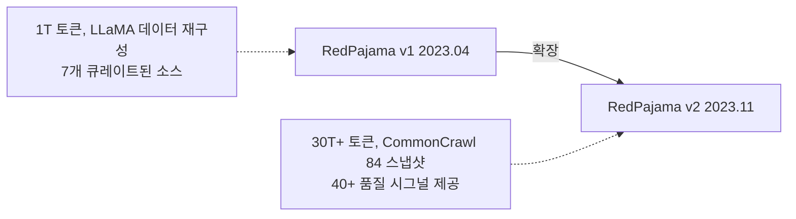
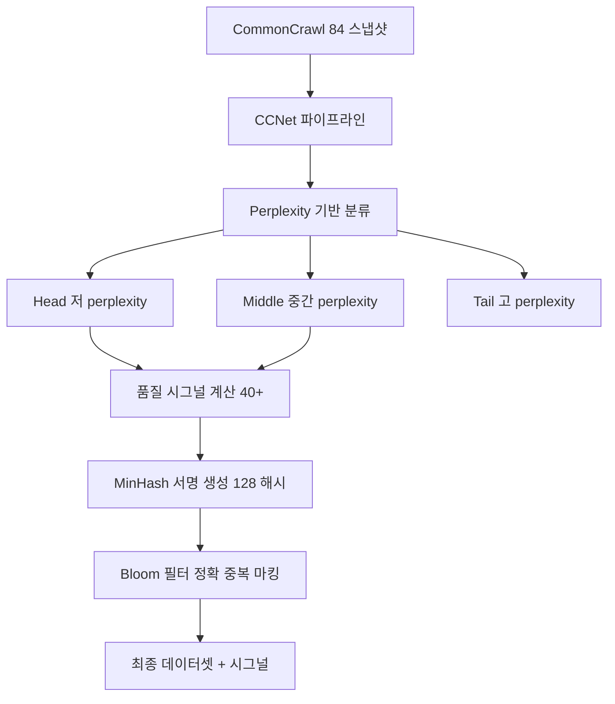

# RedPajama v2 데이터셋 (RedPajama-Data-v2)

## 개요

RedPajama-Data-v2는 Together AI가 2023년 11월에 공개한 30조(30T) 토큰 이상 규모의 웹 데이터셋으로, LLM 학습용으로 공개된 데이터셋 중 최대 규모에 해당한다. 84개의 CommonCrawl 스냅샷에서 1,000억 건 이상의 텍스트 문서를 추출하고, 40개 이상의 사전 계산된 품질 시그널(quality signal)을 함께 제공한다. [[pretraining-data-curation]]의 관점에서 RedPajama v2는 "원시 데이터 + 품질 메타데이터" 접근 방식을 취한다 -- 최종 필터링은 사용자가 자신의 기준에 맞춰 수행하도록 설계되었다.

## 핵심 정보

| 항목 | 내용 |
|------|------|
| 개발 주체 | Together AI |
| 공개 시기 | 2023년 11월 |
| 규모 | ~30T+ 토큰, 100B+ 문서 |
| 소스 | CommonCrawl 84개 스냅샷 |
| 언어 | 영어, 프랑스어, 스페인어, 독일어, 이탈리아어 |
| 라이선스 | Apache 2.0 (품질 시그널), CommonCrawl ToU (원시 데이터) |
| 품질 시그널 | 40+ 사전 계산 어노테이션 |

## RedPajama 프로젝트의 발전

### RedPajama v1 (2023년 4월)

LLaMA 논문에서 기술된 학습 데이터 구성을 재현하려는 시도로, CommonCrawl, C4, GitHub, Wikipedia, 도서, ArXiv, StackExchange 등 7개 소스에서 약 1T 토큰을 구축했다. 최초의 LLaMA 학습 데이터 공개 재현으로서 의의가 있었으나, 규모와 품질 면에서 한계가 있었다.

### RedPajama v2 (2023년 11월)

v1의 "소수 소스 큐레이션" 접근에서 벗어나, 대규모 웹 데이터에 풍부한 메타데이터를 제공하는 방향으로 전환했다. "즉시 사용 가능한(out-of-the-box)" 데이터셋이 아니라, 연구자가 자신만의 고품질 서브셋을 구축할 수 있는 **기반(foundation)** 데이터셋으로 설계되었다.

## 데이터 처리 파이프라인

### 1. CCNet 파이프라인

각 CommonCrawl 스냅샷을 CCNet(Wenzek et al., 2019) 파이프라인으로 처리한다. CCNet은 Wikipedia로 학습한 KenLM 언어 모델의 perplexity를 기준으로 문서를 3개 버킷으로 분류한다.

| 버킷 | Perplexity | 특성 |
|------|-----------|------|
| Head | 낮음 | Wikipedia 유사 고품질 텍스트 |
| Middle | 중간 | 일반적 웹 콘텐츠 |
| Tail | 높음 | 노이즈, 비표준 텍스트 |

CCNet을 선택한 이유는 "경량 처리(light processing)" 원칙에 부합하기 때문이다 -- 원시 데이터의 정보를 최대한 보존하면서, 이후 사용자가 품질 시그널을 활용해 필터링할 수 있도록 한다.

### 2. 품질 시그널 (Quality Signals)

Head와 Middle 버킷의 문서에 40개 이상의 품질 어노테이션을 사전 계산하여 제공한다.

| 시그널 카테고리 | 예시 |
|---------------|------|
| 텍스트 통계 | 문서 길이, 단어 수, 평균 단어 길이 |
| 반복 지표 | 중복 라인 비율, 반복 n-gram 비율, 상위 n-gram 빈도 |
| 자연어 점수 | 종료 구두점이 있는 라인 비율, 알파벳 문자 비율 |
| 유사도 시그널 | MinHash 서명 (퍼지 중복 탐지용) |
| 분류기 점수 | 품질 분류기 확률 |

### 3. 중복 제거 시그널

RedPajama v2는 **중복을 직접 제거하지 않고 마킹만 한다**는 점이 독특하다.

- **퍼지 중복(Fuzzy Dedup)**: 128개 해시 함수로 MinHash 서명을 사전 계산하여 제공. 사용자가 원하는 Jaccard 유사도 임계값(예: 0.8)에 맞춰 중복을 필터링할 수 있다
- **정확 중복(Exact Dedup)**: Bloom 필터 기반으로 텍스트 내용이 동일한 문서를 마킹. 중복 문서는 데이터셋에 남겨두되 `duplicates` 컴포넌트에 표시

이 설계를 통해 연구자는 "엄격한 중복 제거" 또는 "중복 허용" 등 자신의 실험 목적에 맞는 중복 제거 정도를 선택할 수 있다.

## 활용 사례

RedPajama v2는 다양한 모델 학습에 기반 데이터로 활용되었다.

- **Snowflake Arctic LLM**: RedPajama v2 데이터를 기반으로 학습
- **연구 커뮤니티**: 월 20,000건 이상의 다운로드를 기록하며 데이터 큐레이션 연구에 널리 사용

[[data-decontamination]] 관점에서 주의할 점은, RedPajama v2는 원시 웹 데이터이므로 벤치마크 오염 가능성이 있다는 것이다. 사용자가 직접 decontamination을 수행해야 한다.

## 설계 철학: High-Recall vs High-Precision

RedPajama v2의 핵심 설계 원칙은 **high-recall(높은 재현율)** 우선이다.

| 접근 방식 | 설명 | 대표 데이터셋 |
|-----------|------|-------------|
| High-precision | 엄격한 필터링으로 고품질만 제공 | FineWeb-Edu, C4 |
| **High-recall** | **넓은 범위의 데이터 + 품질 메타데이터** | **RedPajama v2** |

이 접근의 장점은 연구자가 다양한 필터링 전략을 실험할 수 있다는 것이다. 단점은 즉시 사용하기 어려우며 사용자 측에서 추가 처리가 필요하다는 것이다. [[neural-scaling-laws]]에 따르면 데이터 양과 품질의 균형이 중요한데, RedPajama v2는 양을 극대화한 뒤 품질 조절을 사용자에게 위임하는 전략이다.

## 대표 자료

- [RedPajama-Data-v2: An open dataset with 30 trillion tokens (Together AI Blog, 2023)](https://www.together.ai/blog/redpajama-data-v2)
- [RedPajama: an Open Dataset for Training Large Language Models (Weber et al., 2024)](https://arxiv.org/abs/2411.12372)
- [HuggingFace Dataset: RedPajama-Data-V2](https://huggingface.co/datasets/togethercomputer/RedPajama-Data-V2)

## 관련 문서

- [[pretraining-data-curation]] -- RedPajama v2가 적용한 품질 시그널 기반 큐레이션 방법론
- [[data-decontamination]] -- 원시 웹 데이터 사용 시 필수적인 벤치마크 오염 방지
- [[neural-scaling-laws]] -- 30T 토큰 규모가 스케일링 법칙에서 갖는 의미
- [[data-mixing-curriculum-learning]] -- 품질 시그널을 활용한 도메인 배합 최적화
- [[tokenizer-training]] -- 다국어(5개 언어) 코퍼스의 토크나이저 학습 고려사항
