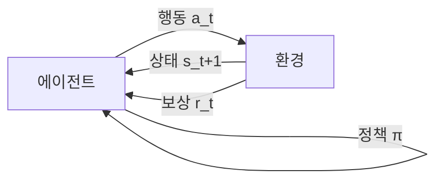

# 강화학습 (Reinforcement Learning)

강화학습(RL)은 에이전트(agent)가 환경(environment)과 상호작용하며 **보상(reward)을 최대화하는 행동 정책(policy)을 학습**하는 머신러닝 패러다임이다. 지도학습과 달리 정답 레이블이 없으며, 행동의 결과로 얻는 스칼라 신호만으로 학습이 진행된다.

## 기본 루프: 에이전트-환경 상호작용

에이전트는 현재 상태를 관측하고 정책에 따라 행동을 선택한다. 환경은 그 행동을 받아 새로운 상태와 보상을 반환한다. 이 사이클이 반복되며 에이전트는 누적 보상(return)을 최대화하는 방향으로 정책을 개선한다.

## 마르코프 결정 과정 (MDP)

강화학습의 수학적 토대는 **마르코프 결정 과정(Markov Decision Process, MDP)**이다. MDP는 다음 5-튜플로 정의된다:

| 기호 | 의미 |
|------|------|
| $\mathcal{S}$ | 상태 공간 (state space) |
| $\mathcal{A}$ | 행동 공간 (action space) |
| $P(s'\|s, a)$ | 전이 확률 (transition probability) |
| $R(s, a)$ | 보상 함수 (reward function) |
| $\gamma \in [0, 1)$ | 할인율 (discount factor) |

**마르코프 성질**: 다음 상태 $s_{t+1}$은 현재 상태 $s_t$와 행동 $a_t$에만 의존하며, 이전 이력에는 무관하다.

## 핵심 개념

### 정책 (Policy)

정책 $\pi(a|s)$는 상태 $s$에서 행동 $a$를 선택할 확률 분포다.

- **결정론적 정책 (deterministic)**: $\pi(s) = a$ - 주어진 상태에서 항상 동일한 행동
- **확률론적 정책 (stochastic)**: $\pi(a|s) \in [0,1]$ - 확률 분포로 행동 선택

### 가치 함수 (Value Function)

정책 $\pi$를 따를 때 기대 누적 보상을 추정한다.

- **상태 가치 함수**: $V^\pi(s) = \mathbb{E}_\pi\left[\sum_{t=0}^{\infty} \gamma^t r_t \mid s_0 = s\right]$
- **행동 가치 함수 (Q-함수)**: $Q^\pi(s, a) = \mathbb{E}_\pi\left[\sum_{t=0}^{\infty} \gamma^t r_t \mid s_0 = s, a_0 = a\right]$
- **어드밴티지 함수**: $A^\pi(s, a) = Q^\pi(s, a) - V^\pi(s)$ — 특정 행동이 평균 대비 얼마나 좋은지

### 탐색 vs. 활용 (Exploration vs. Exploitation)

RL의 근본적 딜레마다. 지금까지 학습한 정책을 **활용(exploit)**할지, 새로운 행동을 **탐색(explore)**할지 균형을 맞춰야 한다.

- $\epsilon$-greedy: 확률 $\epsilon$로 무작위 탐색, $1-\epsilon$으로 최선 행동 선택
- Entropy bonus: 정책 엔트로피를 보상에 더해 다양한 행동 장려

## 알고리즘 분류

### On-policy vs. Off-policy

| 구분 | 설명 | 대표 알고리즘 |
|------|------|-------------|
| **On-policy** | 현재 정책으로 수집한 데이터로만 학습 | PPO, REINFORCE, A3C |
| **Off-policy** | 과거/다른 정책 데이터도 재사용 가능 | DQN, SAC, TD3 |

On-policy는 안정적이나 샘플 효율이 낮고, off-policy는 샘플 효율이 높으나 수렴이 까다롭다.

### Model-based vs. Model-free

| 구분 | 설명 | 장단점 |
|------|------|--------|
| **Model-free** | 환경 전이 모델 없이 경험에서 직접 학습 | 단순하나 샘플 비효율 |
| **Model-based** | 환경 모델을 학습하고 내부 시뮬레이션 활용 | 샘플 효율 높으나 모델 오차 위험 |

관련 페이지: [[model-based-rl]]

### 주요 알고리즘 계통

- **Policy Gradient**: 정책을 직접 최적화. REINFORCE, Actor-Critic
- **PPO (Proximal Policy Optimization)**: Clipping으로 급격한 정책 변화 방지. LLM 학습에 가장 널리 쓰임 - [[ppo-for-llms]]
- **Q-Learning / DQN**: Q-함수를 신경망으로 근사. 이산 행동 공간에 적합
- **SAC (Soft Actor-Critic)**: 엔트로피 최대화 + 오프-폴리시. 연속 행동에 강함

## LLM 학습과의 연결

LLM 후처리 단계에서 RL은 핵심 역할을 한다.

### RLHF (Reinforcement Learning from Human Feedback)

사람의 선호도 비교(A vs. B)로 보상 모델(RM)을 학습한 뒤, PPO로 LLM 정책을 최적화한다. InstructGPT, Claude, ChatGPT의 기반 기술이다. 관련 페이지: [[rlhf-pipeline]]

### RLVR (Reinforcement Learning from Verifiable Rewards)

수학, 코드처럼 **자동 검증 가능한 보상**을 활용하는 방식. 인간 레이블 없이 대규모 RL 학습이 가능하다. DeepSeek-R1, Qwen-2.5 등에서 추론 능력 향상에 사용됐다. 관련 페이지: [[rlvr]]

### 핵심 도전 과제

- **희소 보상(sparse reward)**: 결과를 얻기까지 보상이 없어 신호가 부족
- **신용 할당(credit assignment)**: 어느 행동이 최종 보상에 기여했는지 특정 어려움 - [[credit-assignment-rl]]
- **KL 발산 페널티**: LLM RL에서 사전학습 지식 망각 방지 - [[kl-divergence-penalty]]
- **보상 해킹**: 보상 모델의 결함을 이용해 원치 않는 행동 학습

## 관련 문서

- [[reinforcement-learning-for-llm]] - LLM 특화 RL 기법 총람
- [[rlhf-pipeline]] - RLHF 전체 파이프라인
- [[rlvr]] - 검증 가능 보상 RL
- [[ppo-for-llms]] - PPO 알고리즘 상세
- [[agentic-rl]] - 에이전트 환경에서의 RL
- [[rlaif]] - AI 피드백 기반 RL
- [[kl-divergence-penalty]] - KL 페널티 기법
- [[credit-assignment-rl]] - 신용 할당 문제
- [[rl-scaling-laws]] - RL 스케일링 법칙
- [[model-based-rl]] - 모델 기반 RL
- [[offline-reinforcement-learning]] - 오프라인 RL
- [[hierarchical-rl]] - 계층적 RL
- [[process-reward-models]] - 프로세스 보상 모델
