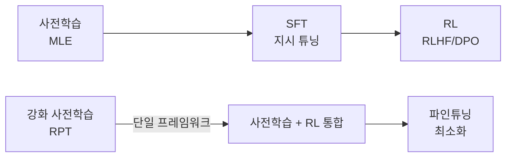

# 강화 사전학습 (Reinforcement Pre-Training / RPT)

## 개요

강화 사전학습(Reinforcement Pre-Training, RPT)은 Microsoft Research, Tsinghua University, Peking University가 공동 제안한 사전학습 패러다임이다. 기존의 다음 토큰 예측(next-token prediction) 방식에 강화학습(Reinforcement Learning, RL)을 통합해, **어노테이션 없이 RL로 사전학습**하는 접근법이다.

## 핵심 아이디어

기존 사전학습은 정답 토큰과의 크로스엔트로피(cross-entropy) 손실을 최소화하는 방식이다. RPT는 이를 **순차적 의사결정 문제(sequential decision-making)**로 재구성한다.

- **상태(State)**: 현재까지 생성된 토큰 시퀀스
- **행동(Action)**: 다음 토큰 선택
- **보상(Reward)**: 선택한 토큰이 실제 정답 토큰인지 여부 (이진 검증 가능 보상)

이 구조에서 보상은 외부 어노테이터 없이 **데이터 자체에서 자동 계산**된다. 정답 토큰이 이미 텍스트 코퍼스에 존재하기 때문이다.

## RPT 파이프라인

```mermaid
flowchart TD
    Corpus[텍스트 코퍼스\n인터넷 데이터 등] --> Tokenize[토크나이제이션]
    Tokenize --> State[현재 상태\n이전 토큰 시퀀스]
    State --> Policy[정책 모델\nLLM]
    Policy --> Action[토큰 예측\n행동 선택]
    Action --> Verify[보상 계산\n실제 토큰과 비교]
    Verify -->|이진 보상 r ∈ {0,1}| Update[정책 경사 업데이트\nPolicy Gradient]
    Update --> Policy
```

## 기존 사전학습과의 차이

| 항목 | 표준 사전학습 (MLE) | 강화 사전학습 (RPT) |
|------|-------------------|------------------|
| 학습 목표 | 크로스엔트로피 손실 최소화 | 누적 보상 최대화 |
| 최적화 방식 | 교사 강제(teacher forcing) | 정책 경사(policy gradient) |
| 탐험(exploration) | 없음 (항상 정답 제공) | 있음 (다양한 토큰 시도) |
| 어노테이션 | 불필요 (자기지도) | 불필요 (자동 보상) |
| 에러 노출 | 없음 (훈련 시 정답만 입력) | 있음 (자체 예측 토큰 사용) |

기존 MLE 방식은 **노출 편향(exposure bias)** 문제가 있다. 학습 시에는 항상 정답 토큰이 입력되지만, 추론 시에는 자체 예측 토큰이 입력되는 불일치가 발생한다. RPT는 자체 예측 토큰으로 다음 단계를 진행하므로 이 편향을 줄인다.

## SFT+RL 통합 관점

RPT는 사전학습과 강화학습 사이의 경계를 흐린다.



RPT가 성숙하면 "사전학습 후 RL" 두 단계를 단일 학습 루프로 압축할 가능성이 있다.

## 검증 가능한 보상 (Verifiable Reward)

RPT의 보상은 RLVR(Reinforcement Learning from Verifiable Rewards)의 사전학습 확장판이다.

- **수학 문제**: 최종 답안 일치 여부
- **코드 생성**: 컴파일 및 테스트 통과 여부
- **다음 토큰 예측**: 코퍼스 정답 토큰과 일치 여부 (RPT 핵심)

어노테이션이 필요 없어 인터넷 규모 데이터에 적용 가능하다는 점이 RLHF 대비 결정적 장점이다.

## 현황 및 한계

- 연구 단계에서 표준 MLE 대비 일부 추론 태스크에서 향상 확인
- 정책 경사 기반 학습은 MLE보다 학습이 불안정하고 컴퓨트 비용이 높음
- 대규모(100B+) 모델에서의 검증은 아직 제한적
- 탐험-활용 트레이드오프(exploration-exploitation trade-off) 조절이 중요한 하이퍼파라미터

## 관련 문서

- [[rlvr]] - 검증 가능한 보상으로 RL 학습
- [[Agentic RL]] - 에이전트 태스크에서의 RL 적용
- [[pretraining-pipeline-e2e]] - 기존 사전학습 전체 흐름
- [[continual-learning-llm]] - 온라인 적응과 RPT의 연결점
