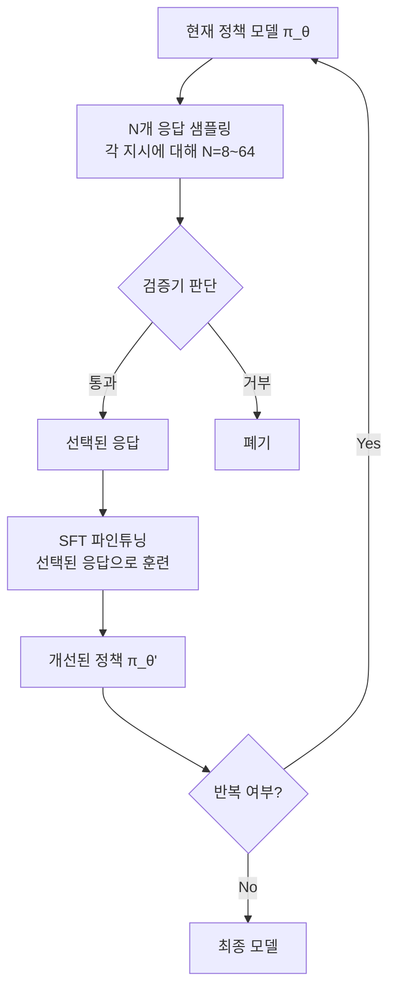

# Rejection Sampling Fine-Tuning (ReST)

## 개요

Rejection Sampling Fine-Tuning(ReST, Reinforced Self-Training)은 LLM 자체가 생성한 응답 중 검증기(verifier) 또는 보상 모델이 통과시킨 샘플만으로 파인튜닝하는 기법이다. 정책(policy) 모델로 $N$개의 후보 응답을 샘플링한 뒤, 기준을 만족하는 응답만 선별하여 SFT 데이터로 사용한다는 점에서 [[best-of-n-sampling]]의 훈련 적용 버전이다.

## 핵심 아이디어

기존 SFT는 인간 작성 데모에 의존한다. ReST는 이를 다음과 같이 대체한다.

**핵심 루프**:
1. 현재 모델로 N개 샘플링 (Grow 단계)
2. 검증기가 정답/고품질 응답 필터링 (Filter 단계)
3. 필터링된 샘플로 SFT (Improve 단계)
4. 반복 (Self-Improvement Loop)

## 검증기 유형

ReST에서 "검증기"의 설계는 적용 도메인에 따라 크게 다르다.

| 도메인 | 검증 방법 | 신뢰도 |
|--------|-----------|--------|
| 수학 | 정답 일치 (GSM8K, MATH) | 높음 (결정적) |
| 코드 | 테스트 케이스 실행 | 높음 (결정적) |
| 일반 QA | 보상 모델 점수 | 중간 (확률적) |
| 창작 | LLM-as-Judge | 낮음 (주관적) |

수학과 코드는 검증 신뢰도가 높아 ReST 효과가 가장 뚜렷하게 나타난다. [[rlvr]] 프레임워크도 이 원리를 활용한다.

## ReST vs. ReST$^{EM}$

Google DeepMind는 ReST의 Expectation-Maximization 변형인 **ReST$^{EM}$**을 제안했다.

| 방식 | 특징 |
|------|------|
| 기본 ReST | 이분법적 필터 (통과/거부) |
| ReST$^{EM}$ | 보상 점수에 따른 가중치 적용 |

ReST$^{EM}$은 E-step(현재 정책으로 샘플링 + 필터링)과 M-step(필터링된 샘플로 SFT)을 교대로 반복하는 EM 알고리즘 해석을 명시화한 것이다. 이론적으로 더 엄밀하며 수렴 보장이 있다.

## Best-of-N과의 관계

[[best-of-n-sampling]]은 추론 시점(inference time)에 N개 샘플 중 최상을 선택하는 기법이다. ReST는 이를 **훈련 시점**으로 내면화한다.

즉, ReST는 Best-of-N의 능력을 모델 파라미터에 **증류(distill)**하는 과정으로 볼 수 있다.

## 반복 ReST와 자기 개선

ReST를 여러 라운드 반복하면 모델이 단계적으로 향상된다.

**분포 이동 고려사항**:
- 각 라운드에서 현재 정책으로 재샘플링하는 것이 중요하다. 이전 라운드의 데이터를 재사용하면 **분포 오염(off-policy contamination)**이 발생한다.
- 라운드가 거듭될수록 검증기 통과율이 높아지므로 난이도를 점진적으로 올리거나 더 엄격한 검증기로 교체한다.
- 너무 많은 라운드는 **분포 붕괴**: 모델이 검증기를 해킹하는 방향으로 특화될 수 있다.

## 실용적 구현 고려사항

**샘플 수 N 선택**:
- N이 클수록 통과 샘플 수가 많아지나 연산 비용 증가
- 검증기 통과율이 10-30%가 되도록 N을 조정하는 것이 경험적 권장
- 온도(temperature) 조절: 너무 낮으면 다양성 부족, 너무 높으면 품질 저하

**데이터 혼합**:
- 이전 SFT 데이터와 ReST 데이터를 혼합해 catastrophic forgetting 방지
- 통과율이 매우 낮은 지시는 제거하거나 난이도를 낮춰 재생성

## 관련 문서

- [[rlvr]] - 검증 가능한 보상 기반 강화학습 (ReST의 확장)
- [[best-of-n-sampling]] - ReST의 추론 시점 버전
- [[synthetic-data-generation-pipeline]] - ReST 데이터 생성의 전 단계
- [[iterative-dpo]] - 반복 자기 개선의 다른 접근법
- [[self-play-training]] - 자기 대전 기반 개선과의 비교
