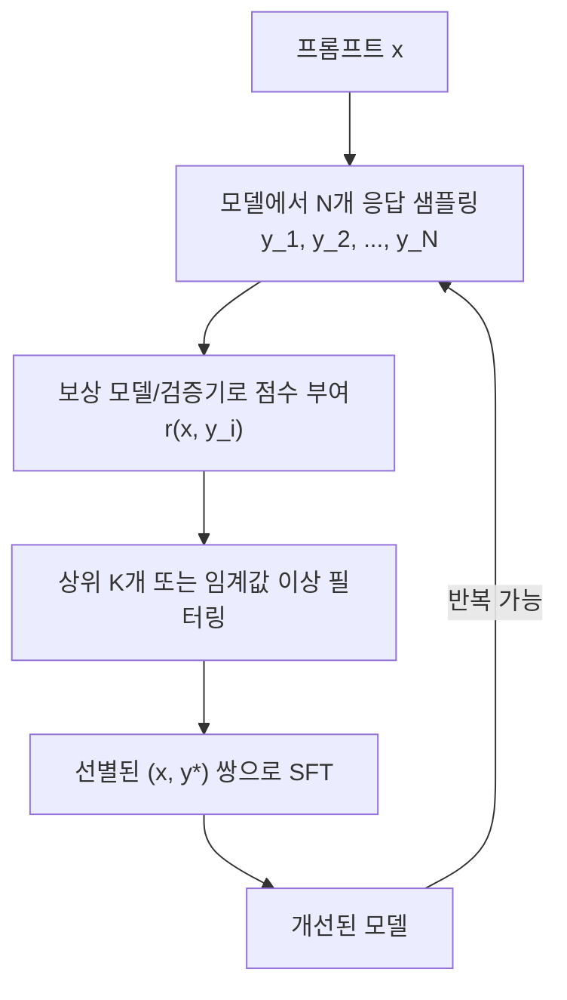
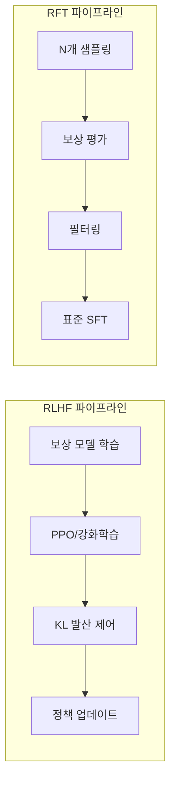

# 거부 샘플링 미세조정 (Rejection Sampling Fine-Tuning)

## 정의

**거부 샘플링 미세조정(Rejection Sampling Fine-Tuning, RFT/RS-FT)**은 모델에서 다수의 응답을 샘플링한 뒤 보상 모델이나 검증기로 품질을 평가하고, 높은 점수를 받은 응답만 선별하여 지도 학습(SFT)을 수행하는 후학습(post-training) 기법이다. RLHF의 복잡한 강화학습 루프 없이도 모델 출력 품질을 크게 향상시킬 수 있어, 실무에서 널리 채택되고 있다.

핵심 아이디어는 단순하다: **모델이 이미 생성할 수 있는 최상의 응답을 찾아내어, 그 응답을 항상 생성하도록 학습시키는 것**이다.

## 핵심 메커니즘

### 파이프라인

이 다이어그램은 RFT의 핵심 루프를 보여준다. 샘플링 -> 평가 -> 필터링 -> 학습의 4단계가 반복될 수 있다.

### 단계별 상세

1. **다중 샘플링**: 주어진 프롬프트 x에 대해 현재 정책(모델) $\pi_\theta$에서 N개의 응답을 생성한다. 일반적으로 N = 8-256 범위를 사용하며, 온도(temperature)를 높여 다양성을 확보한다.

2. **품질 평가**: 각 응답 $y_i$에 대해 보상 모델 $r(x, y_i)$로 점수를 매긴다. 수학/코딩 문제의 경우 정답 검증기(verifier)를 사용하면 더 정확한 이진 피드백을 얻을 수 있다.

3. **필터링 전략**:
   - **Top-K**: 보상 점수 상위 K개만 선택
   - **임계값(Threshold)**: 일정 점수 이상만 선택
   - **Best-of-N**: 가장 높은 점수의 응답 1개만 선택 ([[best-of-n-sampling]] 참조)

4. **SFT 학습**: 선별된 (프롬프트, 우수응답) 쌍으로 [[supervised-fine-tuning|지도 미세조정]]을 수행한다. 표준 교차 엔트로피 손실을 사용하며, 기존 SFT 인프라를 그대로 활용할 수 있다.

### Best-of-N과의 관계

Best-of-N 샘플링은 추론 시점(inference-time)에 N개를 생성하여 최선을 선택하는 기법이고, RFT는 학습 시점(training-time)에 이를 적용하여 모델 자체를 개선한다. RFT는 Best-of-N의 효과를 모델에 내재화(internalize)시키는 것으로 볼 수 있다.

| 구분 | Best-of-N (추론) | RFT (학습) |
|------|------------------|------------|
| 적용 시점 | 매 추론마다 | 학습 단계에서 1회 |
| 비용 | 추론 비용 N배 증가 | 학습 비용 증가, 추론 비용 동일 |
| 효과 지속 | 일시적 | 영구적 (모델에 내재화) |
| N 요구량 | 매번 N개 생성 필요 | 학습 데이터 구축 시만 필요 |

## STaR와의 연결

**STaR(Self-Taught Reasoner, Zelikman et al., 2022)**은 RFT의 핵심 아이디어를 추론 능력 향상에 적용한 선구적 연구다. STaR의 과정은 다음과 같다.

1. 모델이 질문에 대해 추론 과정(rationale)과 답변을 생성
2. 정답과 대조하여 맞은 것만 필터링
3. 틀린 질문에 대해서는 정답을 힌트로 제공하여 합리화(rationalization) 수행
4. 필터링된 데이터 + 합리화 데이터로 SFT
5. 반복

STaR가 보여준 것은 **모델이 스스로 학습 데이터를 개선할 수 있다**는 것이며, 이는 이후 RFT, Self-Play, [[grpo|GRPO]] 등으로 이어지는 자기 향상(self-improvement) 패러다임의 출발점이다.

## RLHF 대비 장단점

### RFT vs RLHF 비교

| 항목 | RLHF (PPO) | RFT |
|------|-----------|-----|
| 학습 안정성 | 낮음 (PPO 하이퍼파라미터 민감) | 높음 (표준 SFT) |
| 구현 복잡도 | 높음 (4개 모델 동시 운용) | 낮음 (샘플링 + SFT) |
| 탐색 능력 | 강함 (RL의 온라인 탐색) | 제한적 (현재 정책 범위 내) |
| 인프라 요구 | 높음 (다중 GPU 동기화) | 중간 (배치 샘플링 + SFT) |
| 데이터 효율성 | 높음 (온라인 피드백) | 낮음 (N개 중 소수만 활용) |

### RFT의 강점

- **구현 단순성**: 기존 SFT 코드와 보상 모델만 있으면 즉시 적용 가능
- **학습 안정성**: RL의 보상 해킹(reward hacking), 학습 불안정성 문제 회피
- **병렬화 용이**: 샘플링 단계를 대규모 병렬로 처리 가능
- **점진적 적용**: 한 라운드만 수행해도 효과가 있으며, 반복하면 추가 개선

### RFT의 한계

- **현재 정책에 종속**: 모델이 생성할 수 없는 응답은 학습할 수 없음
- **보상 모델 의존**: 보상 모델의 품질이 RFT의 상한을 결정
- **계산 비용**: N이 클수록 샘플링 비용이 선형 증가
- **분포 편향**: 반복 수행 시 모델이 자신의 편향을 강화할 위험

## 활용 사례

### Meta Llama 시리즈

Meta의 Llama 2, Llama 3 후학습 파이프라인에서 RFT는 핵심 단계다. [[post-training-pipeline-e2e|후학습 파이프라인]]에서 SFT 이후, RLHF 이전(또는 대안으로) RFT를 적용하여 모델 품질을 끌어올린다. Llama 2 기술 보고서에 따르면 RFT 단계만으로도 유의미한 성능 향상을 관찰했다.

### 수학 추론

GSM8K, MATH 같은 수학 벤치마크에서 RFT는 특히 효과적이다. 수학 문제는 정답을 검증할 수 있으므로(verifiable reward), 보상 모델 대신 정답 검증기를 사용하면 완벽한 필터링이 가능하다. 이는 [[reward-model-training|보상 모델 학습]]의 노이즈를 우회하는 장점이 있다.

### 코드 생성

코드 역시 실행 결과로 정확성을 검증할 수 있는 영역이다. 테스트 케이스 통과 여부를 보상 신호로 사용하여 RFT를 적용하면, 보상 모델 없이도 코드 품질을 개선할 수 있다.

## 실무 관점

RFT는 "가장 단순하면서도 효과적인 후학습 기법"이라 불릴 만하다. 실무 적용 시 고려사항은 다음과 같다.

1. **N의 선택**: 일반적으로 N=16-64가 비용 대비 효과적. N을 늘리면 더 좋은 샘플을 찾을 확률이 높아지지만, 수확 체감이 발생
2. **온도 설정**: 다양성과 품질의 균형. 너무 낮으면 비슷한 응답만, 너무 높으면 품질이 떨어짐
3. **보상 모델 품질**: RFT의 성능 상한은 보상 신호의 품질에 의해 결정됨. 가능하면 검증 가능한 보상(verifiable reward)을 사용
4. **반복 횟수**: 1-3회 반복이 일반적. 과도한 반복은 분포 축소(distribution collapse)를 유발

## 관련 문서

- [[supervised-fine-tuning]] -- RFT의 학습 단계에서 사용하는 기반 기법
- [[reward-model-training]] -- RFT의 평가 단계에서 사용하는 보상 모델
- [[post-training-pipeline-e2e]] -- RFT가 포함되는 전체 후학습 파이프라인
- [[grpo]] -- RFT와 유사한 그룹 기반 정책 최적화
- [[direct-preference-optimization]] -- RFT의 대안적 후학습 기법
- [[rlhf-pipeline]] -- RFT가 단순화하려는 전체 RLHF 파이프라인
