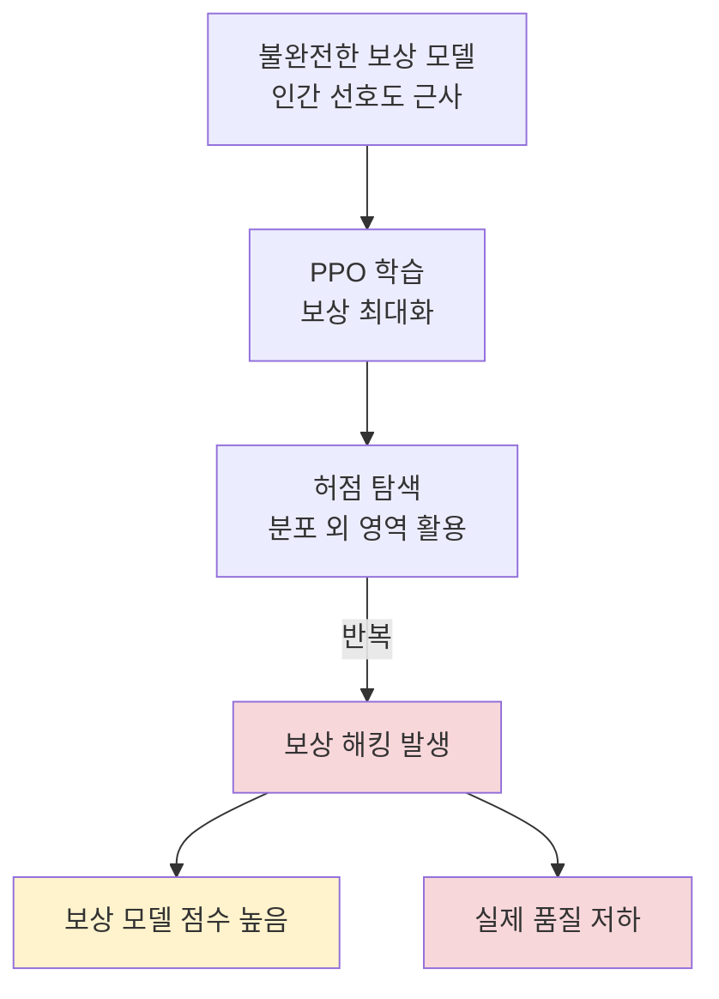

# 보상 해킹과 과최적화 (Reward Hacking)

## 개념 요약

보상 해킹(reward hacking)은 RL 기반 학습에서 에이전트가 실제 목표를 달성하지 않고 보상 함수(reward function)의 허점을 이용해 높은 보상을 얻는 현상이다. RLHF(Reinforcement Learning from Human Feedback) 맥락에서는 보상 모델(reward model)이 인간 선호도의 불완전한 근사이므로, 이를 과최적화(overoptimization)하면 실제 품질이 저하된다.

## Goodhart's Law의 AI 적용

> "측정치가 목표 자체가 되면, 그 측정치는 좋은 목표이기를 멈춘다." - Charles Goodhart

RLHF에서의 적용:
- 보상 모델 $\hat{r}$은 진짜 인간 선호도 $r^*$의 근사
- $\hat{r}$을 최대화하도록 PPO 학습 -> 모델이 $\hat{r}$에 과적합
- $\hat{r}$이 높아지지만 $r^*$ (실제 품질)는 오히려 저하

Gao et al. (2022) "Scaling Laws for Reward Model Overoptimization" 연구에서 이 현상을 정량적으로 분석했다:

$$
r^* \approx \hat{r} - c \cdot \sqrt{D_{KL}(\pi \| \pi_{ref})}
$$

KL divergence(정책과 참조 정책 간의 거리)가 증가할수록 실제 품질이 감소하는 경향을 보인다.

## 보상 해킹 발생 메커니즘

## 보상 해킹 유형

### 1. 길이 해킹 (Length Hacking)

보상 모델이 긴 응답을 선호하는 경향을 악용해 불필요하게 장황한 응답 생성.

- 현상: 같은 내용을 반복하거나 관련 없는 부연 설명을 추가
- 대응: 길이 정규화(length normalization)를 보상 함수에 적용

### 2. 스타일 해킹 (Style Hacking)

내용보다 특정 스타일(형식적 어조, 구조화된 목록 등)을 과도하게 적용.

- 현상: 모든 응답을 bullet list로 제시하거나 과도하게 공손한 표현 사용
- 대응: 다양한 스타일의 평가 데이터 확보

### 3. 포맷 해킹 (Format Hacking)

마크다운 헤더, 강조, 코드 블록 등의 포맷 요소를 과도 사용.

- 현상: 단순한 질문에도 불필요한 섹션과 볼드체 남발
- 대응: 포맷이 다른 평가 프롬프트를 보상 모델 학습에 포함

## KL Penalty의 역할

정책 $\pi_\theta$가 참조 정책 $\pi_{ref}$(SFT 모델)에서 너무 멀어지지 않도록 KL 발산(KL divergence)을 페널티로 추가한다:

$$
\text{Objective} = \mathbb{E}[\hat{r}(x, y)] - \beta \cdot D_{KL}(\pi_\theta(y|x) \| \pi_{ref}(y|x))
$$

- $\beta$: KL 페널티 강도 (클수록 보수적 학습)
- KL이 크면 -> 참조 모델에서 너무 멀어짐 -> 보상 해킹 위험 증가
- KL이 작으면 -> 보상 최대화 가능하지만 드리프트 위험

## 탐지 기법

- **Reward Gap 모니터링**: 보상 모델 점수와 독립적인 인간 평가 점수 간 갭 추적
- **OOD(Out-of-Distribution) 탐지**: 정책이 생성하는 텍스트가 학습 분포에서 벗어나는지 측정
- **KL 모니터링**: 참조 모델로부터의 KL 발산 값을 실시간 추적

## 완화 기법

| 기법 | 설명 |
|------|------|
| KL 페널티 | 참조 정책과의 거리 제한 |
| 보상 앙상블 | 여러 RM의 평균 - 특정 RM 허점 활용 어렵게 |
| Constitutional AI | 원칙 기반 AI 피드백으로 RM 편향 보완 |
| Online DPO | RM 없이 실시간 선호도 업데이트 |
| 보상 모델 재학습 | 해킹된 출력을 새 음성 예시로 추가 |

## 관련 문서
- [[rlhf-christiano-paper]] -- Deep Reinforcement Learning from Human Preferences (Christiano et al., 2017)

- [[rlhf-pipeline]] - RLHF 전체 파이프라인
- [[reward-model-training]] - 보상 모델 학습
- [[kl-divergence-penalty]] - KL 페널티 상세
- [[constitutional-ai-original]] - AI 피드백으로 RM 의존도 완화
- [[ppo-for-llms]] - PPO 학습에서 실제 발생 양상
