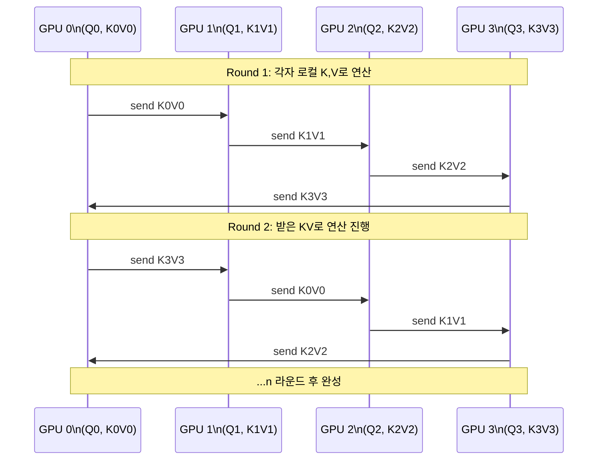
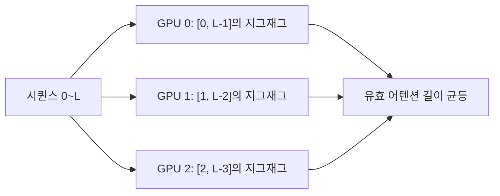

# Ring Attention

## 개요

Ring Attention은 Lianmin Zheng, Hao Liu 등이 2023년에 제안한 분산 어텐션 알고리즘이다. 긴 시퀀스를 여러 GPU에 청크로 분할한 뒤, KV(Key-Value) 블록을 링(ring) 토폴로지로 순환시키면서 각 GPU가 로컬 Q 블록과 도착하는 KV 블록으로 어텐션을 계산한다. 통신과 연산을 오버랩하여 추가 통신 지연 없이 시퀀스 차원을 무한히 확장할 수 있는 것이 핵심 특징이다.

## 핵심 아이디어

표준 [[context-parallelism]]의 나이브 분할은 어텐션 계산 전에 모든 KV를 수집(all-gather)해야 한다. 시퀀스가 길수록 통신 병목이 커진다.

Ring Attention은 다음 원칙으로 이 문제를 해결한다:

- 각 GPU는 자신의 Q 청크를 로컬에 고정
- KV 청크는 링을 따라 한 스텝씩 이웃 GPU로 전달
- GPU는 KV가 도착하는 동안 이전 KV로 연산을 수행 (통신-연산 오버랩)
- $n$ GPU이면 $n$ 라운드 후 모든 Q×K 조합이 계산 완료

## 알고리즘 상세

각 라운드에서 GPU는 이전 라운드에서 수신한 KV 블록으로 어텐션 부분합을 계산하고, 동시에 다음 KV 블록을 전송한다. Flash Attention의 온라인 softmax 알고리즘(누적 최댓값과 분모를 별도 추적)이 이 분산 누적 계산을 가능하게 한다.

## Flash Attention과의 결합

표준 어텐션은 전체 KV 행렬이 있어야 softmax를 정확히 계산할 수 있다. Ring Attention은 Flash Attention의 **online softmax** 기법을 활용해 이 제약을 극복한다:

- 각 블록에서 지역 최댓값 $m_i$와 분모합 $\ell_i$를 유지
- 다음 블록 처리 시 기존 누적값을 수치적으로 안전하게 보정
- 최종 라운드 완료 후 정확한 softmax 출력 도출

수식으로는 온라인 softmax의 보정 인자:

$$\ell_{new} = e^{m_{old} - m_{new}} \cdot \ell_{old} + \ell_{local}$$

$$O_{new} = \frac{e^{m_{old} - m_{new}} \cdot \ell_{old} \cdot O_{old} + \ell_{local} \cdot O_{local}}{\ell_{new}}$$

## Causal Masking과 부하 균형

[[long-context-training]]에서 중요한 실용적 문제는 인과적 마스크(causal mask) 하에서의 부하 불균형이다. 순방향으로 분할하면 GPU 0이 가장 짧은 어텐션, GPU $n-1$이 가장 긴 어텐션을 처리한다.

해결책: **지그재그 링(zig-zag ring)**

각 GPU가 시퀀스의 앞부분과 뒷부분을 동시에 담당하도록 인터리빙하면 어텐션 연산량이 GPU 간에 고르게 분배된다.

## 메모리 절감 효과

$n$ GPU, 시퀀스 길이 $L$, head dimension $d$에서:

- GPU당 Q 메모리: $O(L/n \cdot d)$
- GPU당 KV 메모리 (한 블록): $O(L/n \cdot d)$
- 총 GPU당 메모리: $O(L/n)$ (vs 단일 GPU $O(L)$)

이론적으로는 GPU를 추가할수록 선형으로 더 긴 시퀀스를 처리할 수 있다. 실제로는 통신 오버헤드와 링 크기($n$)의 트레이드오프가 존재한다.

## 구현 라이브러리

| 라이브러리 | 특징 |
|-----------|------|
| ring-flash-attention (PyPI) | PyTorch, triton 기반 레퍼런스 구현 |
| Megatron-LM CP | 프로덕션 수준, 지그재그 지원 |
| EasyContext | 다양한 CP 변형 통합 |
| Hugging Face Transformers | 실험적 지원 중 |

## 관련 문서

- [[context-parallelism]] - Context 병렬화 개요 및 다른 변형 방식
- [[long-context-training]] - 초장문 훈련 전략 전반
- [[flash-attention]] - 온라인 softmax 기반 효율적 어텐션 커널
- [[distributed-training-overview]] - 분산 훈련 전체 구조
