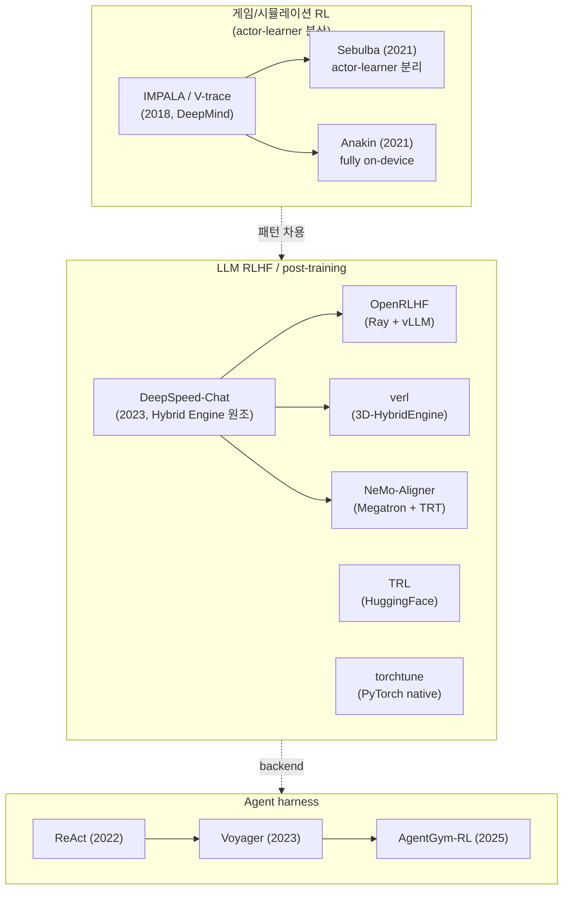
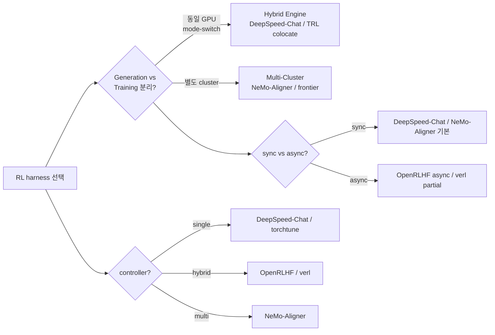

# RL Harness Frameworks 비교 - 분산 RL 학습 인프라 통합

## 개요

RL 학습 harness는 두 흐름이 합류하는 영역이다. **(1) 게임/시뮬레이션 RL** 진영에서 출발한 IMPALA / Sebulba / Anakin 같은 actor-learner 토폴로지 라인과, **(2) LLM RLHF / post-training** 진영에서 출발한 DeepSpeed-Chat / OpenRLHF / verl / NeMo-Aligner / TRL / torchtune 라인이다. 양쪽 모두 결국 **rollout cluster ↔ training cluster ↔ reward/critic cluster** 사이의 통신과 메모리 효율을 푸는 문제로 수렴한다.

이 페이지는 12개 harness raw 분석을 종합한 통합 비교 hub다.

## 두 진영의 분리

## 1. 게임/시뮬레이션 RL — actor-learner 라인

| 시스템 | 연도 | 주체 | 토폴로지 | 알고리즘 | 처리량 |
|--------|------|------|---------|---------|--------|
| [[impala-vtrace]] | 2018 | DeepMind | single-learner / multi-actor (gRPC) | V-trace | 250K frames/s |
| [[sebulba-podracer]] | 2021 | DeepMind | 단일 TPU 호스트, actor-learner 분리 | V-trace plug-in | Atari 200M / 1h |
| [[anakin-podracer]] | 2021 | DeepMind | fully on-device, 통합 | jax.pmap collective | 5M steps/s |

핵심: **actor-learner 분리 → 단일 호스트 압축 → fully on-device** 진화. JAX/XLA의 `pmap`/`pjit` API 도입이 이 흐름의 인프라적 근거.

## 2. LLM RLHF / post-training 라인

### 비교표 (분산 / 컨트롤러 / engine 축)

| 시스템 | 학습 backend | rollout backend | 컨트롤러 | engine 패턴 | sync/async | 강점 |
|--------|-------------|----------------|---------|------------|-----------|------|
| [[deepspeed-chat]] | DeepSpeed ZeRO | DeepSpeed-Inference | single | Hybrid Engine (원조) | sync | 단일 GPU 가능 |
| [[trl-library]] | accelerate / FSDP / DeepSpeed | vLLM (colocate / server) | single | colocate-shrink | sync | HF 생태계 |
| [[openrlhf]] | DeepSpeed ZeRO-3 | vLLM | hybrid (Ray) | hybrid scheduling | async 옵션 | 첫 production-ready |
| [[verl-bytedance]] | FSDP2 / Megatron-LM | vLLM / SGLang | hybrid | 3D-HybridEngine | async + partial | 671B scale |
| [[nemo-aligner]] | Megatron-LM | TensorRT-LLM | multi (PyTriton) | TRT Refitter | async | 6.96x rollout 가속 |
| [[torchtune]] | FSDP2 / torchao | (외부 vLLM 약함) | single | 없음 | sync | PyTorch native |

### 알고리즘 커버리지

| 알고리즘 | DeepSpeed-Chat | TRL | OpenRLHF | verl | NeMo-Aligner | torchtune |
|---------|---------------|-----|----------|------|--------------|-----------|
| SFT | yes | yes | yes | yes | yes | yes |
| DPO | no | yes | yes | yes | yes | yes |
| PPO | yes | exp | yes | yes | yes | single only |
| GRPO | no | yes | yes | yes | no | WIP |
| DAPO | no | no | yes | **공식** | no | no |
| RLOO | no | yes | yes | yes | no | no |
| KTO/CPO/ORPO | no | yes | partial | partial | no | no |
| SteerLM | no | no | no | no | yes | no |
| SPIN | no | no | partial | partial | yes | no |

### 처리량 비교 (oss 자료 기준)

- OpenRLHF vs verl: 1.22~1.68x (1.5B~14B) — verl이 더 빠름
- OpenRLHF vs TRL: 3.1x — OpenRLHF가 빠름
- OpenRLHF vs DeepSpeed-Chat: 3.6x — OpenRLHF가 빠름
- verl HybridFlow: SOTA baseline 대비 1.53~20.57x throughput
- NeMo-Aligner TRT rollout: 6.96x (rollout 단독 측정)
- DeepSpeed-Chat: 기존 RLHF 대비 15x (자체 측정, 동시대 기준)

## 3. Agent harness 라인

| harness | 학습 | 인프라 의존 | 비고 |
|---------|------|------------|------|
| ReAct (2022) | gradient-free | LLM API | Thought-Action-Observation |
| AutoGPT (2023) | gradient-free | LLM + vector DB | self-prompt loop |
| [[voyager-agent]] (2023) | gradient-free | GPT-4 + skill DB | lifelong learning |
| AgentGym (2024) | SFT/BC | accelerate / DeepSpeed | cross-env generalist |
| AgentGym-RL (2025) | multi-turn RL | TRL / OpenRLHF + vLLM | long-horizon decision |

자세한 진화 흐름은 [[agent-training-harness-react-agentgym]] 참조.

## 4. 핵심 결정 축

### Axis 1 - Generation vs Training 분리

가장 큰 결정. **동일 GPU mode-switch**(Hybrid Engine 원조: DeepSpeed-Chat)는 자원 효율적이지만 메모리 압박이 크다. **별도 cluster**(NeMo-Aligner, frontier lab)는 비동기 + scale에 유리하다. verl의 3D-HybridEngine은 양쪽의 hybrid 답안.

### Axis 2 - Sync vs Async

기본은 sync (rollout-then-train). async + partial rollout은 GPU 유휴 시간을 줄이지만 off-policy 정도가 커져 학습 안정성 trade-off. OpenRLHF `--train.async_enable`, verl `partial_rollout`이 대표 옵션.

### Axis 3 - Single / Hybrid / Multi controller

single (master 한 명)은 단순하지만 SPMD scale 한계. multi (전부 SPMD)는 효율적이지만 알고리즘 작성이 어렵다. hybrid (verl, OpenRLHF)는 둘의 절충 — 데이터플로우는 single, 워커 계산은 multi.

### Axis 4 - rollout backend 선택

| 후보 | 장점 | 단점 |
|------|------|------|
| vLLM | 가장 널리 통합 | TP 변경 reshard 비용 |
| SGLang | 멀티턴 + tool 지원 | 통합 적음 |
| TensorRT-LLM | 최고 단일 throughput | NVIDIA 전용, 컴파일 복잡 |
| DeepSpeed-Inference | DeepSpeed 통합 | 후속 발전 정체 |

## 5. 메모리 / 처리량 최적화 공통 도구

- **FSDP2** (PyTorch native sharded data parallel) — torchtune, TRL, verl
- **DeepSpeed ZeRO-2/3** — DeepSpeed-Chat, OpenRLHF, TRL
- **Megatron-LM 3D parallelism** — NeMo-Aligner, verl
- **CPU/NVMe offload** — 모든 시스템
- **Reference model CPU swap** — 거의 모든 RLHF
- **vLLM PagedAttention** — TRL/OpenRLHF/verl
- **TensorRT-LLM Refitter** — NeMo-Aligner

## 6. 시스템 선택 가이드

### 단일 노드 ChatGPT-style 빠른 학습

→ [[deepspeed-chat]] 또는 [[trl-library]] (vLLM colocate)

### HF 생태계 + LoRA + 다양한 알고리즘

→ [[trl-library]] v1.x (Stable Surface)

### 다중 노드 production RLHF (8~64 GPU)

→ [[openrlhf]] (Ray + vLLM, async 옵션)

### 100+ 노드, 100B~700B 모델

→ [[verl-bytedance]] (3D-HybridEngine + Megatron) 또는 [[nemo-aligner]] (NVIDIA stack)

### NVIDIA Megatron 기존 인프라 보유

→ [[nemo-aligner]] (단, 2025-11 archive — NeMo-RL로 마이그레이션 검토)

### PyTorch native + 단일 노드 LoRA

→ [[torchtune]] (단, 2025 wind-down — 신규 적용은 신중)

### 게임/시뮬레이션 환경 RL (JAX 기반)

→ [[anakin-podracer]] / [[sebulba-podracer]] / Mava / Stoix

### Agent multi-turn RL (long-horizon)

→ [[long-horizon-rl-training-for-agents]] + AgentGym-RL on top of TRL/OpenRLHF/verl

## 7. 향후 흐름

- **vLLM hybrid scheduling 표준화** — 거의 모든 LLM RL framework이 vLLM 통합 중
- **Async + partial rollout** 보편화 — sync 한계가 점점 가시화
- **Megatron + FSDP2 결합** — 학습 backend 통합 추세
- **Agent RL** — multi-turn long-horizon이 새로운 1차 시장 ([[long-horizon-rl-training-for-agents]])
- **frontier lab proprietary stack** — 오픈소스 패턴이 frontier 안으로 역수입되거나 그 반대 ([[frontier-lab-rl-infra]])

## 관련 문서

### 게임/시뮬레이션 RL
- [[impala-vtrace]] - V-trace 분산 RL 원조
- [[sebulba-podracer]] - actor-learner 분리 변종
- [[anakin-podracer]] - fully on-device 변종

### LLM RLHF / post-training
- [[deepspeed-chat]] - Hybrid Engine 원조
- [[trl-library]] - HuggingFace post-training
- [[openrlhf]] - Ray + vLLM 첫 production
- [[verl-bytedance]] - 3D-HybridEngine
- [[nemo-aligner]] - NVIDIA Megatron stack
- [[torchtune]] - PyTorch native

### Agent harness
- [[voyager-agent]] - gradient-free lifelong
- [[agent-training-harness-react-agentgym]] - 진화 흐름
- [[long-horizon-rl-training-for-agents]] - multi-turn RL

### 관련 알고리즘 / 인프라
- [[rlhf]], [[rlhf-pipeline]] - RLHF 일반
- [[ppo-for-llms]], [[grpo]], [[dapo]] - 알고리즘
- [[direct-preference-optimization]] - DPO
- [[frontier-lab-rl-infra]] - Anthropic / OpenAI 패턴
- [[fsdp-vs-deepspeed]] - 분산 backend
