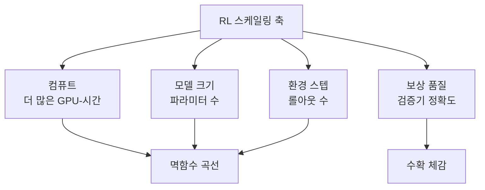

# RL Scaling Laws (ScaleRL)

강화학습(RL) 컴퓨트 규모에 따른 성능을 예측 가능한 곡선으로 모델링하는 방법론. 사전학습(pre-training)에서 성립한 스케일링 법칙(scaling laws)을 포스트 트레이닝(post-training) RL 단계로 확장한다.

## 왜 중요한가

Chinchilla 이후 사전학습 스케일링 법칙은 업계 표준이 됐지만, RL 포스트 트레이닝에서는 "얼마나 오래 훈련하면 얼마나 나아지는가"를 예측하는 공식이 없었다. Meta 주도의 40만 GPU-시간 규모 연구가 RL을 "예술"에서 "과학"으로 전환시키며 2026년 포스트 트레이닝 연구의 핵심 프레임워크로 자리잡았다.

## RL 스케일링의 주요 축

RL 스케일링은 단순히 컴퓨트를 늘리는 것이 아니라 네 축의 균형을 맞추는 문제다.

## 사전학습 vs RL 스케일링 차이

| 항목 | 사전학습 스케일링 | RL 스케일링 |
|------|-----------------|------------|
| 데이터 | 토큰 수 | 환경 스텝(롤아웃) 수 |
| 손실 함수 | 교차 엔트로피 | 보상 기대값 |
| 법칙 성립 조건 | 비교적 명확 | 태스크·보상 함수 의존성 높음 |
| 수확 체감 시점 | 예측 가능 | 태스크별 상이 |
| 로봇공학 적용 | - | 아직 불확실 (2025 기준) |

## 핵심 발견

- **멱함수 관계**: 컴퓨트를 $C$ 배 늘릴 때 성능은 $C^\alpha$ ($\alpha < 1$) 비율로 향상. 수확 체감 존재
- **보상 품질이 상한**: 보상 함수(검증기)가 부정확하면 컴퓨트를 아무리 늘려도 효과 없음
- **가치 기반 RL**: 가치 함수(value function) 크기와 정책(policy) 크기를 별도로 스케일해야 최적
- **로봇공학**: 연속 행동 공간(continuous action space)에서는 LLM RL과 다른 스케일링 거동 보임 (2025 기준 법칙 불명확)

## 실무 적용 관점

- **훈련 예산 배분**: RL 스케일링 곡선으로 "추가 컴퓨트 투자 대비 기대 성능 향상" 사전 추정 가능
- **조기 중단 기준**: 멱함수 곡선에서 수확 체감 진입 시점을 탐지해 불필요한 GPU 소비 방지
- **보상 설계 우선**: 검증기 정확도가 성능 상한을 결정하므로 컴퓨트 확장 전 보상 함수 품질 점검 필수
- **모델 크기 × 컴퓨트 균형**: 소형 모델에 과도한 RL 컴퓨트 투자보다 모델 크기를 먼저 확보하는 것이 효율적

## 미해결 문제

- 멀티 에이전트(multi-agent) 설정에서의 스케일링 거동
- 도구 사용(tool-use) 에이전트에 특화된 보상 스케일링
- 로봇공학에서의 RL 스케일링 (2025 기준 아직 초기)

## 대표 자료

- [The Art of Scaling Reinforcement Learning Compute for LLMs](https://arxiv.org/abs/2510.13786)
- [How to scale RL (Nathan Lambert, Interconnects)](https://www.interconnects.ai/p/the-new-rl-scaling-laws)
- [Scaling laws for robotics & RL: Not quite yet (Interconnects)](https://www.interconnects.ai/p/scaling-rl-axes)
- [Scaling Laws for Value-Based RL](https://value-scaling.github.io/)
- [What comes next with reinforcement learning (Interconnects)](https://www.interconnects.ai/p/what-comes-next-with-reinforcement)

## 관련 문서

- [[ai-hot-topics-2026-04]]
- [[on-policy-distillation|On-Policy Distillation]]
- [[corpus-grounded-self-play|Corpus-Grounded Self-Play (SPICE 계열)]]
- [[open-post-training-recipes|Open Post-Training Recipes (Tülu 3 / OLMo 3)]]
- [[test-time-training-and-self-improvement|Test-Time Training & Self-Improvement]]
