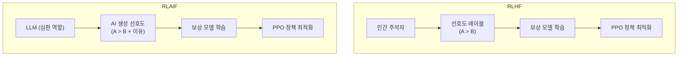

# RLAIF - AI 피드백 기반 강화학습

## 개요

RLAIF(Reinforcement Learning from AI Feedback)는 인간 주석자 대신 LLM이 피드백을 생성하여 선호도(preference) 데이터를 만들고, 이를 기반으로 정책 모델을 강화학습으로 정렬(alignment)하는 기법이다. Google DeepMind의 Lee et al.(2023) "RLAIF: Scaling Reinforcement Learning from Human Feedback with AI Feedback"에서 체계화되었다.

기존 [[rlhf-pipeline]]에서 인간이 수행하던 "어느 응답이 더 좋은가?" 판단을 LLM이 대신한다. 이를 통해 **인간 주석의 병목을 제거**하고 피드백 생성을 대규모로 확장하는 것이 핵심 동기다.

## RLHF와의 구조 비교



두 패러다임은 구조적으로 동일하다. 차이는 선호도 레이블의 출처가 인간인지 AI인지다. 나머지 보상 모델 학습과 PPO 최적화는 동일한 파이프라인을 사용한다.

## 핵심 메커니즘

### AI 심판 프롬프팅

RLAIF의 핵심은 LLM을 심판(judge)으로 프롬프팅하는 방법에 있다. 기본 형태:

```
다음 두 응답 중 더 유용하고 안전하며 정확한 응답을 선택하시오.

질문: {질문}
응답 A: {응답_A}
응답 B: {응답_B}

어느 응답이 더 좋은가? A인지 B인지 먼저 말하고, 이유를 설명하시오.
```

단순 선택 외에 **확률 캘리브레이션**도 가능하다: "A가 B보다 얼마나 더 좋은가를 0-10 점수로 매기시오." 소프트 레이블이 이진 레이블보다 더 풍부한 학습 신호를 제공한다.

### 직접 RLAIF (Direct RLAIF)

보상 모델을 별도로 학습하지 않고, LLM 심판을 직접 보상 함수로 사용하는 변형이다:

1. 정책 모델이 응답 생성
2. LLM 심판이 즉석에서 품질 점수 계산
3. 점수를 직접 보상으로 PPO 업데이트

보상 모델 학습 단계를 제거하므로 파이프라인이 단순해지지만, LLM 심판 호출 비용이 매 스텝마다 발생한다.

### 헌법적 AI와의 관계

[[constitutional-ai-original]](Constitutional AI, CAI)은 RLAIF의 한 특수 형태로 볼 수 있다. CAI에서 AI 피드백은 미리 정의된 "헌법(principles)"에 기반하여 생성된다:

- **SL-CAI 단계**: 모델이 자체 응답을 헌법 원칙으로 비판하고 수정 (AI supervised learning)
- **RL-CAI 단계**: 헌법에 따른 AI 선호도로 보상 모델 학습 후 RL 적용

RLAIF는 이 아이디어를 일반화하여 헌법 없이도 LLM 판단을 활용하는 더 범용적인 프레임워크다.

## 확장성과 품질

Lee et al.(2023)의 핵심 실험 결과:

| 지표 | RLHF | RLAIF |
|------|------|-------|
| 인간 선호율 (vs SFT 기준) | ~69% | ~71% |
| 무해성(harmlessness) | 비슷 | 비슷 |
| 유용성(helpfulness) | 비슷 | 비슷 |
| 주석 비용 | 높음 | 낮음 |
| 확장 가능성 | 인력 의존 | LLM 의존 |

흥미롭게도 RLAIF가 RLHF와 비슷하거나 약간 높은 인간 선호율을 보였다. 이는 인간 주석자의 일관성 문제(피로, 주관적 차이)보다 잘 설계된 AI 피드백이 더 안정적일 수 있음을 시사한다.

## 주요 도전 과제

### 위치 편향 (Position Bias)

LLM 심판은 프롬프트에서 먼저 제시된 응답을 선호하는 경향이 있다. 완화 방법:
- A/B 순서를 바꿔 두 번 평가 후 평균
- "먼저 두 응답을 동등하게 읽은 뒤 판단하라"는 지시 추가

### 자기 편향 (Self-Preference Bias)

심판 LLM이 자신과 스타일이 유사한 응답을 선호하는 경향. 정책 모델과 심판 모델이 같은 계열이면 이 편향이 강화될 수 있다.

### 편향 증폭

심판 LLM에 내재된 편향(성별, 문화, 형식 선호 등)이 RLAIF를 통해 정책 모델로 전달된다. 인간 피드백의 다양성이 오히려 이런 편향을 희석하는 역할을 하기도 한다.

### 최적 심판 모델 선택

심판이 될 LLM은 정책 모델보다 더 강력해야 한다. GPT-4를 심판으로 써서 GPT-3.5급 모델을 훈련하는 것이 전형적인 패턴이다. 심판이 정책 모델보다 약하면 선호도 데이터 품질이 보장되지 않는다.

## 실용적 변형들

- **RLAIF + RLHF 혼합**: 일부 데이터는 인간 주석, 나머지는 AI 주석으로 채우는 하이브리드 접근
- **체인-오브-쏘트 심판**: 이유 설명을 요구해 심판의 판단 품질 향상
- **다중 심판 앙상블**: 여러 LLM의 판단을 종합해 편향 감소
- **반복적 RLAIF**: 정책이 개선될수록 심판 기준도 함께 상향 조정

## 관련 문서
- [[generative-reward-model]] -- Generative Reward Model (GRM)

- [[rlhf-pipeline]] -- 인간 피드백 기반 RL 원조 파이프라인
- [[constitutional-ai-original]] -- 헌법 원칙 기반 AI 피드백 (RLAIF의 특수 사례)
- [[reward-model-training]] -- 보상 모델 학습 상세
- [[direct-preference-optimization]] -- 보상 모델 없는 대안적 정렬 기법
