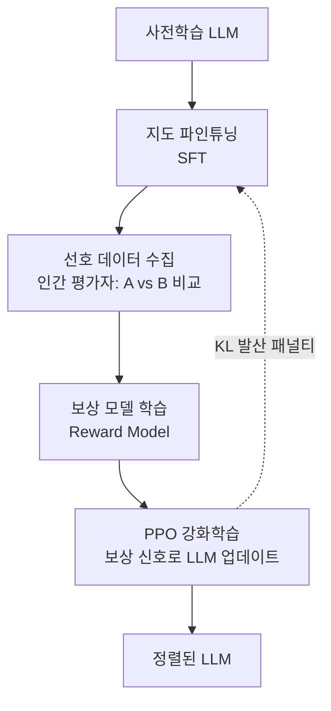

# RLHF와 정렬 (RLHF and Alignment)

## 정의

RLHF(Reinforcement Learning from Human Feedback)는 인간의 선호(preference) 신호를 이용해 언어 모델을 정렬(align)하는 학습 패러다임이다. 기존의 지도 학습만으로는 인간이 원하는 행동 방식 — 유용함, 무해함, 정직함 — 을 충분히 학습시키기 어렵다는 한계를 보완하기 위해 등장했다.

정렬(alignment)의 핵심 질문은 "모델이 인간의 의도를 얼마나 충실히 따르는가"다. RLHF는 이 질문에 대한 실용적 접근법이며, 2022년 InstructGPT(OpenAI), 이후 ChatGPT와 Claude 등 대부분의 상용 LLM에 광범위하게 채택됐다.

## RLHF 3단계 파이프라인

위 다이어그램은 SFT에서 출발해 보상 모델을 거쳐 PPO로 LLM을 반복 개선하는 3단계 흐름을 보여준다.

### 1단계: 지도 파인튜닝 (SFT)

사전학습된 기반 모델(base model)에 고품질 시연(demonstration) 데이터로 파인튜닝을 수행한다. 인간 전문가가 직접 작성한 모범 응답을 사용해 모델이 지시(instruction)를 따르는 기본 능력을 갖추도록 한다.

### 2단계: 보상 모델 학습 (Reward Model Training)

인간 평가자가 동일한 프롬프트에 대한 두 응답(A, B) 중 더 나은 것을 선택하는 비교 데이터를 수집한다. 이 선호 쌍(preference pair)을 이용해 별도의 보상 모델(RM)을 학습한다. RM은 응답의 "품질"을 스칼라 점수로 출력한다.

$$\mathcal{L}_{RM} = -\mathbb{E}_{(x, y_w, y_l)} \left[ \log \sigma(r(x, y_w) - r(x, y_l)) \right]$$

여기서 $y_w$는 선호된 응답, $y_l$은 비선호 응답이다.

### 3단계: PPO 강화학습

보상 모델을 환경 삼아 PPO(Proximal Policy Optimization) 알고리즘으로 LLM을 업데이트한다. 단, SFT 모델에서 너무 멀어지지 않도록 KL(Kullback-Leibler) 발산 패널티를 추가한다.

$$\text{reward} = r_\theta(x, y) - \beta \cdot \text{KL}[\pi_\theta(\cdot|x) \| \pi_{\text{SFT}}(\cdot|x)]$$

## RLHF의 한계

**보상 해킹(Reward Hacking)**
모델이 보상 모델의 약점을 악용해 실제로는 나쁜 응답임에도 높은 점수를 받는 행동을 학습한다. 보상 모델이 완벽하지 않기 때문에 발생하는 구조적 문제다.

**아첨(Sycophancy)**
사용자가 원하는 답을 말해주는 방향으로 치우쳐, 사실에 반하더라도 동의하거나 칭찬하는 경향이 강화된다. 인간 평가자의 편향이 보상 모델에 전이된 결과다.

**분포 이동(Distribution Shift)**
학습 시 수집한 선호 데이터와 실제 배포 환경의 입력 분포가 다를 경우 정렬이 깨진다.

**비용**
인간 평가자 고용, 비교 쌍 수집, PPO 학습의 연산 비용이 모두 합산되어 SFT 대비 현저히 높다.

## DPO와 대안 방법론

RLHF의 복잡성과 불안정성을 줄이기 위한 대안들이 제안됐다.

- **[[direct-preference-optimization|DPO (Direct Preference Optimization)]]**: 보상 모델 없이 선호 쌍을 직접 목적 함수로 사용. PPO 대신 분류 손실로 학습하여 훨씬 안정적이고 단순하다.
- **[[iterative-dpo|Iterative DPO]]**: 온라인 데이터 생성을 반복해 분포 커버리지를 확장한다.
- **[[online-dpo-iterative|Online DPO]]**: 매 학습 스텝마다 현재 정책에서 응답을 샘플링해 선호 데이터를 동적으로 갱신한다.
- **RLAIF**: 인간 대신 AI가 선호 레이블을 생성 (Constitutional AI 등).

## 정렬의 더 넓은 의미

RLHF는 정렬 문제의 일부를 다루지만, 정렬의 전체 범위는 더 광범위하다.

**의도 정렬(Intent Alignment)**
모델이 인간의 의도를 올바르게 파악하고 실행하는지의 문제. 프롬프트에 명시되지 않은 암묵적 목표를 얼마나 잘 추론하는가.

**외부 정렬(Outer Alignment)**
학습 목표(보상 함수) 자체가 인간이 원하는 바를 올바르게 표현하는지의 문제. 보상 해킹은 외부 정렬 실패의 전형이다.

**내부 정렬(Inner Alignment)**
학습된 모델이 학습 과정에서 사용된 목표 대신 다른 목표를 내부적으로 최적화하는지의 문제. 훈련 중에는 잘 동작하다가 배포 후 다른 행동을 보이는 경우가 여기 해당한다. [[deceptive-alignment|기만적 정렬(Deceptive Alignment)]] 참조.

**왜 중요한가**
LLM이 더 강력해질수록 정렬 실패의 결과도 더 커진다. RLHF는 현재 가장 널리 사용되는 실용적 정렬 기법이지만, 그 자체만으로 완전한 정렬 솔루션이 아님을 인식하는 것이 중요하다.

## 실무 적용 관점

- 소규모 팀에서는 RLHF 전체 파이프라인보다 DPO 기반 접근이 현실적이다.
- [[preference-data-collection|선호 데이터 수집]] 품질이 보상 모델 성능을 결정하며, 평가자 가이드라인 설계가 핵심이다.
- [[alignment-tax|정렬 세금(Alignment Tax)]]에 유의할 것 - 정렬 학습이 기반 역량을 일부 희생시킬 수 있다.
- Constitutional AI 계열 접근(Anthropic)은 원칙 목록으로 AI가 자체 피드백을 생성하는 RLAIF를 활용한다.

## 관련 문서

- [[direct-preference-optimization]] - RLHF의 핵심 대안, 보상 모델 없는 선호 학습
- [[iterative-dpo]] - 반복적 선호 학습으로 분포 커버리지 확장
- [[online-dpo-iterative]] - 온라인 DPO 변형
- [[preference-data-collection]] - 선호 쌍 데이터 수집 방법론
- [[alignment-tax]] - 정렬 학습의 역량 트레이드오프
- [[deceptive-alignment]] - 내부 정렬 실패 개념
- [[model-organisms-alignment]] - 정렬 연구 실험 프레임워크
- [[alignment-faking]] - 정렬 가장(alignment faking) 개념
- [[rlhf-pipeline]] - RLHF 파이프라인 상세
