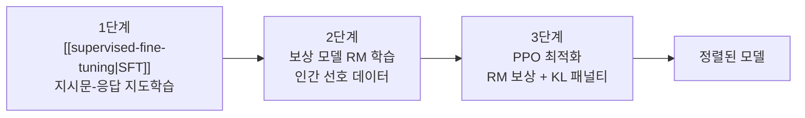

# RLHF 파이프라인 (RLHF Pipeline)

## 개요

RLHF(Reinforcement Learning from Human Feedback)는 인간의 선호 판단을 보상 신호로 변환하여 언어 모델을 인간의 의도에 정렬(align)시키는 강화학습 기반 후학습 파이프라인이다. InstructGPT(Ouyang et al., 2022)가 "SFT -> 보상 모델(RM) 학습 -> PPO 최적화"의 3단계 구조를 체계화했으며, 이 파이프라인은 ChatGPT, Claude, Gemini 등 프론티어 모델 개발의 핵심 기반이 되었다. 2026년 현재 [[grpo]], [[dapo]] 등 PPO를 개선한 변형과 [[rlvr]] 등 보상 신호를 자동화한 접근이 활발히 연구되고 있지만, RLHF의 기본 구조는 여전히 정렬 기술의 표준 참조점이다.

## 핵심 개념

### 3단계 파이프라인

### 1단계: 지도 파인튜닝 (SFT)

사전 학습된 언어 모델을 인간 시연자(demonstrator)가 작성한 고품질 프롬프트-응답 쌍으로 [[supervised-fine-tuning]]한다. 이 단계의 목적은 모델에게 "지시에 따라 응답하는 형식"을 학습시키는 것이다. InstructGPT에서는 약 13,000개의 인간 시연 데이터가 사용되었다.

### 2단계: 보상 모델 학습 (Reward Model Training)

인간 평가자가 동일 프롬프트에 대한 모델의 여러 응답을 비교(pairwise comparison)하여 선호 순위를 매기고, 이 데이터로 보상 모델을 학습한다.

**Bradley-Terry 모델:**

보상 모델은 Bradley-Terry 확률 모델을 기반으로 학습된다.

P(y_w > y_l) = sigma(r(x, y_w) - r(x, y_l))

여기서 y_w는 선호 응답, y_l은 비선호 응답, r(x, y)는 보상 모델의 스칼라 출력, sigma는 시그모이드 함수이다. 보상 모델은 선호 응답에 더 높은 보상을 부여하도록 학습된다.

**보상 모델의 구조:**
- SFT 모델과 동일 아키텍처에서 출발
- 마지막 출력을 스칼라 값(보상 점수)으로 변환하는 헤드 추가
- 약 33,000개의 비교 데이터로 학습 (InstructGPT)

### 3단계: PPO 최적화

보상 모델의 피드백을 사용하여 SFT 모델을 강화학습으로 최적화한다. PPO(Proximal Policy Optimization)가 표준 알고리즘으로 사용된다.

**최적화 목적 함수:**

J(theta) = E_{x~D, y~pi_theta}[r(x, y)] - beta * KL[pi_theta || pi_ref]

| 항 | 역할 |
|----|------|
| r(x, y) | 보상 모델이 부여하는 보상 점수 최대화 |
| beta * KL[pi_theta \|\| pi_ref] | 현재 정책이 SFT 모델(참조 정책)에서 너무 멀어지지 않도록 제약 |

**KL 발산 패널티의 역할:**

KL 패널티가 없으면 모델은 보상 모델의 약점을 이용하여 보상을 극대화하는 비정상적 응답을 생성한다(reward hacking). beta 값은 보상 최대화와 SFT 모델 유지 사이의 균형을 조절한다.

| beta | 효과 |
|------|------|
| 높음 | SFT 모델에 가까움, 보상 향상 제한적 |
| 낮음 | 보상 극대화, reward hacking 위험 증가 |
| 적정 (0.01-0.2) | 품질 향상 + 안정성 균형 |

## PPO의 핵심 구성요소

RLHF에서 PPO는 4개의 모델을 동시에 운영한다.

| 모델 | 역할 | 업데이트 |
|------|------|---------|
| 정책 모델 (Actor) | 응답 생성 | 학습 대상 |
| 가치 모델 (Critic) | 상태 가치 추정, 어드밴티지 계산 | 학습 대상 |
| 보상 모델 (RM) | 응답 품질 점수 부여 | 동결 |
| 참조 모델 (Reference) | KL 패널티 계산용 기준 | 동결 |

이 4-모델 구조는 막대한 GPU 메모리와 연산 비용을 요구하며, 이것이 PPO 대안을 탐색하게 된 주요 동기이다.

## RLHF의 과제와 진화

### 보상 해킹 (Reward Hacking)

보상 모델은 불완전한 인간 선호의 근사이므로, 정책 모델이 보상 모델의 맹점을 이용하여 실제로는 품질이 낮지만 높은 보상을 받는 응답을 생성할 수 있다. [[process-reward-models]]는 최종 결과 대신 추론 과정의 각 단계를 평가하여 이 문제를 완화하려는 접근이다.

### PPO 대안의 등장

| 기법 | 핵심 차이 | 장점 |
|------|-----------|------|
| [[grpo]] | 크리틱 제거, 그룹 내 보상 정규화 | 4모델->3모델, 메모리 절감 |
| [[dapo]] | Clip-Higher + Dynamic Sampling | 대규모 추론 RL 안정성 |
| DPO | 보상 모델 제거, 선호 데이터에서 직접 최적화 | 2모델만 필요, 단순 |
| KTO | 단일 응답 평가(선호 쌍 불필요) | 데이터 수집 비용 감소 |

### 자동 보상 신호

RLHF의 병목 중 하나인 인간 선호 데이터 수집을 자동화하려는 흐름이 형성되었다.

- [[rlvr]]: 수학/코드 등 정답 검증이 가능한 태스크에서 자동 보상
- RLAIF: AI 모델이 인간 대신 선호 판단 제공
- [[process-reward-models]]: 추론 과정의 단계별 자동 검증

## 2026년 현재의 위치

RLHF 파이프라인의 기본 구조(선호 데이터 -> 보상 신호 -> 정책 최적화)는 여전히 정렬 기술의 표준이지만, 세부 구현은 크게 진화했다.

1. PPO 대신 [[grpo]], [[dapo]] 등 경량화된 알고리즘 채택 증가
2. 인간 선호 데이터와 자동 보상([[rlvr]])의 혼합 사용
3. SFT와 RL 단계의 반복 순환(iterative RLHF)
4. [[extended-constitutional-ai]]를 통한 원칙 기반 자동 정렬

## 대표 자료

- [Training language models to follow instructions with human feedback (InstructGPT, Ouyang et al., 2022)](https://arxiv.org/abs/2203.02155)
- [Fine-Tuning Language Models from Human Preferences (Ziegler et al., 2019)](https://arxiv.org/abs/1909.08593)
- [Illustrating RLHF (HuggingFace blog)](https://huggingface.co/blog/rlhf)

## 관련 문서
- [[safety-training-refusal]] -- 안전 학습과 거부 훈련 (Safety Training & Refusal)

- [[supervised-fine-tuning]] -- RLHF 파이프라인의 1단계
- [[grpo]] -- PPO의 크리틱 제거 변형
- [[dapo]] -- 대규모 추론 RL 시스템
- [[rlvr]] -- 검증 가능한 보상 기반 자동 RL
- [[process-reward-models]] -- 단계별 보상 모델
- [[lora-qlora-finetuning]] -- RLHF의 파라미터 효율적 실행
- [[agentic-rl]] -- RLHF 원리의 에이전트 영역 확장
- [[rl-scaling-laws]] -- RL 후학습의 스케일링 법칙
- [[extended-constitutional-ai]] -- 원칙 기반 자동 정렬
