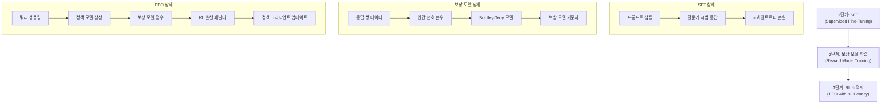
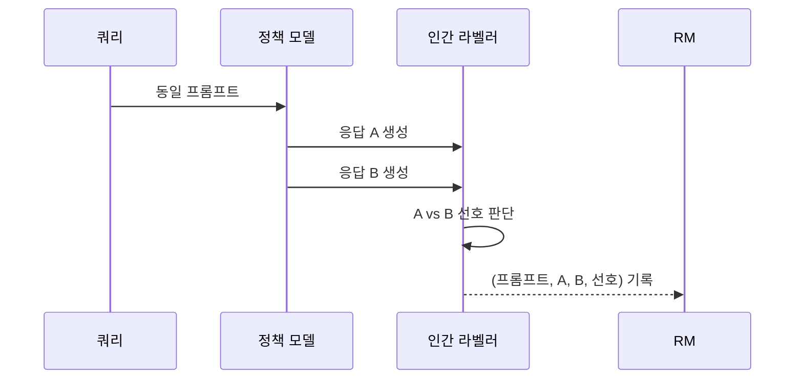
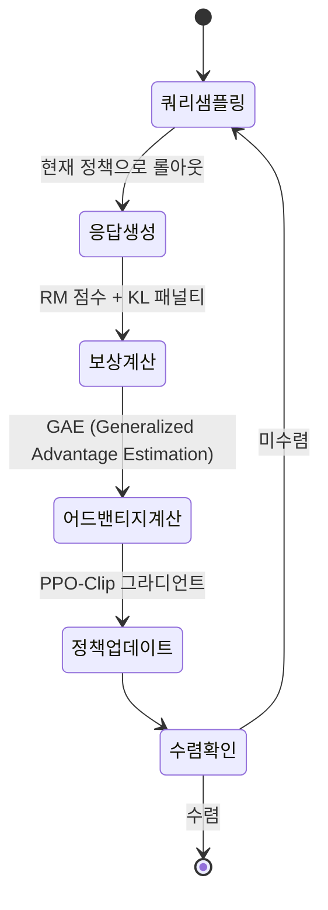
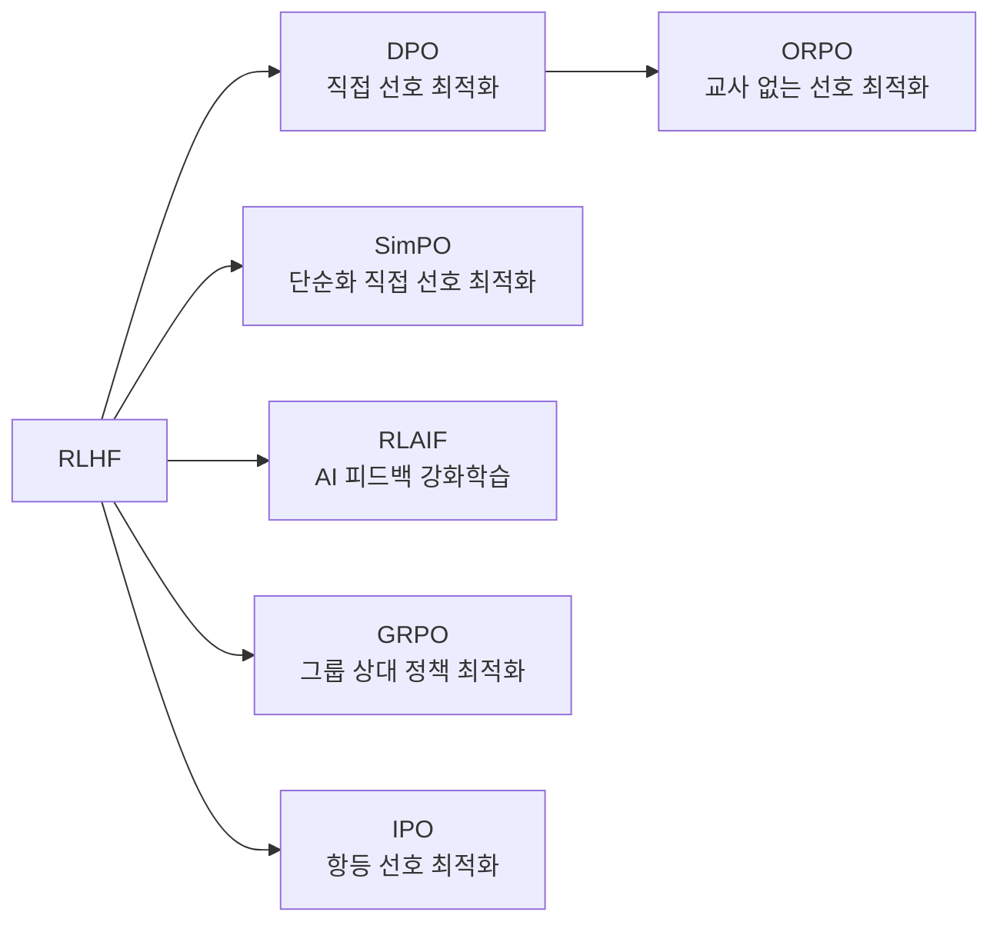

# RLHF (Reinforcement Learning from Human Feedback)

RLHF(Reinforcement Learning from Human Feedback, 인간 피드백 강화학습)는 사전학습된 언어 모델을 인간의 선호(preference)에 맞게 정렬(align)하는 학습 패러다임이다. 2017년 Christiano et al.이 비디오게임·로봇 제어에 처음 적용한 이후, 2022년 InstructGPT(OpenAI)와 Claude(Anthropic)에 적용되어 현대 LLM 정렬의 표준 방법론으로 자리 잡았다.

핵심 아이디어는 **"인간의 선호를 직접 최적화 신호로 사용하되, 희소한 피드백을 보상 모델로 일반화"** 하는 것이다.

## RLHF 전체 파이프라인



위 다이어그램은 RLHF의 3단계 파이프라인을 보여준다. 각 단계는 독립적으로 학습되며, 이전 단계의 결과물이 다음 단계의 입력이 된다.

## 1단계: SFT (Supervised Fine-Tuning)

사전학습 모델을 고품질 시범 데이터(demonstration data)로 파인튜닝하는 단계.

- **목적**: 모델이 지시(instruction)를 따르는 기본 능력 확립
- **데이터**: 전문 라벨러가 프롬프트에 이상적 응답을 직접 작성
- **손실 함수**: 표준 언어 모델 교차엔트로피
- **결과**: Supervised Policy $\pi_{SFT}$

InstructGPT에서는 GPT-3에 13,000개 시범 데이터를 적용했다. 데이터 품질이 양보다 중요하며, 라벨러 지침(labeler guidelines)의 일관성이 핵심이다.

## 2단계: 보상 모델 학습 (Reward Model Training)

인간 선호를 수치 점수로 변환하는 모델을 학습하는 단계.

### 비교 데이터 수집



같은 프롬프트에 대해 두 개 이상의 응답을 생성하고, 인간 라벨러가 어느 쪽을 더 선호하는지 표시한다.

### Bradley-Terry 모델

선호 데이터를 보상 모델 학습에 사용하는 표준 공식:

$$\mathcal{L}_{RM} = -\mathbb{E}_{(x, y_w, y_l)} \left[ \log \sigma(r_\theta(x, y_w) - r_\theta(x, y_l)) \right]$$

여기서:
- $x$: 프롬프트
- $y_w$: 선호된(winning) 응답
- $y_l$: 비선호된(losing) 응답
- $r_\theta$: 보상 모델
- $\sigma$: 시그모이드 함수

직관: 선호 응답의 보상이 비선호 응답보다 높을 확률을 최대화한다.

### 보상 모델 아키텍처

- SFT 모델의 언어 모델 헤드를 스칼라 값 출력 헤드로 교체
- 동결(freeze) 없이 전체 가중치를 학습하는 것이 일반적
- 모델 크기: InstructGPT는 6B 파라미터 RM 사용

## 3단계: PPO 기반 강화학습 최적화

보상 모델을 환경(environment)으로 사용해 정책을 최적화하는 단계.

### PPO-Clip 목적 함수 (KL 패널티 변형)

RLHF에서 사용하는 목적 함수:

$$\mathcal{L}_{RL} = \mathbb{E} \left[ r_\theta(x, y) - \beta \cdot \text{KL}[\pi_\theta \| \pi_{SFT}] \right]$$

- $r_\theta(x, y)$: 보상 모델 점수
- $\beta$: KL 패널티 강도 (일반적으로 0.02~0.2)
- $\text{KL}[\pi_\theta \| \pi_{SFT}]$: 현재 정책과 SFT 정책 간 KL 발산

**KL 패널티의 역할**: 보상 모델 해킹(reward hacking)을 방지한다. KL이 없으면 정책이 보상 모델의 허점을 극단적으로 활용해 인간에게 실제로는 좋지 않은 응답을 생성하게 된다.

### 강화학습 루프



### PPO의 실용적 어려움

PPO는 LLM 학습에 적용 시 여러 엔지니어링 과제를 만든다:

1. **배우-평론가 비동기성**: 정책 모델과 가치 모델을 동시에 업데이트
2. **롤아웃 메모리**: 배치 생성에 많은 VRAM 필요
3. **하이퍼파라미터 민감도**: KL 계수, 클립 엡실론, PPO 에포크 수
4. **보상 해킹 감지**: 주기적으로 실제 평가가 필요

## InstructGPT - RLHF의 상업적 이정표

2022년 OpenAI가 발표한 InstructGPT(Ouyang et al.)는 RLHF를 대규모 LLM에 적용해 인간 선호 정렬을 달성한 최초의 상업적 사례다.

주요 결과:
- 1.3B InstructGPT가 175B GPT-3보다 인간 선호 측면에서 우수함을 실증
- "성실함(helpful)", "무해함(harmless)", "정직함(honest)" 세 축 정렬 (Anthropic HHH 원칙의 선구)
- 더 큰 모델이 항상 더 선호되지 않음 — 정렬의 중요성 증명

[[instructgpt-rlhf-paper]] 참조.

## Anthropic의 RLHF와 Constitutional AI

Anthropic은 RLHF를 기반으로 두 가지 확장을 개발했다:

1. **RLHF + HHH**: Helpful, Harmless, Honest 세 축을 보상 모델에 반영
2. **Constitutional AI (CAI)**: 원칙 목록(constitution)을 기반으로 AI 스스로 응답을 비판·개선 → RLAIF(RL from AI Feedback)

CAI는 인간 피드백 없이도 원칙 기반 자동 피드백으로 보상 신호를 생성해 라벨링 비용을 절감한다.

## RLHF의 한계

### 보상 해킹 (Reward Hacking)
보상 모델이 완벽한 인간 선호 대리자가 아니기 때문에, 정책이 보상 모델의 분포 밖 영역을 과적합 최적화할 위험이 있다. 실무에서는 KL 패널티와 주기적 인간 평가로 완화한다.

### 분포 이동 (Distribution Shift)
SFT 단계의 데이터 분포와 RL 롤아웃 분포 간 격차가 커지면 불안정하거나 품질 저하가 발생한다.

### 라벨러 편향
인간 라벨러는 다양한 편향(자기 의견 투영, 피로, 지침 해석 차이)을 가져올 수 있어 보상 모델의 품질을 제한한다.

### 확장 비용
PPO 학습은 동일 파라미터 규모에서 SFT 대비 약 3~4x 더 많은 메모리와 계산을 요구한다.

## RLHF에서 파생된 방법론들

RLHF의 복잡성과 한계를 극복하려는 다양한 변형이 등장했다.



### DPO (Direct Preference Optimization)

[[dpo|dpo-direct-preference-optimization]] 참조.

보상 모델과 RL 루프를 제거하고, 선호 데이터로 직접 정책을 최적화한다. Rafailov et al. (2023)이 RLHF와 수학적 동치를 증명하면서 등장.

$$\mathcal{L}_{DPO} = -\mathbb{E} \left[ \log \sigma \left( \beta \log \frac{\pi_\theta(y_w|x)}{\pi_{ref}(y_w|x)} - \beta \log \frac{\pi_\theta(y_l|x)}{\pi_{ref}(y_l|x)} \right) \right]$$

- 장점: 단순, 안정적, 메모리 효율적
- 단점: 정책 표현력이 RLHF 대비 제한될 수 있음

### SimPO (Simple Preference Optimization)

참조 모델(reference model) 없이 평균 로그 가능도를 직접 활용해 DPO를 단순화. 빠른 학습과 비슷한 성능을 달성한다.

### GRPO (Group Relative Policy Optimization)

DeepSeek이 수학 추론 강화에 사용한 방법. 같은 프롬프트에 대해 여러 응답을 생성하고 그룹 내 상대적 보상을 사용한다. 가치 모델(value network) 없이 PPO 구조를 단순화한 것이 핵심이다.

## 실무 구현 코드 예시

```python
from trl import PPOTrainer, PPOConfig, AutoModelForCausalLMWithValueHead

# PPO 설정
ppo_config = PPOConfig(
    model_name="gpt2",
    learning_rate=1.41e-5,
    batch_size=128,
    mini_batch_size=16,
    ppo_epochs=4,
    kl_penalty="kl",         # KL 발산 패널티 방식
    init_kl_coef=0.2,        # 초기 KL 계수 (beta)
    adap_kl_ctrl=True,       # 적응적 KL 계수
    target_kl=6.0,           # 목표 KL 발산
)

# 모델 초기화 (가치 헤드 포함)
model = AutoModelForCausalLMWithValueHead.from_pretrained("gpt2-sft")
ref_model = AutoModelForCausalLMWithValueHead.from_pretrained("gpt2-sft")

trainer = PPOTrainer(
    config=ppo_config,
    model=model,
    ref_model=ref_model,    # SFT 참조 모델 (KL 계산용)
    tokenizer=tokenizer,
    dataset=dataset,
)

# 보상 함수 (보상 모델 호출)
def compute_reward(query, response):
    inputs = tokenizer(query + response, return_tensors="pt")
    with torch.no_grad():
        reward = reward_model(**inputs).logits.squeeze()
    return reward

# PPO 업데이트 루프
for batch in trainer.dataloader:
    query_tensors = batch["input_ids"]
    
    # 롤아웃 생성
    response_tensors = trainer.generate(query_tensors, max_new_tokens=200)
    
    # 보상 계산
    rewards = [compute_reward(q, r) for q, r in zip(queries, responses)]
    
    # PPO 스텝 (내부에서 어드밴티지, 클립, 가치 손실 계산)
    stats = trainer.step(query_tensors, response_tensors, rewards)
```

[[ppo-rlhf-implementation]] 참조.

## 비교: RLHF vs SFT 단독

| 항목 | SFT 단독 | RLHF |
|------|---------|------|
| 학습 비용 | 낮음 | 높음 (3~4x) |
| 지시 따르기 | 기본 | 우수 |
| 유해 출력 방지 | 약함 | 강함 |
| 창의성/다양성 | 데이터 의존 | 탐색 가능 |
| 보상 해킹 위험 | 없음 | 존재 |
| 구현 복잡도 | 단순 | 복잡 |

## 데이터 규모와 품질

인간 피드백 데이터의 양보다 품질이 더 중요하다:

- InstructGPT: 약 40,000개 선호 쌍으로 충분한 성능 달성
- Llama-2 RLHF: 1M+ 선호 쌍, 더 세밀한 라벨러 지침
- 핵심: 일관된 라벨러 지침, 충분한 교육, 모호한 케이스 처리 기준

## 관련 문서

- [[rlhf-christiano-paper]] - RLHF 원조 논문 (Christiano et al., 2017)
- [[instructgpt-rlhf-paper]] - InstructGPT 논문 (Ouyang et al., 2022)
- [[ppo-rlhf-implementation]] - PPO 구현 실무 가이드
- [[dpo|dpo-direct-preference-optimization]] - DPO: RLHF의 단순화 대안
- [[openrlhf]] - 오픈소스 RLHF 학습 프레임워크
- [[trl-library]] - Hugging Face TRL: RLHF/DPO 라이브러리
- [[alignment-tax]] - 정렬이 모델 성능에 미치는 비용
