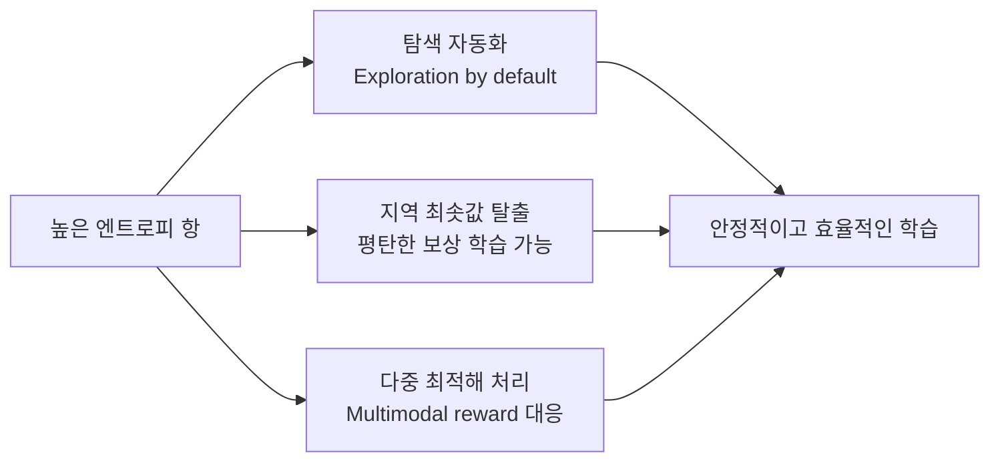
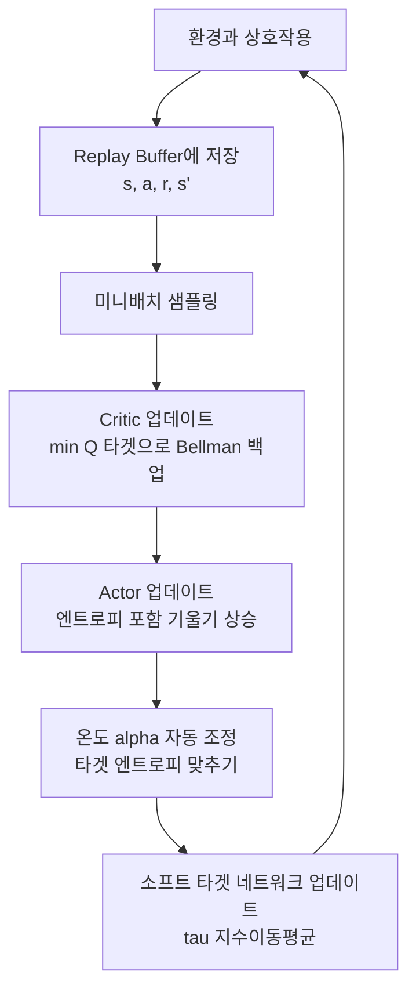

# SAC (Soft Actor-Critic)

SAC(Soft Actor-Critic)은 Haarnoja et al. 2018이 제안한 **엔트로피 정규화(entropy-regularized) 오프-폴리시 심층 강화학습 알고리즘**이다. 연속 행동 공간(continuous action space)에서 높은 샘플 효율성과 안정적 학습을 동시에 달성하며, 로보틱스·물리 시뮬레이션 벤치마크에서 장기간 최고 성능 기준을 보유했다.

## 핵심 아이디어: 최대 엔트로피 프레임워크

일반 RL은 누적 보상의 기댓값만 최대화한다:

$$J(\pi) = \mathbb{E}\left[\sum_t r_t\right]$$

SAC는 여기에 **정책 엔트로피(policy entropy)를 보상으로 추가**한다:

$$J_{\text{soft}}(\pi) = \mathbb{E}\left[\sum_t r_t + \alpha \mathcal{H}(\pi(\cdot|s_t))\right]$$

- $\mathcal{H}(\pi(\cdot|s))$: 상태 $s$에서의 정책 엔트로피 $= -\mathbb{E}[\log \pi(a|s)]$
- $\alpha$: 온도 파라미터(temperature) - 엔트로피 중요도 조절

이 목적함수는 높은 보상을 받으면서도 **최대한 다양한 행동을 유지**하는 정책을 학습한다.

### 엔트로피 정규화의 효과



## 알고리즘 구성

SAC는 세 가지 네트워크로 구성된다:

| 네트워크 | 입력 | 출력 | 역할 |
|---------|------|------|------|
| Actor $\pi_\phi$ | 상태 $s$ | 행동 분포 $\mu, \sigma$ | 정책 결정 |
| Critic 1 $Q_{\theta_1}$ | $(s, a)$ | Q값 | 행동 평가 |
| Critic 2 $Q_{\theta_2}$ | $(s, a)$ | Q값 | 과대추정 방지 |

쌍둥이 Q 네트워크(twin Q)로 과대추정(overestimation bias)을 억제하는 아이디어는 [[td3-twin-delayed-ddpg]]와 공유한다.

## 학습 루프



### 자동 온도 조정 (SAC v2)

원래 SAC는 $\alpha$를 수동 설정하지만, Haarnoja et al. 2019(SAC v2)에서 **타겟 엔트로피를 목표로 $\alpha$를 자동 학습**하도록 확장됐다:

$$\min_\alpha \mathbb{E}[-\alpha \log \pi(a|s) - \alpha \bar{\mathcal{H}}]$$

- $\bar{\mathcal{H}}$: 타겟 엔트로피 (보통 행동 차원의 음수: $-\dim(\mathcal{A})$)

이 덕분에 하이퍼파라미터 튜닝 부담이 크게 줄어 실용성이 높아졌다.

## [[policy-gradient-ppo]] 와의 비교

| 항목 | SAC | PPO |
|------|-----|-----|
| 폴리시 타입 | 오프-폴리시 | 온-폴리시 |
| 샘플 효율성 | 높음 (리플레이 버퍼) | 낮음 (매번 신규 샘플) |
| 연속 행동 | 자연스러움 | 가우시안 정책 필요 |
| 안정성 | 높음 | 높음 (클리핑) |
| 환경 상호작용 | 적게 필요 | 많이 필요 |
| 분산 학습 | 복잡 | 자연스러움 (벡터환경) |

연속 행동 로보틱스: SAC 우세. 이산 행동 게임/대규모 분산 학습: PPO 우세.

## [[offline-reinforcement-learning]] 연결

SAC는 온라인 학습 알고리즘이지만, 오프라인 RL(offline RL)의 기반으로도 활용된다. CQL(Conservative Q-Learning) 등 오프라인 RL 기법이 SAC의 구조를 차용하면서 분포 이탈(distributional shift)을 억제하는 정규화를 추가한다.

## 연속 행동 처리: reparameterization trick

SAC의 Actor는 가우시안 분포의 평균($\mu$)과 표준편차($\sigma$)를 출력하고, **reparameterization trick**으로 기울기를 통과시킨다:

$$a = \tanh(\mu + \sigma \cdot \epsilon), \quad \epsilon \sim \mathcal{N}(0, I)$$

$\tanh$ 압축으로 행동을 유계 범위에 제한하고, 로그 확률 계산 시 Jacobian 보정을 적용한다.

## 구현 예시 (핵심 업데이트)

```python
# Critic 업데이트 (twin Q)
with torch.no_grad():
    next_action, next_log_pi = actor.sample(next_state)
    q1_next = critic1_target(next_state, next_action)
    q2_next = critic2_target(next_state, next_action)
    q_next = torch.min(q1_next, q2_next) - alpha * next_log_pi
    target_q = reward + gamma * (1 - done) * q_next

q1_loss = F.mse_loss(critic1(state, action), target_q)
q2_loss = F.mse_loss(critic2(state, action), target_q)

# Actor 업데이트 (엔트로피 포함)
action_pi, log_pi = actor.sample(state)
q1_pi = critic1(state, action_pi)
q2_pi = critic2(state, action_pi)
actor_loss = (alpha * log_pi - torch.min(q1_pi, q2_pi)).mean()

# 온도 자동 조정
alpha_loss = -(log_alpha * (log_pi + target_entropy).detach()).mean()
```

## 실무 관점

- MuJoCo, DMControl 벤치마크에서 TD3와 함께 오랫동안 SOTA 유지
- 실제 로봇 팔, 드론 제어 연구에서 표준 베이스라인으로 사용
- 하이퍼파라미터 민감도가 낮아(특히 SAC v2) 도메인 전환 시 재튜닝 부담 적음
- 환경 병렬화 없이도 샘플 효율성이 높아 물리 시뮬레이션 비용이 비쌀 때 유리

## 관련 문서

- [[policy-gradient-ppo]] - 온-폴리시 기반의 대표 알고리즘과 비교
- [[offline-reinforcement-learning]] - SAC 구조를 기반으로 한 오프라인 RL 기법
- [[td3-twin-delayed-ddpg]] - 쌍둥이 Q 아이디어를 공유하는 병행 발전 알고리즘
- [[q-learning-dqn]] - Q 함수 학습의 기반 개념
