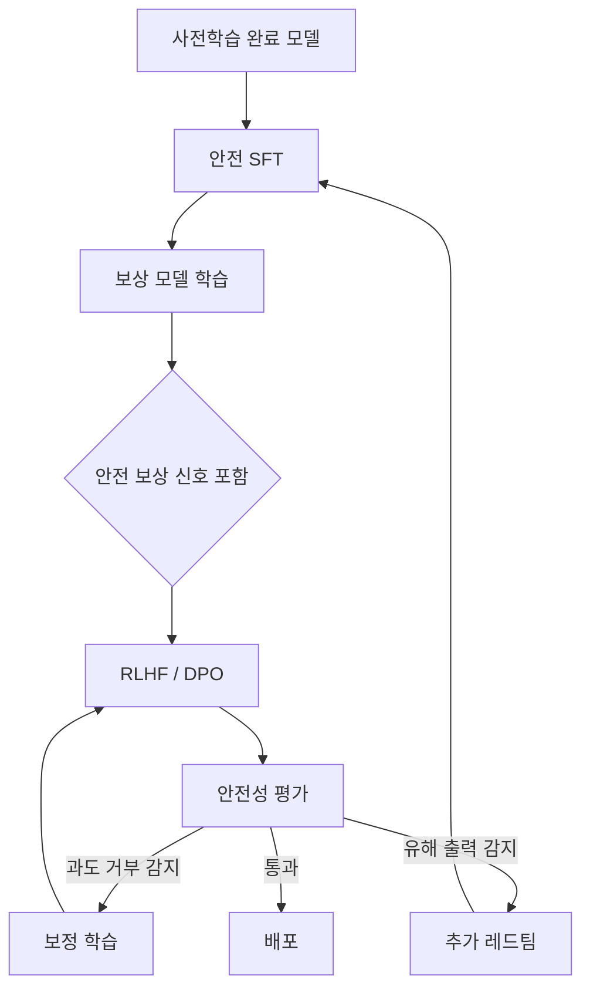

# 안전 학습과 거부 훈련 (Safety Training & Refusal)

## 개요

안전 학습(safety training)은 대형 언어 모델(LLM)이 유해하거나 위험한 출력을 생성하지 않도록 훈련하는 후학습(post-training) 단계의 핵심 구성요소다. 모델이 유해한 요청을 적절히 거부(refusal)하면서도 정당한 요청에는 충분히 유용하게 응답하는 균형을 달성하는 것이 핵심 과제다. 이 과정에서 과도한 거부(over-refusal) 문제가 발생할 수 있으며, 이를 교정하는 보정된 거부(calibrated refusal) 기법이 활발히 연구되고 있다.

안전 학습은 [[rlhf-pipeline|RLHF 파이프라인]]의 일부로 통합되거나, [[extended-constitutional-ai|Constitutional AI]]처럼 독립적인 프레임워크로 구현된다. [[reward-model-training|보상 모델 학습]] 단계에서 안전성 관련 신호를 포함시키는 방식도 널리 사용된다.

## 거부 훈련의 메커니즘

### 안전 데이터 수집

안전 학습의 첫 단계는 유해한 프롬프트와 적절한 거부 응답 쌍을 수집하는 것이다. 주요 방법론은 다음과 같다.

- **레드팀 테스트(Red Teaming)**: 전문가가 모델의 취약점을 탐색하며 유해 출력을 유도하는 적대적 프롬프트를 수집한다. 수동 레드팀은 미묘한 엣지 케이스를 발견하는 데 강점이 있고, 자동화된 공격 시뮬레이션은 대규모 커버리지를 제공한다.
- **합성 데이터 생성**: 모델 자체 또는 별도 모델이 다양한 유해 시나리오와 적절한 거부 응답을 생성한다. [[rlaif-scalable-oversight|RLAIF]] 접근법에서 AI 피드백으로 안전 데이터를 확장하는 것이 대표적이다.
- **인간 주석(Human Annotation)**: 주석자가 응답의 안전성을 평가하고, "안전하지 않은" 응답뿐 아니라 "과도하게 조심스러운" 응답도 함께 표시한다.

### 학습 파이프라인 통합

안전 훈련은 후학습 파이프라인의 여러 단계에 걸쳐 적용된다.

[[supervised-fine-tuning|SFT]] 단계에서 안전 거부 응답을 포함한 데이터로 미세조정하고, 이후 RLHF 또는 [[direct-preference-optimization|DPO]] 단계에서 안전한 응답이 높은 보상을 받도록 최적화한다. 보상 모델에는 유용성(helpfulness)과 무해성(harmlessness) 두 축을 모두 반영하며, 두 목표 간 트레이드오프를 관리하는 것이 정렬 세금(alignment tax)의 핵심이다.

## 과도 거부(Over-Refusal) 문제

### 정의와 원인

과도 거부란 모델이 실제로 무해한 요청까지 유해하다고 판단하여 거부하는 현상이다. 예를 들어, "칼을 사용한 요리법"이라는 무해한 질문을 무기 관련 질문으로 오인하여 거부하는 경우가 해당한다.

과도 거부의 주요 원인:

1. **안전 데이터 불균형**: 유해 프롬프트 데이터가 과대 대표되어 모델이 지나치게 보수적으로 학습
2. **키워드 패턴 매칭**: 맥락을 무시하고 특정 키워드(폭발, 약물 등)의 존재만으로 거부 판단
3. **보상 해킹(Reward Hacking)**: 거부가 항상 안전한 선택이라는 편향이 보상 모델에 학습
4. **안전 결정 경계의 모호성**: 표현 공간에서 유해/무해 프롬프트가 겹치는 영역이 존재

### 측정 벤치마크

OR-Bench(Over-Refusal Benchmark)는 대규모 과도 거부 평가를 위한 벤치마크로, 10개 거부 카테고리에 걸친 약 80,000개 과도 거부 프롬프트와 최신 모델도 어려워하는 약 1,000개의 고난도 프롬프트, 그리고 무차별 응답을 방지하기 위한 600개 유해 프롬프트를 포함한다.

## 보정된 거부(Calibrated Refusal)

### 핵심 원칙

보정된 거부는 "제약 하의 역량(competence under constraint)"이라는 개념에 기반한다. 유해한 요청은 거부하되, 거부 이유를 투명하게 설명하고 안전한 대안을 제시하며, 무해한 요청에는 최대한 유용하게 응답하는 것이 목표다.

### 거부 분류 체계

체계적인 거부 설계를 위해 거부 사유를 분류한다:

- **거부해야 하는 경우(Should-not)**: 윤리적, 법적, 정책적 이유로 응답이 부적절한 경우
- **응답할 수 없는 경우(Cannot)**: 모델 능력, 모달리티 한계, 잘못된 전제, 정보 부족 등으로 정확한 응답이 불가능한 경우

이 분류는 거부 응답의 톤과 대안 제시 방식을 결정하는 데 활용된다.

### 표현 공간 기반 접근

ACTOR(Activation-Based Training for Over-Refusal Reduction)는 모델 내부 활성화(activation)를 조정하여 과도 거부를 줄이는 기법이다. 각 쿼리에 대해 거부 벡터(refusal vector)를 따라 "딱 필요한 만큼만" 이동시키는 개별화된 프로젝션을 적용한다. 이 접근법은 안전 경계 근처의 프롬프트를 활용하여 모델이 유해/무해를 더 세밀하게 구분하도록 유도한다.

### 안전 완성(Safe Completions)

OpenAI의 GPT-5에서 도입한 "안전 완성(safe completions)" 접근법은 경직된 거부(hard refusal) 대신 출력 중심(output-centric) 안전 학습을 지향한다. 유해한 요청에 대해 단순히 "할 수 없습니다"라고 거부하는 대신, 원칙에 기반한 추론으로 경계를 설명하고 안전한 대안을 제시하는 방식이다.

## Constitutional AI와 안전 학습

[[extended-constitutional-ai|Constitutional AI(CAI)]]는 Anthropic이 개발한 접근법으로, 모델에게 헌법(constitution) 형태의 고수준 원칙을 제공하고 이에 따라 자기 평가와 수정을 수행하게 한다. CAI의 특징:

- 키워드 패턴 매칭이 아닌 원칙 기반 추론으로 거부 판단
- 자기 감독(self-supervision)으로 안전 데이터를 확장 가능
- 유용성, 정직성, 무해성의 균형을 원칙 수준에서 설계

이 접근법은 단순한 패턴 매칭 기반 거부보다 구조적으로 다른 안전 행동을 만들어낸다.

## 적대적 강건성(Adversarial Robustness)

안전 학습된 모델도 탈옥(jailbreaking) 공격에 취약할 수 있다. 방어 전략은 다층적으로 구성된다:

1. **적대적 미세조정(Adversarial Fine-tuning)**: 탈옥 시도와 적절한 거부를 학습 데이터에 포함
2. **입력 필터(Input Filter)**: 유해 프롬프트를 모델에 도달하기 전에 차단
3. **출력 필터(Output Filter)**: 생성된 응답의 안전성을 후처리로 검증
4. **엄격한 지시 정책(Instruction Policy)**: 시스템 프롬프트 수준에서 안전 경계 설정

단일 기법만으로는 완벽한 방어가 불가능하며, 계층적 방어(layered defense)가 필수적이다.

## 정렬 세금(Alignment Tax)

안전 학습은 필연적으로 모델의 일반 성능에 영향을 미치며, 이를 정렬 세금이라 한다. 안전 학습 강도가 높을수록 과도 거부가 증가하고, 약할수록 유해 출력 위험이 높아진다. 최신 연구는 이 트레이드오프를 최소화하는 방향으로 진행되고 있으며, 표현 공간에서 안전 결정 경계를 정밀하게 조정하는 방식, 후학습 라운드를 반복하며 유용성과 안전성 데이터를 균형 있게 혼합하는 방식 등이 활용된다.

## 관련 페이지

- [[rlhf-pipeline|RLHF 파이프라인]] - 안전 학습이 통합되는 전체 후학습 프로세스
- [[extended-constitutional-ai|Constitutional AI]] - 원칙 기반 안전 학습 프레임워크
- [[reward-model-training|보상 모델 학습]] - 안전성 신호를 포함한 보상 모델
- [[rlaif-scalable-oversight|RLAIF]] - AI 피드백 기반 확장 가능한 감독
- [[direct-preference-optimization|DPO]] - 안전 선호도 데이터를 활용한 직접 최적화
- [[preference-data-collection|선호도 데이터 수집]] - 안전 데이터 수집 방법론
