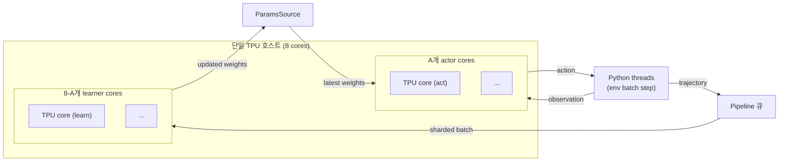

# Sebulba - DeepMind Podracer 시리즈 (actor-learner 분리)

## 개요

Sebulba는 DeepMind가 2021년 발표한 Podracer 두 변종 중 하나로, 분산 actor-learner 토폴로지를 **단일 TPU 호스트** 안에 압축한 RL 아키텍처이다. [[impala-vtrace]]의 분산 패턴을 작은 비용으로 재현하면서, 학습 효율과 GCP preemptible 인스턴스 비용을 동시에 최적화한 것이 핵심 기여다.

자매 아키텍처 [[anakin-podracer]]와 함께 발표되었으며, JAX의 `pmap`/`pjit` API 진화에 직접 영향을 주었다.

- 논문: [Podracer architectures for scalable Reinforcement Learning (2104.06272)](https://arxiv.org/abs/2104.06272)
- 저자: Matteo Hessel, Manuel Kroiss, Aidan Clark, Iurii Kemaev, John Quan, Thomas Keck, Fabio Viola, Hado van Hasselt (DeepMind)
- 제출일: 2021-04-13
- 공식 구현: instadeepai/sebulba (JAX), vwxyzjn/cleanba (CleanRL 단일파일)
- 시스템: TPU pod / TPU v3, v4 / 8-core TPU 단일 호스트

## 핵심 기여

- 분산 actor-learner 토폴로지를 단일 TPU 호스트에 압축
- Atari 200M frame 학습을 8-core TPU에서 약 1시간, GCP preemptible 인스턴스 약 $2.88
- DMLab 환경에서 IMPALA 대비 wall-clock 단축

## 분산 토폴로지

8개 TPU 코어를 두 disjoint 그룹으로 분할: `A`개는 actor 전용(rollout 추론), `8-A`개는 learner 전용(gradient update). Python thread가 환경 batch를 병렬 step → observation을 acting TPU 코어에 전달 → action 수신 → trajectory를 큐에 push.

`ParamsSource` 컴포넌트가 learner → actor 파라미터 동기화를 담당한다.

## 통신 패턴

- 모든 컴퓨트가 단일 TPU 호스트 안에서 진행 → **머신 간 통신 없음**
- Learner thread는 모든 learning TPU 코어에서 동일 update 함수를 `jax.pmap`으로 실행
- 파라미터 업데이트는 `jax.pmean` / `jax.psum`으로 averaged
- Multi-pod 확장 시 pod 간 replica 식으로 scale, pod 내부는 위 구조

## rollout vs policy update 분리

- 비동기 acting + 비동기 learning: actor가 trajectory를 큐에 넣고 곧바로 다음 batch 진행
- Off-policy 보정은 **V-trace** ([[impala-vtrace]] 계열) 활용
- Sebulba 자체는 알고리즘 templated — IMPALA, PPO, R2D2 등을 plug-in 가능

## 실측 처리량

| 셋업 | 결과 |
|------|------|
| 8-core TPU, Atari 200M frames | 약 1시간 |
| 1 GPU + 10 CPU (Cleanba) | monobeast IMPALA 대비 6.8x, moolib IMPALA 대비 1.2x |
| 8 GPU + 40 CPU (Cleanba) | 5x / 2x |

## Anakin과의 비교

| 측면 | Sebulba | Anakin |
|------|---------|--------|
| 환경 위치 | host CPU (Python thread) | TPU 위 (JAX pure function) |
| Actor/learner | 분리 (두 disjoint TPU 그룹) | 통합 (모든 core 동일) |
| 적합 환경 | Atari, DMLab 등 일반 환경 | gymnax, brax 등 JAX-native |
| 처리량 | 높음 (rollout 병렬) | 매우 높음 (Python overhead 0) |

자세한 비교는 [[anakin-podracer]] 참조.

## 핵심 인용

> "𝐴 cores are used exclusively to act, and the remaining 8 − 𝐴 cores are used to learn." — paper §3

> "Each Python thread steps an entire batch of environments in parallel and feeds the resulting batch of observations to a TPU core, to perform inference of that batch of observations and select the next batch of actions." — paper §3.1

> "parameter updates can be averaged across all participating learner cores using JAX's pmean/psum primitives." — paper §3.1

## 운영 / 영향

- DeepMind 자체 RL 연구 인프라(XLand, AlphaZero 후속 등)에 영향
- InstaDeep이 enterprise RL에 적용 — DeepPCB(반도체 라우팅) 등 산업 사례
- JAX의 `pmap`/`pjit` API 진화에 기여 (James Bradbury 인용)

## 관련 문서

- [[anakin-podracer]] - 자매 아키텍처 (fully on-device)
- [[impala-vtrace]] - V-trace 기반 분산 actor-learner
- [[rl-harness-frameworks-comparison]] - RL harness 통합 비교
