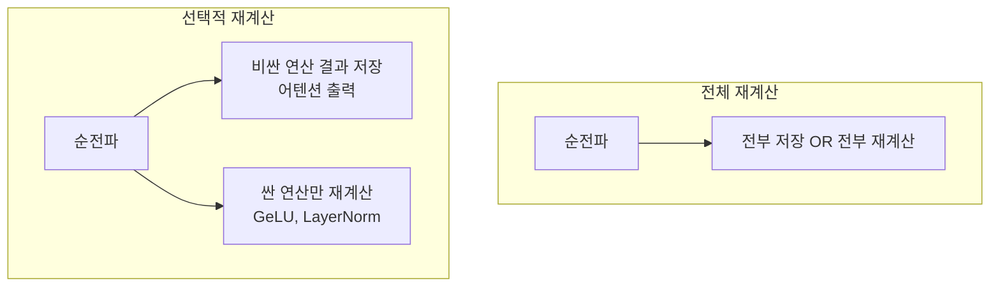

# 선택적 활성값 재계산

레이어 전체가 아닌 **연산 단위**로 체크포인트를 선택해 재계산 오버헤드를 최소화하는 메모리 절감 기법. NVIDIA의 SAC(Selective Activation Checkpointing)가 대표적.

## 왜 "선택적"인가

| 연산 | 메모리 비용 | 재계산 비용 | 전략 |
|------|-----------|-----------|------|
| 어텐션 QKV | **높음** | 높음 | **저장** |
| GeLU/SwiGLU | 중간 | **낮음** | **재계산** |
| LayerNorm | 낮음 | **매우 낮음** | **재계산** |
| Dropout 마스크 | 낮음 | 재현 필요 | 저장 |

전체 활성값 체크포인팅은 순전파를 2회 수행해 ~33% 오버헤드. 선택적 재계산은 **5-10% 오버헤드**로 메모리를 대폭 절감.

## 관련 문서

- [[distributed-training-overview]] -- 분산 학습
- [[flash-attention]] -- FlashAttention (메모리 효율)
- [[data-parallelism-fsdp]] -- FSDP
