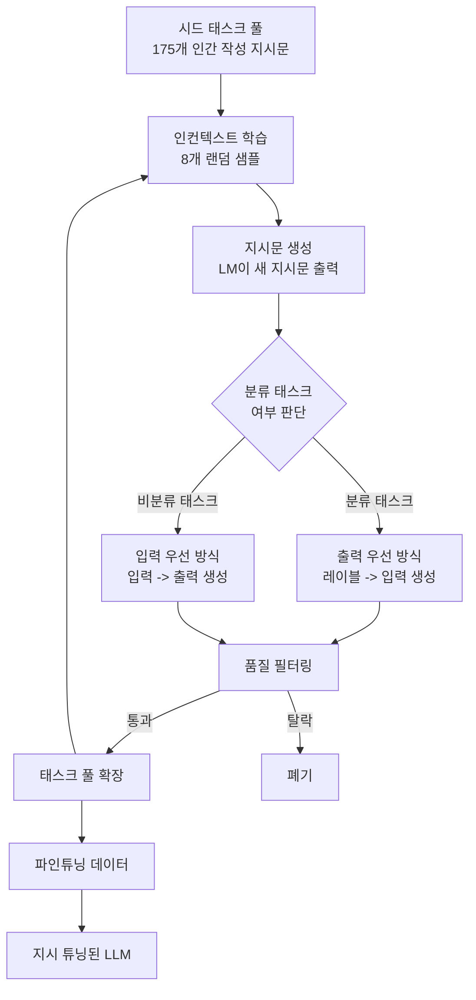
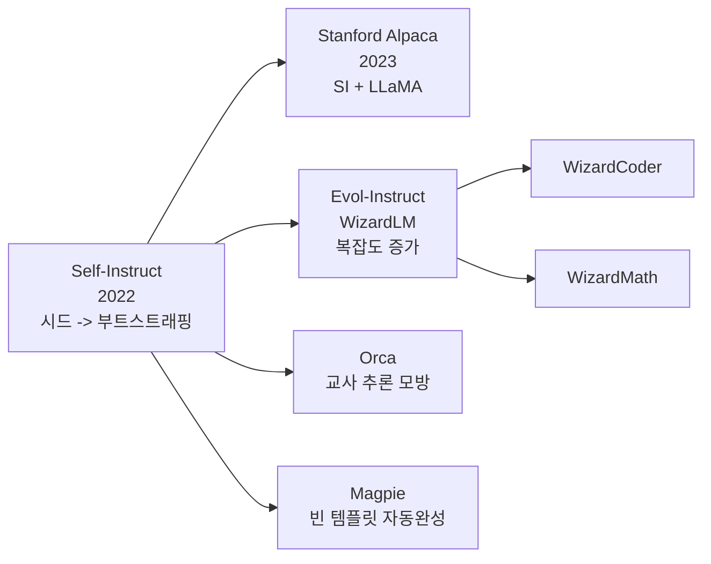

# Self-Instruct - 자기 부트스트래핑 지시문 생성

## 배경과 문제 의식

InstructGPT, FLAN 같은 지시 튜닝(instruction tuning) 모델의 성공은 **고품질 (지시문, 응답) 쌍 데이터**에 달려 있다. 그러나 이 데이터는 인간 주석 작업자가 직접 작성하거나 큐레이션해야 하며, 확장이 어렵고 비용이 높다:

- 인간 작성: 다양성 제한, 시간·비용 높음
- 크라우드소싱: 품질 불균일, 여전히 높은 비용
- 웹 크롤링: 노이즈 많고 지시 형식과 맞지 않음

Self-Instruct는 2023년 Stanford/Washington 대학 연구팀이 제안한 방법으로, **LLM이 스스로 지시문과 응답을 생성해 자신의 학습 데이터를 부트스트래핑**하는 최초의 체계적 접근이다. 이는 이후 [[evol-instruct-method|Evol-Instruct]], [[magpie-synthetic-instruction|Magpie]] 등 수많은 합성 데이터 방법론의 토대가 되었다.

## 핵심 아이디어

> "LLM 자신의 지식을 활용해 지시 데이터를 자동으로 생성하고, 이를 통해 해당 모델을 다시 파인튜닝할 수 있다."

이 아이디어의 핵심은 **순환(bootstrapping)** 이다:
1. 소수 인간 작성 시드(seed)에서 시작
2. LLM이 새 지시문과 응답을 생성
3. 필터링 후 풀(pool)에 추가
4. 풀에서 다시 인컨텍스트 예시로 사용해 새 생성
5. 반복

## 전체 파이프라인



## 세부 단계

### 1. 시드 태스크 정의

175개의 수작업 지시문 예시로 시작한다. 각 예시는 지시문(instruction) + 입력(input, 선택) + 출력(output) 구조다:

```json
{
  "instruction": "다음 이메일을 세 줄로 요약해주세요.",
  "input": "[이메일 내용]",
  "output": "[요약]"
}
```

이 175개는 다양한 태스크 유형(질문 응답, 요약, 분류, 코드, 추론 등)을 의도적으로 포함한다.

### 2. 새 지시문 생성

시드 풀에서 8개를 랜덤 샘플해 인컨텍스트 예시로 제공하고, LLM에게 새 지시문을 생성하도록 요청한다:

```
다음은 다양한 태스크에 대한 예시입니다.

태스크 1: ...
태스크 2: ...
...
태스크 8: ...

태스크 9:  ← LLM이 여기서 새 지시문 생성
```

GPT-3(text-davinci-003)가 원래 사용된 생성 모델이다.

### 3. 분류 태스크 여부 판별

생성된 지시문이 분류(classification) 태스크인지 아닌지 먼저 판별한다. 이유는 입출력 생성 전략이 다르기 때문이다:

- **분류 태스크**: 레이블 수가 제한적 -> 출력 우선(output-first) 방식으로 다양성 확보
- **비분류 태스크**: 자유 형식 출력 -> 입력 우선(input-first) 방식 적용

### 4. 인스턴스 생성

지시문에 맞는 실제 입력과 출력 쌍을 생성한다:

**입력 우선(비분류 태스크)**:
```
지시문: {instruction}
입력: (입력 생성 요청)
출력: (출력 생성 요청)
```

**출력 우선(분류 태스크)**:
```
지시문: {instruction}
분류 레이블: (레이블 목록 생성)
레이블 1에 해당하는 입력:
레이블 2에 해당하는 입력:
```

### 5. 품질 필터링

자동 생성 데이터의 노이즈를 줄이기 위한 필터:

- **ROUGE-L 유사도**: 새 지시문과 기존 지시문 간 유사도 0.7 이상이면 제거 (중복 방지)
- **키워드 필터**: "이미지", "그림", "차트" 같은 비텍스트 요청 제거
- **최소 길이**: 지나치게 짧은 지시문/응답 제거
- **동일 입출력**: 입력과 출력이 완전히 동일한 경우 제거

## 생성 결과: 52K 데이터셋

원논문에서 GPT-3로 다음 규모의 데이터를 생성했다:

| 항목 | 수치 |
|------|------|
| 생성된 지시문 총수 | 82,612개 |
| 필터링 후 지시문 수 | 52,445개 |
| 인스턴스 총수 | 82,439개 |
| 고유 지시문 루트 단어 | 4,068개 |

이 52K 데이터로 GPT-3를 파인튜닝한 **GPT3_SELF-INST** 모델이 InstructGPT 대비 경쟁력 있는 성능을 보였다. 특히 Stanford Alpaca에서 이 52K 데이터를 LLaMA 파인튜닝에 활용해 널리 알려졌다.

## Stanford Alpaca와의 관계

Self-Instruct 방법론을 가장 유명하게 만든 것은 **Stanford Alpaca** 프로젝트다:

- Self-Instruct 파이프라인 그대로 사용
- 생성 모델: text-davinci-003 대신 GPT-3.5-turbo로 비용 절감
- 생성 비용: $500 미만으로 52K 데이터 생성
- 파인튜닝: LLaMA-7B에 적용
- 결과: ChatGPT와 유사한 수준의 지시 따르기 능력

이 낮은 비용으로의 성공이 오픈소스 커뮤니티의 지시 튜닝 붐을 이끌었다.

## 방법론의 의의

Self-Instruct는 다음 측면에서 역사적 의미를 가진다:

1. **데이터 부트스트래핑 증명**: LLM이 자신의 학습 데이터를 생성할 수 있음을 체계적으로 증명.
2. **접근성 확대**: 소규모 팀도 지시 튜닝 모델을 만들 수 있는 길을 열음.
3. **합성 데이터 시대 개막**: 이후 Evol-Instruct, Magpie, Orca 등의 직접 영감.
4. **비용 효율**: 인간 주석 없이 경쟁력 있는 데이터 생성 가능함을 입증.

## 한계와 알려진 문제

- **환각 전파**: 생성 LLM의 환각이 데이터에 포함될 수 있음.
- **편향 증폭**: 생성 모델의 편향이 데이터에 반영.
- **복잡도 한계**: 생성된 지시문이 대체로 단순함 (Evol-Instruct의 등장 배경).
- **참조 모델 필요**: 강력한 LLM(GPT-3, GPT-3.5)으로 데이터 생성 필요.

## Self-Instruct 계보



Self-Instruct는 이후 합성 데이터 생성 방법론의 공통 조상이다.

## 관련 문서

- [[evol-instruct-method]] - Self-Instruct의 직접 발전형 - 진화적 복잡도 증가
- [[magpie-synthetic-instruction]] - 시드 없는 자동 지시문 생성
- [[instruction-tuning]] - 지시 튜닝 전반 개요
- [[synthetic-data-training]] - 합성 데이터 훈련 방법론
- [[synthetic-data-generation-pipeline]] - 합성 데이터 생성 파이프라인
- [[synthetic-data-tools]] - 합성 데이터 생성 도구
- [[supervised-fine-tuning]] - SFT 기본 개념
- [[rlhf-and-alignment]] - 정렬 학습 전반 맥락
