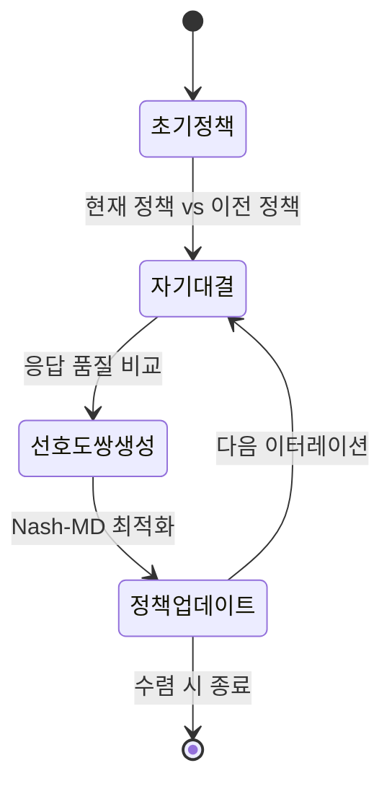

# Self-Play Training (자기 대국 학습)

## 개요

Self-play training은 에이전트가 자기 자신(또는 자신의 과거 버전)과 상호작용하면서 학습하는 강화학습 패러다임이다. 외부 전문가 데이터나 인간 레이블 없이 모델 스스로 경험을 생성하고, 그 경험으로부터 정책을 개선한다. AlphaGo(2016)와 AlphaZero(2017)가 바둑/체스/장기에서 초인적 성능을 달성하며 이 패러다임을 입증했고, 2024-2026년 LLM 시대에는 SPIN, SPICE 등의 연구를 통해 언어 모델의 자기 개선(self-improvement)으로 확장되고 있다.

## 핵심 메커니즘

### 기본 구조

Self-play의 핵심은 단순하다: 학습 대상인 에이전트가 환경의 일부 또는 전부를 자기 자신이 채운다.

```
반복 t:
  1. 현재 정책 pi_t로 에이전트 A와 에이전트 B를 인스턴스화
  2. A와 B가 상호작용하여 궤적(trajectory) 생성
  3. 결과(승/패, 보상)를 기반으로 정책 업데이트
  4. pi_{t+1} 획득
  5. 반복
```

핵심 특성은 **비정상성(non-stationarity)**: 상대가 고정되어 있지 않고 함께 진화하므로, 에이전트는 점점 더 강한 상대에 적응해야 한다. 이 동적 평형이 성능의 상한을 계속 끌어올린다.

### 변형 패턴

| 패턴 | 상대 설정 | 장점 | 위험 |
|------|----------|------|------|
| 현재 vs 현재 | 동일 파라미터 복사본 | 구현 단순 | 전략 고착(strategy collapse) |
| 현재 vs 과거 | 이전 체크포인트 풀 | 다양한 상대 | 체크포인트 관리 비용 |
| 현재 vs 혼합 | 과거 버전 + 현재 혼합 | 안정성과 탐색 균형 | 혼합 비율 튜닝 필요 |
| 비대칭 | 서로 다른 역할 (출제자/풀이자) | 역할 특화 | 역할 간 불균형 |

## AlphaGo에서 AlphaZero로

### AlphaGo (2016)

DeepMind의 AlphaGo는 두 단계로 학습했다:

1. **지도학습(SL)**: 인간 프로 기보 16만 대국으로 정책망(policy network) 초기화
2. **Self-play RL**: SL 정책을 시작점으로 자기 대국을 수행하며 REINFORCE로 정책 개선

인간 데이터로 "합리적 출발점"을 확보한 뒤 self-play로 초인적 수준에 도달한 하이브리드 접근이다.

### AlphaGo Zero (2017)

인간 데이터를 완전히 제거했다. 무작위 초기화에서 시작하여 순수 self-play만으로 학습하되, MCTS(Monte Carlo Tree Search)를 정책 개선 오퍼레이터로 활용했다:

- **신경망**: 현재 보드 상태에서 정책(다음 수 확률)과 가치(승률)를 동시 예측
- **MCTS**: 신경망의 예측을 가이드로 트리 탐색 수행, 더 정확한 정책/가치 추정 생성
- **학습**: MCTS의 개선된 추정치를 타겟으로 신경망 업데이트

이 "계획(MCTS) -> 경험 -> 학습 -> 더 나은 계획" 루프가 self-play의 핵심 엔진이다. 40일 학습으로 AlphaGo를 초월했다.

### AlphaZero (2017)

AlphaGo Zero의 바둑 특화 설계를 범용화했다. 동일한 알고리즘과 하이퍼파라미터로 바둑, 체스, 장기 세 게임 모두에서 기존 최강 프로그램(Stockfish, Elmo)을 압도했다. 게임 규칙 외에 어떤 도메인 지식도 주입하지 않았으며, 각 게임에 24시간 이내의 학습으로 초인적 수준에 도달했다.

이 결과는 "충분한 계산과 self-play가 있으면 도메인 전문 지식을 대체할 수 있다"는 강력한 증거가 되었다.

## LLM 시대의 Self-Play

게임 환경과 달리 언어는 명확한 승/패가 없고, 상태 공간이 사실상 무한하며, 보상 신호가 희소하다. 이 차이를 극복하기 위한 여러 접근이 등장했다.

### SPIN (Self-Play Fine-Tuning, 2024)

SPIN은 LLM에 self-play를 적용한 대표적 연구다. 핵심 아이디어는 모델이 자신의 이전 버전이 생성한 텍스트와 인간이 작성한 텍스트를 구분하도록 학습하는 것이다:

- **주 플레이어(main player)**: 현재 모델. 인간 텍스트와 이전 버전 생성 텍스트를 구분하도록 학습
- **상대 플레이어(opponent)**: 이전 반복(iteration)의 모델. 인간 텍스트와 구분하기 어려운 텍스트를 생성하려 시도

SFT(Supervised Fine-Tuning) 데이터만 필요하며, 추가 인간 주석이나 GPT-4 같은 외부 모델의 도움 없이도 반복적 자기 개선이 가능하다. 실험에서 HuggingFace Open LLM Leaderboard와 MT-Bench에서 DPO(Direct Preference Optimization)를 상회하는 결과를 보였다.

### Self-Play의 붕괴 문제

순수 self-play를 LLM에 적용하면 몇 라운드 후 품질이 급격히 하락하는 현상이 관찰된다:

- **모드 붕괴(mode collapse)**: 모델이 좁은 범위의 패턴만 반복 생성
- **보상 해킹(reward hacking)**: 실제 품질 향상 없이 보상 신호만 최적화
- **분포 이탈(distribution drift)**: 생성 텍스트가 자연어 분포에서 점점 벗어남

이 붕괴를 해결하는 핵심 방향이 코퍼스 접지(corpus grounding)이며, 이는 [[corpus-grounded-self-play]]에서 다룬다.

## Corpus-Grounded Self-Play와의 관계

[[corpus-grounded-self-play|SPICE 계열]] 연구는 self-play의 붕괴 문제에 대한 직접적 해법이다. 외부 문서 코퍼스를 "근거(ground)"로 활용하여:

- **출제자 역할**: 코퍼스 문서를 기반으로 질문/문제 생성
- **풀이자 역할**: 생성된 문제를 풀고, 코퍼스 근거로 검증

코퍼스가 분포 이탈의 앵커 역할을 하면서 self-play의 자기 개선 동학은 유지하는 접근이다. "라벨 없는 지속적 self-improvement"의 현실적 경로로 주목받고 있다.

## Agentic RL과의 연결

Self-play는 [[agentic-rl]]의 핵심 학습 메커니즘 중 하나다. 에이전트가 도구를 호출하고, 환경과 상호작용하는 멀티스텝 궤적 전체를 최적화할 때, 환경의 일부를 자기 자신이 채우는 self-play 패턴이 자연스럽게 등장한다. 예를 들어:

- 코드 생성 에이전트가 자신이 만든 테스트를 통과하도록 학습 (출제자 = 테스트 생성기, 풀이자 = 코드 생성기)
- 대화 에이전트가 자기 자신과 대화하며 설득/협상 능력을 개선

## 열린 문제

- **스케일링 법칙**: Self-play의 계산량 대비 성능 향상이 어떤 곡선을 따르는가? 게임 도메인의 경험이 언어 도메인으로 전이되는가?
- **안정성**: 붕괴 없는 장기 self-play의 이론적 조건은 무엇인가?
- **평가**: Self-play로 학습한 모델의 능력을 어떻게 객관적으로 측정하는가? 자기 평가의 한계
- **안전성**: Self-play가 의도치 않은 행동(deceptive alignment 등)을 학습할 위험

## SPPO (Self-Play Preference Optimization)

SPPO는 2024년 Wu et al.이 제안한 self-play 기반 선호도 최적화 기법이다. SPIN이 SFT 데이터만 사용하는 것과 달리, SPPO는 preference 데이터(선호도 쌍)를 self-play 프레임워크로 최적화한다.

핵심 아이디어는 Nash 균형(Nash equilibrium) 관점에서 최적 정책을 찾는 것이다:

- **Nash 균형 정책**: 어떤 단일 참조 모델과 대결해도 이기는 응답을 생성하는 정책
- **반복 절차**: 현재 정책이 상대(reference)가 되고, 새 정책이 그 상대를 이기도록 학습

RLVR([[rlvr]])과의 관계에서 SPPO는 외부 검증자(verifier) 없이 자기 자신을 심판으로 사용한다는 점이 다르다.



SPPO는 MT-Bench, AlpacaEval 2.0에서 DPO, IPO를 상회하는 결과를 보였으며, 특히 단일 모델 자원으로도 반복 개선이 가능하다는 실용적 장점이 있다.

## SPIN vs SPPO 비교

| 항목 | SPIN | SPPO |
|------|------|------|
| 필요 데이터 | SFT 데이터만 | 선호도 쌍 (preferred/rejected) |
| 심판/보상 | 인간 텍스트 구분 | Nash 균형 기반 |
| 이론 기반 | 게임이론 (구분자/생성자) | Nash-MD (거울하강법) |
| 주요 장점 | 추가 레이블 불필요 | 수렴 보장이 더 강함 |

## 관련 문서

- [[corpus-grounded-self-play]] -- 코퍼스 접지 self-play (SPICE 계열)
- [[agentic-rl]] -- 도구 통합 에이전트 강화학습
- [[rlvr]] -- 검증 가능한 보상 기반 RL (self-play의 확장)
- [[direct-preference-optimization]] -- self-play 없는 선호도 최적화 비교

## 출처

- Silver et al., "Mastering Chess and Shogi by Self-Play with a General Reinforcement Learning Algorithm" (2017) - https://arxiv.org/abs/1712.01815
- Chen et al., "Self-Play Fine-Tuning Converts Weak Language Models to Strong Language Models" (2024) - https://arxiv.org/abs/2401.01335
- Silver et al., "Mastering the game of Go without human knowledge" (2017) - https://www.nature.com/articles/nature24270
