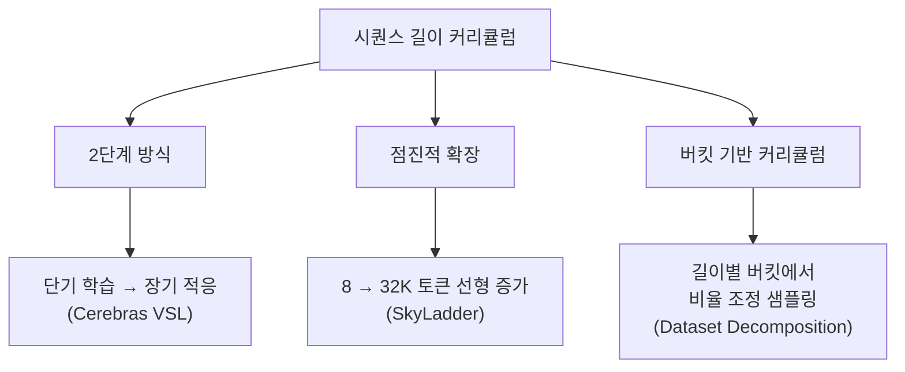
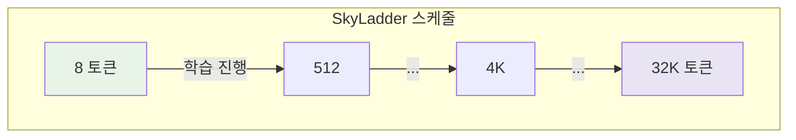

# 시퀀스 길이 커리큘럼 (Sequence Length Curriculum)

## 개요

시퀀스 길이 커리큘럼(Sequence Length Curriculum)은 LLM 사전학습에서 입력 시퀀스의 길이를 짧은 것에서 긴 것으로 점진적으로 확장하는 학습 전략이다. 짧은 시퀀스는 연산 비용이 낮고 학습이 "쉬우며", 긴 시퀀스는 연산 비용이 높지만 장거리 의존성(long-range dependency) 학습에 필수적이다. 고정 길이 학습 대비 연산 효율을 높이면서도 장문맥(long-context) 능력을 유지하거나 향상시킬 수 있어, Llama 3, Qwen 2.5 등 최근 프론티어 모델에서 널리 채택되고 있다.

## 연산 효율의 핵심 원리

Transformer의 self-attention은 시퀀스 길이 L에 대해 O(L^2) 연산 비용을 가진다. 따라서 시퀀스 길이를 절반으로 줄이면 어텐션 연산이 약 1/4로 감소한다.

| 시퀀스 길이 | 어텐션 비용 (상대) | 토큰당 FLOP (상대) |
|-----------|-----------------|------------------|
| 2K | 1x | 1x |
| 4K | 4x | ~1.5x |
| 8K | 16x | ~2.5x |
| 32K | 256x | ~8x |

동일한 토큰 예산에서 짧은 시퀀스로 학습하면 더 많은 학습 스텝을 소화할 수 있다. 핵심 질문은 "언제, 어떻게 긴 시퀀스로 전환하는가"이다.

## 주요 접근법

### 2단계 방식 (Two-Stage)

가장 직관적인 접근으로, 사전학습을 두 구간으로 나눈다.

1. **1단계 (단기 학습)**: 목표보다 훨씬 짧은 시퀀스(예: 2K 토큰)로 대부분의 토큰을 소화
2. **2단계 (장기 적응)**: 목표 시퀀스 길이(예: 8K-128K)로 전환하여 장문맥 능력 학습

Cerebras의 Variable Sequence Length(VSL) 연구에 따르면, 2K 토큰으로 1단계를 진행한 후 8K 토큰으로 전환하면 전체 학습에서 처음부터 8K를 사용하는 것 대비 약 29%의 FLOP 절감이 가능하다.

**실제 사례 -- Qwen 2.5**는 4단계 long-context 학습을 적용했다:
1. 기본 사전학습 (4K 컨텍스트)
2. 중간 확장 (16K)
3. 장문맥 적응 (64K)
4. 최종 확장 (128K)

### 점진적 확장 (Progressive Expansion)

2단계 방식의 급격한 전환 대신, 시퀀스 길이를 학습 스텝에 따라 연속적으로 증가시킨다.

**SkyLadder (NeurIPS 2025)**는 이 접근의 대표적 연구다:

- 최소 컨텍스트 윈도우(8 토큰)에서 시작하여 목표 컨텍스트(32K 토큰)까지 점진 확장
- 전체 학습 토큰의 약 60%를 확장 구간에 할당
- 일반 벤치마크에서 최대 3.7% 성능 향상, 학습 속도 최대 22% 단축
- 선형(linear), 사인곡선(sinusoidal), 지수(exponential), 단계적(stepwise) 등 다양한 스케줄 함수 평가

### 버킷 기반 커리큘럼 (Dataset Decomposition)

Apple의 Dataset Decomposition(NeurIPS 2024) 연구는 학습 데이터를 시퀀스 길이별 버킷으로 분류하고, 학습 초기에는 짧은 버킷의 샘플링 비율을 높게, 후기에는 긴 버킷의 비율을 높게 설정한다.

- 짧은 시퀀스가 "쉬운" 예제라는 커리큘럼 학습의 원리 적용
- 표준 언어 평가와 장문맥 벤치마크 모두에서 성능 향상
- 기준 대비 최대 6배 빠른 목표 정확도 도달

## 위치 인코딩과의 상호작용

시퀀스 길이를 점진적으로 늘릴 때 위치 인코딩(positional encoding)의 외삽(extrapolation) 능력이 중요하다.

### RoPE (Rotary Position Embedding)

대부분의 현대 LLM이 사용하는 RoPE는 학습 시 본 길이 범위에서는 안정적이나, 학습 범위를 넘어서는 길이에서는 성능이 급격히 저하된다.

**대응 기법**:
- **YaRN (Yet another RoPE extension)**: RoPE의 주파수 성분을 선택적으로 스케일링하여 외삽 능력 확장
- **NTK-Aware Scaling**: 신경 탄젠트 커널 관점에서 RoPE 기저 주파수를 조정
- **RoPE base 조정**: theta(base) 값을 증가시켜 더 긴 시퀀스 지원 (Llama 3: 500K base)

시퀀스 길이 커리큘럼 적용 시, 각 확장 단계에서 위치 인코딩 파라미터도 함께 조정하는 것이 일반적이다.

## 실무 설계 가이드

### 핵심 설계 변수

| 변수 | 권장 범위 | 비고 |
|------|----------|------|
| 초기 시퀀스 길이 | 2K-4K | 짧을수록 초기 효율 높지만, 너무 짧으면 언어 구조 학습 어려움 |
| 목표 시퀀스 길이 | 8K-128K | 모델 용도에 따라 결정 |
| 전환 시점 | 전체 토큰의 60-80% 소화 후 | SkyLadder: 60%를 확장에 할당 |
| 전환 방식 | 점진적 > 급격 | 급격한 전환 시 손실 급등 주의 |
| 위치 인코딩 조정 | 각 확장 단계에서 | RoPE base 재조정 |

### 배치 사이즈와의 병행

시퀀스 길이가 증가하면 GPU 메모리 사용량이 급증하므로, 배치 사이즈를 줄여야 할 수 있다. [[batch-size-scheduling]]과 시퀀스 길이 커리큘럼을 동시에 설계할 때는 총 토큰 처리량(시퀀스 길이 x 배치 사이즈)의 변화를 관리해야 한다.

Llama 3는 이 두 스케줄을 결합한 대표 사례다:
- 처음 252M 토큰: 배치 4M, 시퀀스 4K
- 252M ~ 2.87T 토큰: 배치 8M, 시퀀스 8K
- 2.87T 토큰 이후: 배치 16M, 시퀀스 8K

### 주의 사항

1. **패딩 효율**: 짧은 시퀀스를 긴 컨텍스트 윈도우에 패딩하면 연산 낭비. 문서 패킹(document packing)으로 해결
2. **평가 일관성**: 시퀀스 길이가 바뀌면 검증 손실의 비교가 어려움. 고정 길이 검증 세트를 별도 유지
3. **데이터 다양성**: 긴 시퀀스 학습 단계에서는 실제로 긴 문서(논문, 도서, 코드 파일)의 비율을 높여야 효과적
4. **안정성**: 시퀀스 길이 전환 시 [[training-stability]]에서 다루는 loss spike가 발생할 수 있으므로, 학습률 재warmup 등 완충 조치 권장

## 관련 페이지

- [[batch-size-scheduling]] -- 배치 사이즈 점진 증가 전략과의 병행
- [[learning-rate-scheduling]] -- 시퀀스 길이 전환 시 학습률 재조정
- [[data-mixing-curriculum-learning]] -- 커리큘럼 학습의 일반 프레임워크
- [[mixed-precision-training]] -- 긴 시퀀스에서의 메모리 최적화
- [[gradient-accumulation-checkpointing]] -- 긴 시퀀스 학습 시 메모리 관리
- [[training-stability]] -- 시퀀스 길이 전환 시 안정성 관리
- [[pretraining-pipeline-e2e]] -- 사전학습 파이프라인에서의 위치
