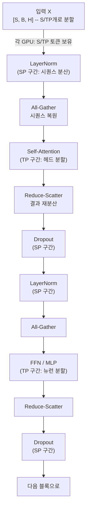

# Sequence 병렬화 (Sequence Parallelism)

## 개요

Sequence Parallelism(SP)은 트랜스포머의 시퀀스 차원(sequence dimension)을 여러 GPU에 분산하는 기법이다. [[distributed-training-overview]]에서 텐서 병렬화(Tensor Parallelism, TP)가 attention/FFN 레이어의 내부 차원을 분할하는 것과 달리, SP는 **TP가 처리하지 못하는 구간**, 즉 LayerNorm, Dropout 등 시퀀스 전체를 독립적으로 처리하는 연산의 시퀀스 축을 분할한다.

2022년 Megatron-LM 팀의 "Reducing Activation Recomputation in Large Transformer Models"에서 TP와 함께 사용하는 SP 기법이 제안되었다.

## TP의 미해결 구간

텐서 병렬화(TP)는 attention과 MLP를 효율적으로 분산하지만, 두 레이어 사이의 **LayerNorm과 Dropout**은 처리하기 어렵다:

- LayerNorm은 시퀀스의 각 토큰에 독립적으로 적용됨 (토큰 간 의존성 없음)
- Dropout도 마찬가지로 각 요소에 독립적으로 적용됨

TP 환경에서 이 구간을 처리하려면 분산된 텐서를 All-Gather로 모아야 하는데, 이것이 메모리 병목을 만든다. SP는 이 구간의 시퀀스 차원을 TP GPU들에 분산함으로써 All-Gather 없이 처리한다.

## TP + SP 결합 아키텍처

Megatron-LM의 TP+SP는 하나의 트랜스포머 블록 내에서 두 병렬화가 번갈아 역할을 맡는다:

All-Gather와 Reduce-Scatter가 SP와 TP 구간 사이에서 데이터를 변환한다. 핵심은 All-Reduce(전통적인 TP 통신)를 All-Gather + Reduce-Scatter 쌍으로 분리하여, 그 사이 구간에 SP 처리를 끼워넣는다는 점이다.

## 메모리 절약

SP의 주요 이점은 활성화 메모리(activation memory) 절감이다:

- TP만 사용할 때: LayerNorm/Dropout의 입력 activation이 모든 TP GPU에 복제됨 (중복 저장)
- TP+SP: LayerNorm/Dropout 구간의 activation이 TP GPU들에 분산됨 (중복 없음)

시퀀스 길이가 길수록 이 중복의 비용이 커지므로, SP는 특히 **긴 컨텍스트 훈련**에서 효과적이다.

## SP vs Context Parallelism

[[context-parallelism]]은 SP보다 더 적극적으로 시퀀스를 분산하는 기법이다. 둘의 차이:

| 항목 | Sequence Parallelism | Context Parallelism |
|------|---------------------|-------------------|
| 대상 | LayerNorm, Dropout 구간 | Attention 포함 전체 시퀀스 |
| Attention 처리 | TP가 담당 | CP: 시퀀스 청크별 Ring Attention |
| 주된 목적 | TP의 activation 중복 제거 | 매우 긴 시퀀스 확장 |
| 구현 복잡도 | 낮음 (TP와 통합) | 높음 (attention 재설계 필요) |
| 시퀀스 한계 | TP 크기에 비례 | 이론상 무제한 |

SP는 수만 토큰 수준에서 효과적이고, 수십만~백만 토큰이 필요하면 Context Parallelism이나 Ring Attention([[ring-attention]])으로 확장한다.

## [[data-parallelism-fsdp]]과의 결합

실제 대규모 훈련에서는 SP+TP+DP(또는 FSDP)를 계층적으로 조합한다:

- **TP+SP**: 단일 노드 내 GPU들 (NVLink 대역폭 활용)
- **DP/FSDP**: 노드 간 (InfiniBand 활용)
- **파이프라인 병렬화**: 모델 레이어를 노드 그룹에 분배

Megatron-LM의 3D 병렬화(DP + TP + PP)에서 TP 차원이 SP를 포함하는 형태로 확장된다.

## 구현 요점

- **올바른 랜덤 시드**: Dropout이 시퀀스 분산 상태에서 실행될 때, 각 GPU의 랜덤 시드를 일관되게 관리해야 재현 가능한 훈련이 보장된다
- **Reduce-Scatter vs All-Reduce**: TP 구간 끝에 All-Reduce를 쓰면 SP 구간 진입 전 All-Gather가 필요하므로 비효율적. Reduce-Scatter로 결과를 분산 상태로 남기는 것이 SP와 자연스럽게 연결된다
- **GradSync 타이밍**: SP와 DP가 결합될 때 기울기 동기화(All-Reduce)의 타이밍을 조정해야 통신 오버헤드를 겹칠 수 있다

## 관련 문서

- [[distributed-training-overview]] -- 분산 학습 전반 (DP, TP, PP, SP 개요)
- [[data-parallelism-fsdp]] -- FSDP 기반 데이터 병렬화 (SP와 결합되는 외부 차원)
- [[context-parallelism]] -- 더 긴 시퀀스를 위한 어텐션 수준 시퀀스 분산
- [[ring-attention]] -- Context Parallelism의 어텐션 구현 기법
