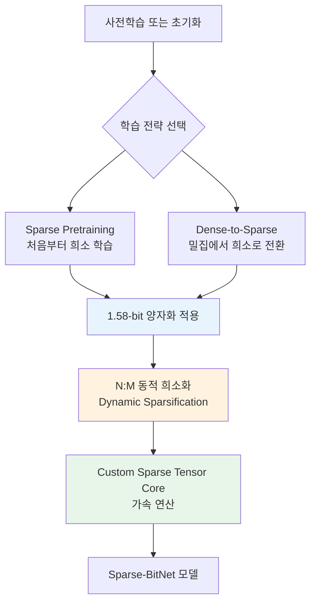
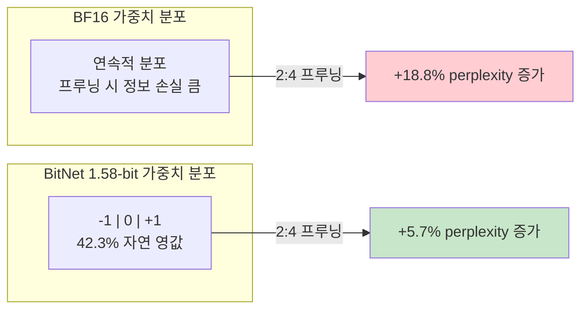

# Sparse-BitNet: 1.58-bit 극저비트 + N:M 희소성 결합 학습

## 개요

Sparse-BitNet은 Microsoft Research에서 2026년 3월 발표한 프레임워크로, **1.58-bit 양자화(quantization)**와 **N:M 반구조적 희소성(semi-structured sparsity)**을 동시에 적용하면서도 안정적인 학습을 최초로 달성한 연구다. 핵심 발견은 1.58-bit BitNet이 전정밀도(full-precision) 모델 대비 N:M 희소성에 "자연적으로 친화적"이라는 점이다.

기존 [[mixed-precision-training]]에서 FP16/BF16 수준의 양자화를 다뤘다면, Sparse-BitNet은 가중치를 {-1, 0, +1} 세 값으로만 표현하는 극단적 양자화와 구조적 프루닝을 결합해 연산 효율을 극대화한다.

## 배경: BitNet b1.58

BitNet b1.58은 가중치를 삼진(ternary) 값 {-1, 0, +1}로 양자화하여 학습하는 방법이다. 전통적인 후처리(post-training) 양자화와 달리, 처음부터 1.58-bit로 학습(native training)하기 때문에 모델이 저비트 표현에 최적화된 파라미터를 학습한다.

### 자연적 희소성 특성

사전학습된 1.58-bit BitNet의 가중치를 분석하면 독특한 "양자화 골짜기(quantization-valley)" 구조가 관찰된다:

- 전체 가중치 중 약 **42.3%가 0** 값
- 명시적 프루닝 없이도 자연적으로 높은 희소성 달성
- 이 특성이 N:M 희소성 적용 시 성능 열화를 최소화하는 근본 원인

## N:M 반구조적 희소성

N:M 희소성은 연속된 M개 원소 중 N개만 비영(non-zero) 값을 유지하는 패턴이다. 대표적으로:

| 패턴 | 희소율 | 설명 |
|------|--------|------|
| 2:4 | 50% | 4개 중 2개만 유지 (NVIDIA Ampere 이상 하드웨어 가속 지원) |
| 4:8 | 50% | 8개 중 4개 유지 (더 유연한 패턴 선택) |
| 6:8 | 25% | 8개 중 6개 유지 (경미한 희소화) |

NVIDIA의 Sparse Tensor Core가 2:4 패턴을 네이티브로 가속하기 때문에, 이 패턴이 실용적으로 가장 중요하다.

## Sparse-BitNet 프레임워크

### 두 가지 학습 전략

**1. Sparse Pretraining**: 학습 초기부터 N:M 희소성 마스크를 적용한다. 매 학습 스텝마다 가중치의 크기(magnitude) 기준으로 동적으로 마스크를 갱신한다.

**2. Dense-to-Sparse Schedule**: 밀집(dense) 학습으로 시작한 뒤, 일정 시점에서 희소성을 점진적으로 도입한다. 모델이 충분한 표현력을 확보한 후 프루닝하는 전략이다.

### 핵심 실험 결과 (Qwen-2.5 모델 패밀리)

2:4 희소성(50% 프루닝) 적용 시:

| 모델 | BF16 perplexity 증가 | BitNet 1.58-bit perplexity 증가 |
|------|----------------------|--------------------------------|
| 0.5B | +18.8% | +5.7% |
| 1.5B | 10% 임계값 초과 | 10% 임계값 이내 유지 |
| 3B | 심각한 성능 열화 | 안정적 성능 유지 |

BF16 모델은 2:4 희소성에서 이미 10% 열화 임계값을 초과하지만, BitNet은 동일 조건에서 5.7% 증가로 안정적이다.

## 효율성 분석

### 연산 효율

커스텀 Sparse Tensor Core를 활용한 Sparse-BitNet의 성능:

- 학습 및 추론에서 최대 **1.30배 속도 향상**
- 1.58-bit 양자화 자체의 메모리 절감 + 50% 희소성의 연산량 절감 효과 결합
- 기존 [[gradient-accumulation-checkpointing]]와 조합 시 추가 메모리 절감 가능

### 이론적 압축률

| 기법 | 비트/파라미터 | 유효 연산량 |
|------|--------------|------------|
| BF16 (기준선) | 16 bits | 100% |
| BitNet b1.58 | 1.58 bits | ~10% |
| Sparse-BitNet (2:4) | 1.58 bits + 50% sparse | ~5% |

전정밀도 대비 약 **20배 압축**과 연산량 절감이 이론적으로 가능하다.

## 왜 1.58-bit이 희소성에 친화적인가

1. **이산적 가중치 공간**: {-1, 0, +1} 세 값만 존재하므로, 프루닝으로 0이 되는 가중치의 "정보 손실"이 연속 분포 대비 극히 작다
2. **자연적 영값 집중**: 학습 과정에서 자연스럽게 42%+ 가중치가 0으로 수렴
3. **재학습 용이성**: 프루닝 후 남은 가중치의 재조정(fine-tuning) 범위가 제한적이어서 안정적

## 실용적 함의

### 온디바이스 추론

Sparse-BitNet은 모바일/엣지 디바이스에서의 LLM 배포에 특히 유망하다:

- 메모리 풋프린트 대폭 감소 (1.58-bit + 희소성)
- 하드웨어 가속기(Sparse Tensor Core)와의 자연스러운 호환
- [[lora-qlora-finetuning]]과 결합한 효율적 커스터마이징 가능성

### 학습 비용 절감

- 학습 시 연산량 감소로 GPU 시간 절약
- 더 큰 모델을 동일 하드웨어에서 학습 가능
- [[supervised-fine-tuning]] 단계에서도 적용 가능한 범용성

## 한계와 향후 방향

- 현재 실험은 Qwen-2.5 계열(0.5B-3B)에 한정되어, 대규모 모델(70B+)에서의 검증 필요
- 커스텀 Sparse Tensor Core 의존성으로 범용 하드웨어 지원이 제한적
- 1.30배 속도 향상은 이론적 기대 대비 보수적 -- 하드웨어/소프트웨어 최적화 여지 존재
- [[direct-preference-optimization]]이나 [[ppo-for-llms]] 같은 포스트트레이닝 단계와의 결합 연구 필요

## 참고 자료

- 논문: "Sparse-BitNet: 1.58-bit LLMs are Naturally Friendly to Semi-Structured Sparsity" (arXiv:2603.05168)
- GitHub: AAzdi/Sparse-BitNet
- 관련 선행 연구: BitNet b1.58 (Microsoft, 2024)
