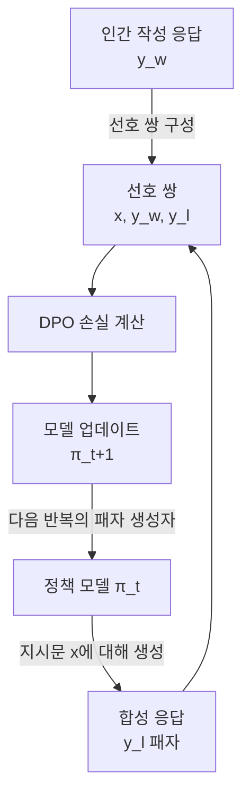
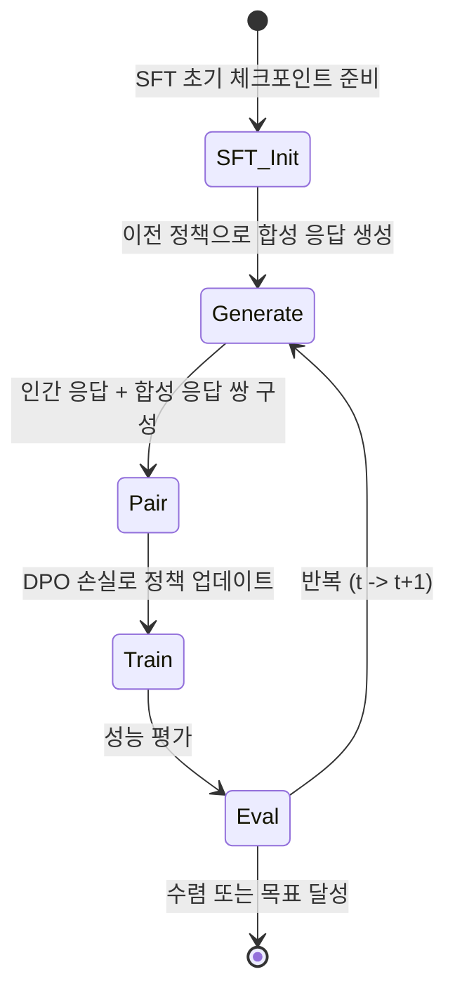

# SPIN - 자기 대국 파인튜닝

## 배경과 문제 의식

고품질 선호 데이터(선호/기각 쌍)는 수집 비용이 높다. 인간 주석 또는 강력한 외부 모델(GPT-4 등)이 기각 응답을 생성해야 하는데, 이는 확장성이 낮고 비용이 크다. 또한 기존 지도 파인튜닝(SFT)은 동일 데이터를 반복 사용할 경우 성능 향상이 빠르게 포화된다.

SPIN(Self-Play Fine-Tuning)은 **모델 자신이 생성한 응답을 기각 샘플로 사용**하여 선호 쌍을 만들고, 이를 반복적으로 학습함으로써 외부 데이터 없이 성능을 향상시키는 자기 대국(self-play) 방법론이다.

## 핵심 아이디어: 모델 vs 모델 대결

바둑/체스 강화학습에서 에이전트가 과거 자신과 대결하며 성장하는 아이디어를 LLM 파인튜닝에 적용한 것이다.

- **승자(winner)**: 인간이 작성한 참조 응답 $y_w$
- **패자(loser)**: 현재(또는 이전) 정책 모델이 생성한 합성 응답 $y_l^{(t)}$
- **선호 쌍**: $(x, y_w, y_l^{(t)})$

반복마다 패자 응답의 품질이 올라가기 때문에 모델은 더 어려운 비교를 학습하게 된다.

## 이론적 근거

### 게임 이론 관점

SPIN은 2인 제로섬 게임으로 모델링된다:

- **플레이어 1**: 주 정책 $\pi_\theta$ (응답 생성)
- **플레이어 2**: 이전 정책 $\pi_{\theta_{\text{old}}}$ (합성 패자 생성)

내시 균형(Nash equilibrium)에서 $\pi_\theta = \pi_{\theta_{\text{old}}}$가 되고, 이 시점에서 모델은 인간 참조 응답과 자신의 응답을 더 이상 구분하지 못하게 된다. 이는 모델이 인간 분포를 정확히 학습했음을 의미한다.

### 형식적 목표

$$\min_{\pi_\theta} \max_{\pi_{\text{old}}} \ell(\pi_\theta, \pi_{\text{old}})$$

여기서 $\ell$은 현재 정책이 (인간 응답, 이전 정책 응답) 쌍을 얼마나 잘 구분하는지를 측정하는 손실이다.

## 손실 함수

SPIN은 DPO 손실을 활용한다. $t$번째 반복에서:

$$\mathcal{L}_{\text{SPIN}}^{(t)}(\pi_\theta) = \mathbb{E}_{(x, y_w) \sim \mathcal{D},\, y_l \sim \pi_{\theta^{(t)}}(\cdot \mid x)} \left[ -\log \sigma \left( \beta \log \frac{\pi_\theta(y_w \mid x)}{\pi_{\text{ref}}(y_w \mid x)} - \beta \log \frac{\pi_\theta(y_l \mid x)}{\pi_{\text{ref}}(y_l \mid x)} \right) \right]$$

- $\pi_{\theta^{(t)}}$: $t$번째 반복 시점의 고정된 이전 정책 (패자 생성)
- $\pi_\theta$: 현재 학습 중인 정책 (업데이트 대상)
- $\pi_{\text{ref}}$: 초기 SFT 모델 (DPO의 참조 모델)

## 학습 반복 (Iteration) 절차

각 반복에서:
1. 현재 정책 $\pi_{\theta^{(t)}}$로 모든 지시문에 대해 합성 응답 생성.
2. 인간 참조 응답과 합성 응답으로 선호 쌍 구성.
3. DPO 손실로 새 정책 $\pi_{\theta^{(t+1)}}$ 학습.
4. 새 정책으로 다음 반복의 합성 응답 생성.

## 실험 결과

원논문에서는 HuggingFace Open LLM Leaderboard 기준:

- **zephyr-7b-sft** 기반으로 SPIN 3회 반복 적용 시, 인간 주석 없이 Mistral-7B 기반 모델과 동등 또는 우월한 성능.
- AlpacaEval 2에서 DPO(인간 선호 데이터 사용) 대비 경쟁력 있는 결과.
- 반복이 진행될수록 합성 패자 응답의 품질이 향상되어 학습 난이도가 점진적으로 증가하는 커리큘럼 효과 관찰.

## 합성 응답 품질의 중요성

SPIN의 효과는 패자 응답의 품질에 강하게 의존한다:

- **초기 반복**: 패자 응답이 낮은 품질 -> 쉬운 구분 -> 빠른 초기 학습
- **후기 반복**: 패자 응답이 인간 응답에 가까워짐 -> 어려운 구분 -> 세밀한 정렬

이 자연스러운 커리큘럼은 직접 설계하기 어렵지만 SPIN에서 자동으로 발생한다.

## 한계와 주의사항

- **반복 비용**: 매 반복마다 전체 데이터셋에 대해 응답 생성이 필요하여, 반복 횟수가 늘면 계산 비용 증가.
- **수렴 판단**: 언제 반복을 멈출지 명확한 기준이 없어 경험적 판단 필요.
- **참조 모델 여전히 필요**: 기본 SPIN은 DPO 기반으로 참조 모델을 사용. SimPO 버전으로 확장 가능.
- **데이터 품질 의존**: 인간 참조 응답 품질이 낮으면 상한도 낮아짐.

## 관련 개념: 자기 대국 강화학습과의 차이

| 특성 | RL 자기 대국 (AlphaGo) | SPIN |
|------|----------------------|------|
| 피드백 | 환경 보상 (승패) | 인간 참조 응답 |
| 경쟁자 | 이전 버전 에이전트 | 이전 버전 정책 모델 |
| 목표 | 최적 정책 | 인간 분포 학습 |
| 확장 | 무한 자기 대국 가능 | 인간 데이터 상한 |

## 실무 적용 관점

SPIN은 다음 상황에서 유용하다:

- **인간 선호 데이터 부족**: 기존 SFT 데이터만 있어도 선호 학습 가능.
- **반복 개선 목표**: 소규모 SFT 체크포인트에서 시작해 점진적 성능 향상.
- **연구/실험 환경**: 데이터 수집 없이 정렬 방법론 실험.

프로덕션 환경에서는 실제 인간 선호 데이터를 사용할 수 있다면 SPIN보다 DPO나 [[iterative-dpo|반복 DPO]]가 일반적으로 더 효과적이다.

## 관련 문서

- [[direct-preference-optimization]] - SPIN의 손실 기반인 DPO
- [[self-play-training]] - 자기 대국 학습 일반 개념
- [[online-dpo-iterative]] - 온라인/반복 DPO와의 유사성
- [[iterative-dpo]] - 반복적 선호 최적화
- [[synthetic-data-training]] - 합성 데이터 활용 학습
- [[magpie-synthetic-instruction]] - 합성 지시문 생성의 다른 접근
- [[rlhf-and-alignment]] - 정렬 방법론 전체 맥락
- [[preference-data-collection]] - 선호 데이터 수집과 SPIN의 관계
