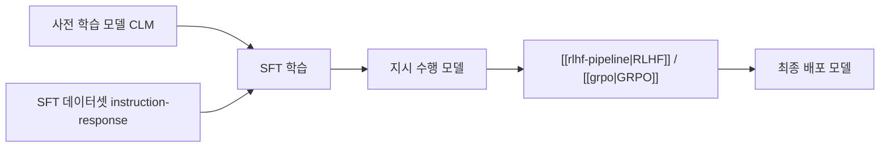

# 지도 파인튜닝 (Supervised Fine-Tuning)

## 개요

지도 파인튜닝(Supervised Fine-Tuning, SFT)은 [[causal-language-modeling]]으로 사전 학습된 언어 모델을 지시문-응답(instruction-response) 쌍으로 구성된 고품질 데이터셋에 지도 학습시키는 후학습(post-training) 단계이다. SFT는 사전 학습된 모델의 일반적인 언어 능력을 특정 형식의 대화, 지시 수행, 코드 생성 등 실용적 행동으로 변환하는 핵심 단계이다. InstructGPT(Ouyang et al., 2022)가 "SFT -> 보상 모델 -> PPO"라는 3단계 파이프라인을 정립한 이후, SFT는 프론티어 모델 개발의 첫 번째 후학습 단계로 표준화되었다.

## 핵심 개념

### SFT의 역할

사전 학습된 언어 모델은 다음 토큰 예측에 능숙하지만, "사용자의 질문에 유용하게 답변하는 것"은 학습하지 않았다. SFT의 역할은 이 간극을 메우는 것이다.

| 사전 학습 후 | SFT 후 |
|-------------|--------|
| "서울의 수도는" -> "한국이다. 서울은..." (문장 완성) | "서울은 한국의 수도입니다." (질문에 대한 답변) |
| 형식 없는 텍스트 연속 생성 | 구조화된 지시-응답 형식 |
| 다음 토큰 확률 최대화 | 유용성, 정확성, 안전성 지향 |

### 학습 데이터 형식

SFT 데이터셋은 일반적으로 다음 구조를 따른다.

```
{"instruction": "...", "input": "...(선택)", "output": "..."}
```

또는 대화형 형식:

```
{"messages": [
  {"role": "system", "content": "..."},
  {"role": "user", "content": "..."},
  {"role": "assistant", "content": "..."}
]}
```

학습 시에는 일반적으로 지시문/입력 부분의 토큰에 대해서는 손실을 계산하지 않고(loss masking), 응답 부분에 대해서만 cross-entropy 손실을 계산한다. 이를 통해 모델이 응답 생성에 집중하도록 유도한다.

### SFT 데이터의 품질 원칙

InstructGPT 논문에서 확인된 핵심 발견은 "1.3B 파라미터의 InstructGPT가 인간 평가에서 175B GPT-3를 능가"했다는 것이다. 이는 SFT 데이터의 품질이 모델 크기를 보상할 수 있음을 보여준다.

| 원칙 | 설명 |
|------|------|
| 다양성 | 다양한 태스크, 도메인, 난이도 포함 |
| 정확성 | 사실 오류 없는 정확한 응답 |
| 형식 일관성 | 통일된 대화 형식 및 톤 |
| 거부 포함 | 유해/불가능한 요청에 대한 적절한 거부 응답 |
| 적정 길이 | 불필요하게 장황하지 않은 응답 |

### 주요 SFT 데이터셋

| 데이터셋 | 규모 | 특징 |
|----------|------|------|
| OpenAssistant Conversations | ~160K | 크라우드소싱 다중 턴 대화 |
| ShareGPT | ~90K | 실제 사용자-ChatGPT 대화 수집 |
| Alpaca | ~52K | GPT-4로 생성한 [[instruction-tuning]] 데이터 |
| Dolly 2.0 | ~15K | Databricks 직원이 수동 작성 |
| LIMA | ~1K | "Less Is More for Alignment" -- 소량 고품질 |
| UltraChat | ~1.5M | 다중 턴 대규모 합성 대화 |

LIMA(Zhou et al., 2023)는 1,000개의 고품질 예제만으로도 강력한 SFT 모델을 학습할 수 있음을 보여주며, "데이터 양보다 질"이라는 관점을 강화했다.

## 작동 원리



### 학습 설정

| 항목 | 일반적 설정 |
|------|------------|
| 학습률 | 1e-5 ~ 5e-5 (사전 학습 대비 10-100x 낮음) |
| 에포크 | 1-3 (과적합 주의) |
| 배치 크기 | 32-128 |
| 시퀀스 길이 | 2048-8192 |
| 정밀도 | BF16/FP16 혼합 정밀도 |

### 전체 파인튜닝 vs 파라미터 효율적 파인튜닝

| 방식 | 학습 파라미터 | 메모리 | 성능 |
|------|-------------|--------|------|
| 전체 파인튜닝 | 100% | 높음 | 최상 |
| [[lora-qlora-finetuning]] | 0.1-1% | 낮음 | 근접 |
| Prefix Tuning | <1% | 매우 낮음 | 태스크 의존 |

2026년 기준 [[lora-qlora-finetuning]]이 SFT의 실질적 표준이 되었으며, "하나의 베이스 모델 + 다수 LoRA 어댑터" 패턴이 기업 환경에서 지배적이다.

## SFT의 한계와 후속 단계

SFT만으로는 해결되지 않는 문제들이 있다.

- **모방 학습의 한계**: SFT는 데이터의 응답 패턴을 모방하므로, 데이터에 없는 행동은 학습하지 못한다
- **환각 완화 부족**: SFT만으로는 모델의 [[hallucination|환각(hallucination)]]을 충분히 줄이지 못한다
- **선호 정렬 부재**: 여러 가능한 응답 중 "더 나은" 응답을 구별하는 능력이 부족하다

이러한 한계를 해결하기 위해 SFT 이후 [[rlhf-pipeline]](보상 모델 + PPO), [[grpo]], [[dapo]] 등의 강화학습 기반 정렬이 후속된다. 2026년 현재 "SFT -> RL 정렬"은 대부분의 프론티어 모델이 채택하는 표준 파이프라인이다.

## 대표 자료

- [Training language models to follow instructions with human feedback (InstructGPT, Ouyang et al., 2022)](https://arxiv.org/abs/2203.02155)
- [LIMA: Less Is More for Alignment (Zhou et al., 2023)](https://arxiv.org/abs/2305.11206)
- [Stanford Alpaca: An Instruction-following LLaMA Model (2023)](https://github.com/tatsu-lab/stanford_alpaca)

## 관련 문서
- [[learning-dynamics-finetuning]] -- LLM 파인튜닝 학습 동역학 (Learning Dynamics of LLM Finetuning)
- [[label-smoothing]] -- 라벨 스무딩 (Label Smoothing)
- [[multitask-learning]] -- 멀티태스크 학습 (Multi-Task Learning)
- [[llama-factory]] -- LLaMA-Factory -- 100+ 모델 통합 파인튜닝 프레임워크
- [[fine-tuning-overview]] -- 파인튜닝 개요 (Fine-Tuning Overview)

- [[instruction-tuning]] -- SFT의 변형으로 다양한 태스크 지시문 학습에 특화
- [[rlhf-pipeline]] -- SFT 이후 강화학습 기반 인간 선호 정렬
- [[grpo]] -- SFT 이후 적용되는 크리틱 없는 정책 최적화
- [[dapo]] -- 대규모 추론 RL 시스템
- [[lora-qlora-finetuning]] -- SFT의 파라미터 효율적 실행
- [[causal-language-modeling]] -- SFT가 전제하는 사전 학습 단계
- [[synthetic-data-training]] -- SFT 데이터의 합성 생성
- [[rlvr]] -- 검증 가능한 보상 기반 RL로 SFT 모델 추가 학습
