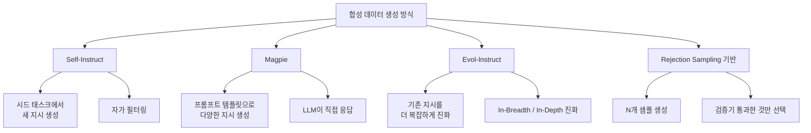

# 합성 데이터 생성 파이프라인

## 개요

합성 데이터 생성(Synthetic Data Generation)은 인간 어노테이터 없이 LLM이 스스로 훈련 데이터를 생성하는 기법이다. 고품질 인간 레이블 데이터가 부족하거나 비용이 높은 상황에서 지시 튜닝(instruction tuning), 선호 학습(preference learning), 추론 능력 강화 등 다양한 목적으로 활용된다. 방법론에 따라 Self-Instruct, Magpie, Evol-Instruct 등 여러 변형이 존재한다.

## 주요 생성 방식



### Self-Instruct

Stanford Alpaca에서 사용한 초기 방식이다. 소수의 시드(seed) 예시 태스크를 바탕으로 LLM이 새로운 지시-응답 쌍을 생성하고, 생성된 데이터로 자기 자신을 파인튜닝한다.

**파이프라인**:
1. 인간 작성 시드 태스크 175개 준비
2. LLM에게 "새로운 지시를 생성하라" 요청 (few-shot)
3. 생성된 지시가 기존 지시와 유사하면 제거 (ROUGE 기반 중복 제거)
4. LLM이 생성된 지시에 대한 응답 생성
5. 품질 필터링 후 훈련 데이터로 사용

**한계**: 교사 모델 수준의 데이터를 넘기 어렵고, 시드 편향이 전파된다.

### Magpie

Magpie는 지시를 "입력"으로 주는 대신 LLM의 **자연스러운 자동완성(autocompletion)**을 활용한다. 모델에게 사용자 역할의 프롬프트 템플릿만 주면 모델 스스로 그 다음에 올 법한 지시를 생성한다.

```
<|user|>
[모델이 이 이후를 채워 자연스러운 지시를 생성]
```

이 방식은 대상 모델 자체의 분포를 반영한 데이터를 생성하므로, 해당 모델을 파인튜닝하기에 최적화된 데이터가 된다.

### Evol-Instruct

WizardLM에서 도입한 방식으로, 기존 지시를 "진화"시켜 더 복잡하고 다양한 지시를 만든다.

| 진화 유형 | 설명 |
|-----------|------|
| In-Depth (깊이 진화) | 더 많은 제약 조건 추가, 더 구체적인 요구사항 |
| In-Breadth (너비 진화) | 완전히 새로운 주제의 지시 생성 |
| Deepen (심화) | 추론 단계 추가, 멀티스텝 문제로 변환 |
| Concretizing | 추상적 개념을 구체적 예시로 변환 |

반복 진화(N라운드) 후 더 복잡하고 다양한 데이터셋이 구성된다.

## 품질 관리 파이프라인

```mermaid
flowchart LR
    G[대량 생성\n(1M+)] --> F1[형식 필터링\n길이/구조 검사]
    F1 --> F2[중복 제거\nMinHash LSH]
    F2 --> F3[품질 스코어링\nLLM-as-Judge]
    F3 --> F4[다양성 샘플링\n클러스터 기반]
    F4 --> Final[훈련 데이터\n(50K-500K)]
```

합성 데이터는 대량 생성이 쉽지만 품질 편차가 크다. 효과적인 필터링 파이프라인이 필수적이며:

- **LLM-as-Judge**: GPT-4 또는 강력한 오픈소스 모델이 응답 품질을 1-10점으로 평가
- **규칙 기반 필터**: 과도한 반복, 부적절한 거절, 응답 누락 등 자동 감지
- **다양성 보장**: 지시 임베딩을 클러스터링해 균형 있는 서브샘플링

## 합성 데이터의 주요 활용처

### 지시 튜닝 데이터

[[instruction-tuning]] 데이터를 합성으로 보완한다. 특히 특정 도메인(의료, 법률, 코드)에서 인간 레이블 데이터가 부족할 때 유용하다.

### 추론 데이터 증강

수학, 코드, 논리 문제에서 Chain-of-Thought 풀이 과정을 합성으로 생성한다. [[synthetic-data-training]]에서 상세히 다룬다.

### 선호 데이터 생성

동일 지시에 대해 여러 응답을 생성하고, 검증기 또는 보상 모델로 순위를 매겨 DPO, RLHF용 선호 쌍(preference pair)을 구성한다.

## 모델 붕괴(Model Collapse) 위험

합성 데이터로만 반복 훈련하면 **모델 붕괴(model collapse)** 현상이 발생할 수 있다. 각 세대(generation)에서 분포의 꼬리(tail)가 잘려나가고 다양성이 감소한다.

**완화 전략**:
- 실제 인간 데이터를 일정 비율로 혼합 유지
- 생성 온도(temperature)를 높여 다양성 확보
- 세대 간 데이터 축적(cumulative mixing) - 직전 세대가 아닌 전체 세대 데이터를 혼합

## 관련 문서

- [[synthetic-data-training]] - 합성 데이터 훈련 전반 개요
- [[instruction-tuning]] - 지시 튜닝 파이프라인 상세
- [[rejection-sampling-finetuning]] - 검증기 기반 고품질 샘플 선별
- [[data-quality-scoring]] - 데이터 품질 평가 방법론
- [[model-collapse-synthetic]] - 합성 데이터 반복 훈련의 붕괴 현상
