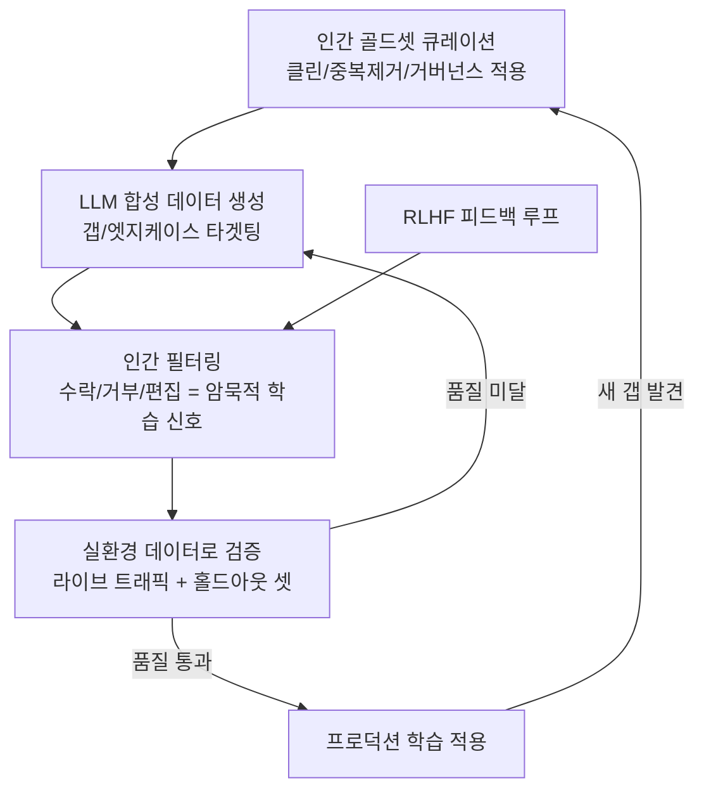

# 합성 데이터 학습 파이프라인 (Synthetic Data Training Pipeline)

## 개요

합성 데이터 학습 파이프라인은 고품질 인간 데이터를 앵커(anchor)로 삼아 LLM이 생성한 합성 데이터를 검증-필터링하는 순환 구조(flywheel)이다. 핵심 원칙은 "합성 데이터는 인간 판단을 대체하는 것이 아니라 확장(scale)한다"는 것이다. 2026년 기업의 75%가 합성 고객 데이터를 활용할 전망이며, 실제 인간 데이터 수집의 비용-개인정보-다양성 한계를 돌파하는 핵심 전략으로 부상했다. 에이전트 워크플로우에서는 합성 데이터 파이프라인이 [[agent-memory-systems|에이전트 메모리 시스템]]의 지식 베이스를 채우는 원천이 되기도 한다.

## 핵심 개념

### 인간 데이터 앵커링

합성 데이터의 품질 상한은 앵커 역할을 하는 인간 데이터가 결정한다. 도메인별 수용 기준(임상 프로토콜, 금융 리스크 임계값, 운영 레드라인 등)은 범용 웹 코퍼스로는 포착할 수 없으므로, 소규모라도 도메인 특화된 인간 데이터셋이 필수적이다.

조직은 각 유스케이스별로 "골든 코퍼스(Golden Corpus)"를 구축해야 한다 -- 클린하고 중복 제거되며 거버넌스가 적용된 고품질 인간 참조 데이터셋이다. 이 골든 코퍼스가 "무엇이 좋은 것인가"의 기준선을 정의한다.

### 생성-검증 플라이휠

파이프라인의 운영 모델은 네 단계 순환 구조를 따른다.

1. **큐레이션(Curation)**: 실제 워크플로와 정책에서 직접 추출한 고품질 인간 참조 데이터셋 구축
2. **생성(Generation)**: LLM(GPT-4, Llama, DeepSeek, HuggingFace 모델 등)으로 알려진 갭과 엣지 케이스 주변에 수천 개 후보 예시 생성. 범용 증강보다 롱테일 이벤트, 도메인 특화 갭, 희귀 엣지 케이스를 타겟팅
3. **인간 필터링(Human Filtering)**: 리뷰어가 수락/거부/편집하는 고속 선별. 하나의 옵션 선택, 문장 삭제, 캡션 수정 등 모든 행위가 암묵적 학습 신호(implicit annotation)가 됨
4. **검증(Validation)**: 인간+합성 혼합 데이터셋을 실제 워크플로 데이터와 라이브 트래픽으로 테스트. 합성 벤치마크가 아닌 실환경 검증. "실제 데이터에서 성능이 움직이지 않으면 합성 파이프라인은 GPU를 태워 예쁜 데모만 만드는 것"

### 데이터 거버넌스

혼합 코퍼스의 출처 추적(실제 vs 합성 vs 외부)과 데이터 구성 정책 수립이 필수다. 규제 산업에서는 합성 데이터의 비율과 라벨링이 감사(audit) 대상이 된다.

필수 거버넌스 요소:

- **출처 추적(Provenance tracking)**: 실제 로그, 합성 예시, GAN/LLM 출력, 외부 소스를 명확히 구분. "어떤 학습 데이터가 로그에서 왔고 어떤 것이 GAN/LLM에서 왔는지 구분할 수 있어야 한다"
- **합성 비율 정책(Synthesis quotas)**: 유스케이스별 수용 가능한 합성:인간 데이터 비율 정의
- **검증 게이트(Validation gates)**: 합성 데이터가 학습 파이프라인에 투입되기 전 품질 체크포인트 설정
- **규제 준수**: 의료 등 규제 산업에서는 특별한 엄격성 적용

## 작동 원리

이 접근법은 작업 방식을 "수공예적 저작(artisanal authoring)"에서 "고속 큐레이션과 검증"으로 전환한다. 진입점은 좁고 구체적이어야 한다: 예측 가능한 실패 모드가 있는 하나의 워크플로를 식별하고(클레임 요약, 티켓 분류, 접수 작업 등), 소규모 인간 골드셋을 구축한 뒤, 최소 루프로 개선을 검증한 후 스케일링한다.

## 모델 붕괴와 리스크 관리

### 모델 붕괴(Model Collapse)

합성 데이터만으로 학습 시 발생하는 핵심 실패 모드다. 모델이 "자신의 과거 출력만을 리믹스"하게 되면서 다양성이 감소하고 품질이 붕괴한다. 주요 원인:

- 이전 모델의 출력을 학습 데이터로 재활용
- 합성 생성에 다양성 제약이 없는 경우
- 저품질 합성 예시가 학습 세트를 오염 ("Synthetic garbage in, synthetic garbage out")

### 리스크 완화 전략

- 인간 앵커 데이터를 항상 유지하여 다양성의 하한선 보장
- RLHF(인간 피드백 강화학습)를 통한 지속적 행동 보정
- 합성 벤치마크가 아닌 실제 프로덕션 데이터로 검증
- 핵심 질문에 대한 책임자 지정: "합성 데이터셋이 실제로 프로덕션 모델 성능을 개선하는지 누가 책임지는가?"

## 도메인별 적용 패턴

### 의료/헬스케어

임상 프로토콜, 진단 기록, 환자 데이터는 개인정보 규제(HIPAA, GDPR)로 수집이 극히 제한된다. 합성 데이터는 실제 환자 데이터의 통계적 분포를 보존하면서 개인 식별 정보를 제거한 학습 세트를 생성한다. 규제 감사 시 합성 데이터의 비율과 생성 방법이 문서화되어야 한다.

### 금융/보험

사기 탐지, 리스크 평가 모델의 학습에서 합성 데이터는 실제 사기 사례(극소수)를 증강하여 클래스 불균형을 해소한다. 금융 규제 기관은 합성 데이터 기반 모델의 의사결정 근거를 요구할 수 있으므로, 출처 추적이 특히 중요하다.

### 소프트웨어 개발

코드 생성 모델의 학습에서 합성 코드-테스트 쌍은 엣지 케이스 커버리지를 확대한다. 실제 프로덕션 코드의 저작권 문제를 회피하면서 다양한 프로그래밍 패턴을 학습시킬 수 있다.

## 성능/효과

- 인간 데이터만 사용 대비 데이터 다양성과 규모를 수 배 확장
- 개인정보 민감 도메인에서 실제 데이터 수집 비용 대폭 절감
- 학습 데이터의 편향 제어가 명시적으로 가능 -- 특정 인구통계, 언어, 시나리오의 대표성을 의도적으로 조정
- 2026년 기업 75%가 합성 고객 데이터 활용 전망 (Gartner/IBM 추정)
- 2026년의 경쟁 우위는 프론티어 모델이 아닌 "가장 스마트한 플라이휠을 운영하는 조직"에 있다 -- 큐레이션된 인간 코퍼스, 규율 잡힌 합성 생성, 인간 참여 선별의 조합

## 관련 문서
- [[datatrove]] -- DataTrove - 대규모 데이터 처리 라이브러리

- [[knowledge-distillation]] -- 교사 모델 출력을 활용한 학습 데이터 생성
- [[lora-qlora-finetuning]] -- 합성 데이터로 효율적 파인튜닝
- [[extended-constitutional-ai]] -- 합성 피드백 검증 루프
- [[agent-memory-systems]] -- 합성 데이터 파이프라인이 생성하는 episodic/semantic 메모리 예시는 에이전트 메모리 시스템 설계와 맞닿아 있다
