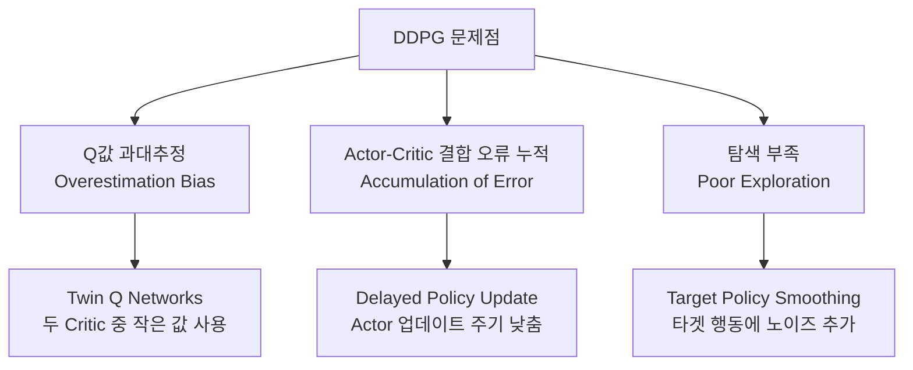
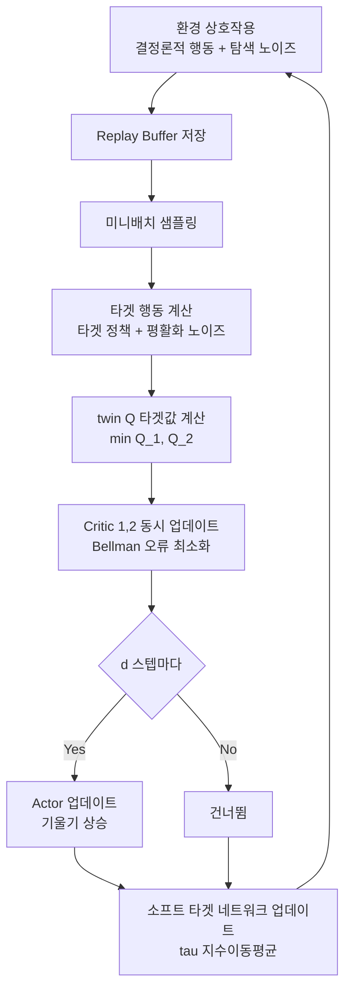

# TD3 (Twin Delayed Deep Deterministic Policy Gradient)

TD3는 Fujimoto et al. 2018이 발표한 **연속 행동 공간을 위한 오프-폴리시 심층 강화학습 알고리즘**이다. DDPG(Deep Deterministic Policy Gradient)의 세 가지 핵심 불안정성 원인을 해결하는 세 가지 기법을 추가해 학습 안정성과 성능을 크게 향상시켰다. 이름에서 드러나듯 "Twin(쌍둥이 Q)", "Delayed(지연 업데이트)" 두 핵심 아이디어가 조합된다.

## DDPG의 문제와 TD3의 해법



### 1. 쌍둥이 Q 네트워크 (Twin Q-Networks)

Actor-Critic에서 Q 함수가 과대추정되면 정책이 그 오류 방향으로 학습된다. TD3는 **두 개의 독립적인 Q 네트워크를 학습하고 더 작은 값을 사용**해 과대추정을 억제한다:

$$y = r + \gamma \min_{i=1,2} Q_{\theta_i'}(s', \pi_{\phi'}(s'))$$

두 네트워크는 서로 다른 파라미터를 갖고 독립적으로 업데이트되므로, 어느 한 쪽이 과대추정해도 최솟값 연산이 이를 억제한다.

### 2. 지연된 정책 업데이트 (Delayed Policy Update)

Critic(Q 함수)이 충분히 수렴하기 전에 Actor(정책)를 업데이트하면 불안정해진다. TD3는 **Critic을 여러 번 업데이트할 때마다 Actor를 1번만 업데이트**한다:

- 보통 d=2 (Critic 2번 업데이트 : Actor 1번 업데이트)
- Actor는 더 안정된 Critic을 기반으로 업데이트되어 오류 누적 감소

### 3. 타겟 정책 평활화 (Target Policy Smoothing)

타겟 Q값 계산 시 사용하는 타겟 정책의 행동에 **작은 노이즈를 추가**해 특정 행동에 과도하게 높은 Q값이 할당되는 것을 방지한다:

$$\tilde{a} = \pi_{\phi'}(s') + \epsilon, \quad \epsilon \sim \text{clip}(\mathcal{N}(0, \sigma), -c, c)$$

이는 학습 데이터의 보간(interpolation) 효과를 주어 Q 함수를 더 부드럽게(smooth) 만든다.

## 전체 학습 루프



## [[q-learning-dqn]] 과의 관계

TD3의 Critic 업데이트는 [[q-learning-dqn]]의 Bellman 백업을 심층 신경망으로 확장한 것이다:

$$L(\theta_i) = \mathbb{E}\left[(Q_{\theta_i}(s,a) - y)^2\right], \quad y = r + \gamma \min_j Q_{\theta_j'}(s', \tilde{a})$$

DQN이 이산 행동 공간에서 $\max_a Q(s',a)$로 타겟을 계산하는 것과 달리, TD3는 결정론적 Actor로 최적 행동을 직접 근사한다.

## SAC와의 비교

| 항목 | TD3 | SAC |
|------|-----|-----|
| 정책 타입 | 결정론적(Deterministic) | 확률론적(Stochastic) |
| 탐색 방법 | 외부 노이즈(OU/가우시안) 수동 추가 | 엔트로피 정규화 자동 탐색 |
| 하이퍼파라미터 민감도 | 탐색 노이즈 튜닝 필요 | 온도 자동 조정(SAC v2) |
| 샘플 효율성 | 높음 | 비슷하거나 약간 높음 |
| 성능 일관성 | 환경에 따라 변동 | 더 일관적 경향 |

실무에서는 두 알고리즘을 모두 시도해보는 것이 표준 접근이다.

## [[policy-gradient-ppo]] 와의 비교

| 항목 | TD3 | PPO |
|------|-----|-----|
| 학습 방식 | 오프-폴리시 | 온-폴리시 |
| 행동 공간 | 연속 특화 | 연속/이산 모두 |
| 샘플 효율성 | 높음 | 낮음 |
| 구현 복잡도 | 중간 | 낮음 |

## 구현 예시 (핵심 차이점)

```python
# Twin Q Critic 업데이트
with torch.no_grad():
    # 타겟 행동에 평활화 노이즈 추가
    noise = (torch.randn_like(action) * policy_noise).clamp(-noise_clip, noise_clip)
    next_action = (actor_target(next_state) + noise).clamp(-max_action, max_action)

    # 두 Critic 중 작은 값으로 타겟 계산
    target_q1 = critic1_target(next_state, next_action)
    target_q2 = critic2_target(next_state, next_action)
    target_q = reward + gamma * (1 - done) * torch.min(target_q1, target_q2)

q1_loss = F.mse_loss(critic1(state, action), target_q)
q2_loss = F.mse_loss(critic2(state, action), target_q)

# 지연된 Actor 업데이트 (d 스텝마다)
if total_steps % policy_delay == 0:
    actor_loss = -critic1(state, actor(state)).mean()
    # Actor 파라미터 업데이트
    actor_optimizer.zero_grad()
    actor_loss.backward()
    actor_optimizer.step()
    # 소프트 타겟 업데이트
    soft_update(critic1_target, critic1, tau)
    soft_update(actor_target, actor, tau)
```

## 실무 관점

- MuJoCo 표준 태스크(HalfCheetah, Ant, Humanoid 등)에서 SAC와 함께 최강 알고리즘
- 탐색 전략이 수동(외부 노이즈)이므로 환경의 보상 구조에 따라 성능 차이 발생
- 결정론적 정책이므로 로보틱스 실제 배포 시 행동 예측성이 높은 장점
- OpenAI Spinning Up, CleanRL 등 공개 구현체에서 검증된 코드 활용 권장
- 쌍둥이 Q 아이디어는 이후 SAC, REDQ, DrQ-v2 등 많은 알고리즘에 영향

## 관련 문서

- [[q-learning-dqn]] - Bellman 백업과 Q 함수 학습의 기반
- [[policy-gradient-ppo]] - 온-폴리시 기반의 대표 알고리즘과 비교
- [[sac-soft-actor-critic]] - 확률론적 정책 + 엔트로피 정규화를 추가한 발전형
- [[offline-reinforcement-learning]] - 리플레이 버퍼 개념을 극대화한 오프라인 RL
