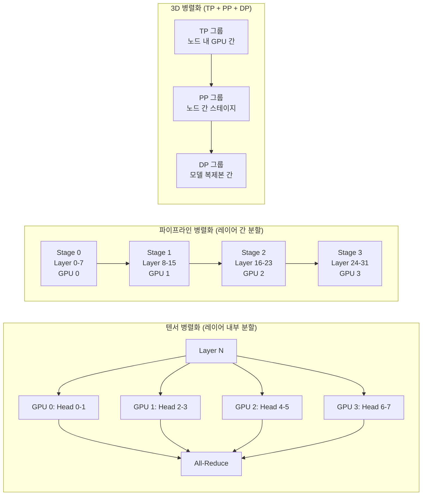

# 텐서/파이프라인 병렬화

## 개요

텐서 병렬화(Tensor Parallelism, TP)와 파이프라인 병렬화(Pipeline Parallelism, PP)는 단일 GPU에 적재할 수 없는 대규모 모델을 여러 GPU에 분할하여 학습하는 모델 병렬화(Model Parallelism) 기법이다. TP는 개별 레이어 내부의 연산을 GPU 간에 분할하고, PP는 모델의 레이어 그룹을 순차적으로 서로 다른 GPU에 배치한다. NVIDIA Megatron-LM 논문(2019)에서 체계화되었으며, 2026년 현재 [[data-parallelism-fsdp]]와 결합한 3D 병렬화(TP + PP + DP)가 수조 파라미터 규모 모델 학습의 표준이다.

## 핵심 개념

### 텐서 병렬화 (TP)

Transformer의 개별 레이어를 여러 GPU에 걸쳐 분할한다. 주요 대상은 Multi-Head Attention(MHA) 블록과 MLP(Feed-Forward) 블록이다.

**MHA 분할**: 어텐션 헤드를 GPU에 균등 배분한다. 8개 헤드, 4개 GPU라면 GPU당 2개 헤드를 담당한다. 각 GPU가 독립적으로 자신의 헤드에 대한 Q/K/V 연산을 수행하고, 결과를 all-reduce로 합산한다.

**MLP 분할**: 첫 번째 선형 레이어(W1)를 열 방향(column)으로 분할하고, 두 번째 선형 레이어(W2)를 행 방향(row)으로 분할한다. 이 분할 패턴은 중간 활성화(activation)에 대한 통신 없이 GPU별 독립 연산이 가능하며, 최종 결과만 all-reduce로 합산한다.

### 파이프라인 병렬화 (PP)

모델의 레이어를 순차적 단계(stage)로 나누어 각 GPU에 배치한다. 32개 레이어, 4개 GPU라면 GPU당 8개 레이어를 담당하여 "파이프라인"을 형성한다.

**파이프라인 버블 문제**: 단순한 PP에서는 앞 단계의 GPU가 연산을 완료해야 뒤 단계가 시작할 수 있다. 이 대기 시간이 "버블(bubble)"이며, GPU 활용률을 심각하게 저하시킨다.

### 파이프라인 스케줄링 전략

| 스케줄 | 버블 비율 | 메모리 | 설명 |
|--------|----------|--------|------|
| Naive (GPipe) | (p-1)/m | 높음 (마이크로배치 수 비례) | 전체 마이크로배치 forward 후 backward |
| 1F1B (PipeDream-Flush) | (p-1)/m | 낮음 (일정) | 1 forward, 1 backward 교대 실행 |
| Interleaved 1F1B | (p-1)/(m*v) | 낮음 | 비연속 레이어 청크로 버블 추가 감소 |

p = 파이프라인 스테이지 수, m = 마이크로배치 수, v = 인터리브 청크 수

1F1B 스케줄은 forward와 backward를 교대로 실행하여 메모리 사용량을 일정하게 유지하면서 버블을 줄인다. Interleaved 1F1B는 각 GPU에 비연속적인 레이어 청크를 여러 개 할당하여 버블을 추가로 v배 감소시킨다.

## 작동 원리



### 3D 병렬화 구성 예시 (64 GPU 클러스터)

```
TP = 8 (노드 내 NVLink 고속 통신)
PP = 4 (노드 간 스테이지)
DP = 2 (모델 복제본)
총 GPU = 8 x 4 x 2 = 64
```

1. **TP 그룹**: 같은 노드 내 GPU 간에 텐서를 분할. NVLink/NVSwitch의 고대역폭을 활용하여 all-reduce 지연을 최소화
2. **PP 그룹**: 서로 다른 노드의 GPU가 파이프라인 스테이지를 형성. 노드 간 통신은 point-to-point로 제한
3. **DP 그룹**: 동일한 TP+PP 구조의 모델 복제본 간에 그래디언트를 동기화

## 성능과 확장성

### TP vs PP 특성 비교

| 특성 | 텐서 병렬화 (TP) | 파이프라인 병렬화 (PP) |
|------|----------------|---------------------|
| 통신 패턴 | all-reduce (빈번, 소량) | point-to-point (드문, 대량) |
| 대역폭 요구 | 매우 높음 (NVLink 필수) | 상대적으로 낮음 |
| GPU 활용률 | 높음 (버블 없음) | 버블로 인한 유휴 발생 |
| 확장 한계 | 어텐션 헤드 수에 제한 | 스테이지 수에 제한 |
| 최적 배치 | 노드 내 (고속 인터커넥트) | 노드 간 (범용 네트워크) |

### Megatron-LM 벤치마크

PTD-P(Pipeline, Tensor, Data Parallelism) 결합이 단독 기법 대비 일관적으로 우수한 성능을 보인다. 수천 GPU에서 선형에 가까운 확장성을 달성하며, 단독 TP나 PP로는 이 수준의 확장이 불가능하다.

### 최신 발전 (2025-2026)

- **Dynamic Context Parallelism**: 가변 길이 시퀀스 학습에서 적응형 CP 크기 조정으로 최대 1.48x 속도 향상
- **Sequence Parallelism (SP)**: TP와 결합하여 LayerNorm, Dropout 등 TP로 분할되지 않는 연산의 활성화 메모리도 분산
- **Expert Parallelism (EP)**: [[mixture-of-experts]] 모델에서 전문가를 GPU에 분산하여 5차원 이상의 병렬화 가능

## 실전 도입 가이드

### 병렬화 차원 결정 순서

1. **TP 먼저 결정**: 노드 내 GPU 수를 기준으로 설정 (일반적으로 4 또는 8)
2. **PP 다음 결정**: 모델 크기와 노드 수에 따라 스테이지 수 설정
3. **DP 마지막**: 남은 GPU로 데이터 병렬화 또는 [[data-parallelism-fsdp]] 적용
4. **마이크로배치 수 조정**: PP 버블을 줄이기 위해 마이크로배치 수를 PP 스테이지 수의 4배 이상으로 설정

### 흔한 실수

- **TP를 노드 간에 적용**: all-reduce가 빈번하므로 InfiniBand 대역폭으로는 병목 발생. 반드시 NVLink 범위 내에서 적용
- **PP 스테이지 불균형**: 임베딩 레이어나 출력 레이어의 연산량이 다른 레이어와 크게 다를 때 특정 스테이지가 병목
- **마이크로배치 수 부족**: PP 버블을 줄이려면 충분한 마이크로배치가 필요. [[gradient-accumulation-checkpointing]] 활용

## 관련 문서
- [[megatron-lm-internals]] -- Megatron-LM 내부 구조

- [[data-parallelism-fsdp]] -- 데이터 병렬화 (3D 병렬화의 DP 축)
- [[deepspeed-zero]] -- DeepSpeed의 메모리 최적화 (FSDP 대안)
- [[distributed-communication]] -- NCCL all-reduce 등 통신 기본
- [[gpu-cluster-scheduling]] -- 다중 노드 학습 스케줄링
- [[nvidia-vera-rubin]] -- NVLink 6세대 포함 차세대 GPU 아키텍처
- [[dgx-spark]] -- 소규모 학습/추론 환경
