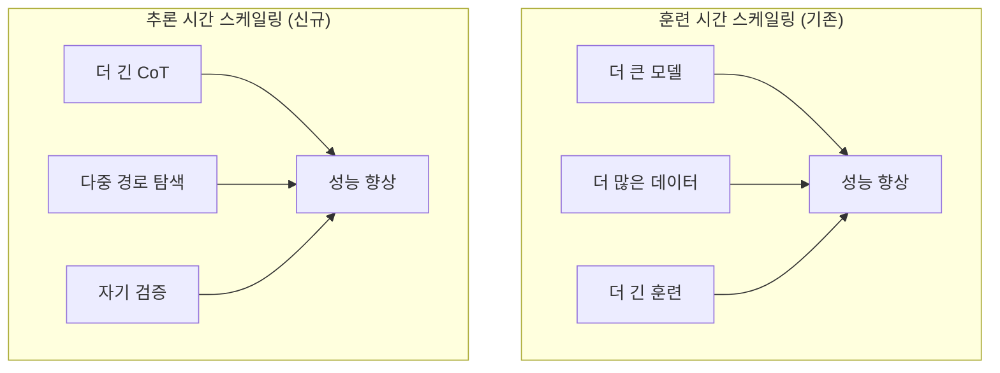
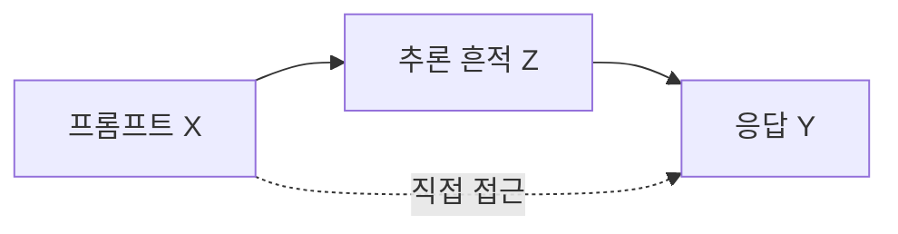

## 개요

Test-Time Compute Scaling은 모델을 더 크게 훈련하는 대신, 추론 시점에서 계산량을 증가시켜 성능을 향상시키는 패러다임이다. 기존의 "훈련 시간 스케일링"(더 큰 모델, 더 많은 데이터, 더 긴 훈련)과 대비되는 새로운 효율적 성능 향상 경로로, OpenAI o1/o3, [[deepseek-r1-paper|DeepSeek R1]] 등 추론 모델의 핵심 원리다. Reasoning Budget Forcing은 이를 한 단계 발전시켜, [[chain-of-thought|Chain-of-Thought(CoT)]]를 정보 병목(Information Bottleneck) 원리 기반의 손실 압축 문제로 재구성한다.

## 핵심 개념

### 두 가지 스케일링 축

- **훈련 시간 스케일링**: 모델 파라미터, 데이터, 컴퓨팅을 증가 -> 고정된 추론 비용
- **추론 시간 스케일링**: 동일 모델로 추론 시 계산량 증가 -> 유연한 성능/비용 트레이드오프

### 추론 시간 스케일링의 기법

| 기법 | 설명 | 대표 모델 |
|------|------|----------|
| CoT 연장 | 더 긴 추론 체인 생성 | o1 |
| Best-of-N 샘플링 | N개 후보 중 최적 선택 | 범용 |
| 빔 서치(Beam Search) | 트리 탐색으로 최적 경로 추적 | o3 |
| 다수결 투표(Majority Voting) | 복수 답변 중 합의 선택 | 범용 |
| 자기 검증 | 생성된 답변의 자체 검증 | o3 |
| 반복적 정제 | 초기 답변을 반복 개선 | DeepSeek R1 |
| 조기 종료(Early Exit) | 충분성 판단 후 추론 중단 | DTSR |

## 기술 상세

### Reasoning Budget Forcing

기존의 Budget Forcing 방식은 휴리스틱 길이 페널티를 통해 CoT 토큰 수를 줄이지만, 필수 추론과 불필요한 부분을 구분하지 못한다. 2026년 3월 발표된 "Reasoning as Compression" 논문은 이를 이론적으로 재구성한다.

#### 조건부 정보 병목 (CIB)

핵심 관계: 추론 흔적 Z는 프롬프트 X에서 직접 접근 불가능한 Y에 대한 정보만 포함하는 "계산 다리" 역할을 한다.

- **문제**: 어텐션이 프롬프트-추론-응답 사이 마르코프 속성을 위반
- **해법**: CIB(Conditional Information Bottleneck)로 이론적 격차 해결
- **목적함수**: 작업 보상 최대화 + 추론 압축의 결합

#### 의미론적 사전 (Semantic Prior)

토큰 비용을 단순 개수 대신, 언어 모델의 놀라움(surprisal) 기반으로 측정한다. "the"와 같은 예측 가능한 토큰은 낮은 비용으로, 새로운 정보를 담는 토큰은 높은 비용으로 평가된다.

### 실증 결과

- **중간 수준 압축**: 정확도 개선 (불필요한 인지적 팽창 제거)
- **적극적 압축**: 최소 성능 저하 유지
- **품질 보존**: 유창성과 논리성을 보존하면서 CoT 길이 단축

### 소형 모델이 대형 모델을 능가하는 사례

추론 시간 스케일링의 가장 주목할 만한 발견은 소형 모델이 대형 모델을 능가할 수 있다는 점이다:

- **Llama-3.2-3B**: compute-optimal TTS 전략 적용 시 Llama-3.1-**405B**를 MATH-500과 AIME24에서 능가
- **Qwen2.5-500M**: 적절한 TTS 전략으로 **GPT-4o** 수준 달성
- compute-optimal 전략은 Best-of-N 베이스라인 대비 **4배 이상** 효율 개선
- 소형 모델이 비자명한 성공률을 보이는 문제에서, TTS로 **14배 큰 모델**을 능가 가능

### 모델 크기별 최적 기법 선택

| 모델 크기 | 쉬운 문제 | 중간 문제 | 어려운 문제 |
|----------|----------|----------|-----------|
| <7B | Best-of-N | Best-of-N | 빔 서치 |
| 7B-32B | 다양한 트리 탐색 | 다양한 트리 탐색 | 빔 서치 |
| >32B | 다수결 투표 | 빔 서치 | 빔 서치 |

### DTSR: 동적 사고 충분성 추론

Dynamic Thought Sufficiency in Reasoning(DTSR)은 CoT 추론 중 "Wait", "Alternatively", "But"과 같은 반성 신호를 모니터링하고, 사고의 충분성을 평가하여 최적 조기 종료 지점을 결정한다:

- Qwen3-14B: 정확도 84.8%(기존 84.4%) 유지하면서 토큰 **34.9% 감소**
- Qwen3-32B: 정확도 84.6%(기존 84.7%) 유지하면서 토큰 **28.9% 감소**
- 프로그래밍(LiveCodeBench): 생성 길이 **50% 이상** 감소
- 엔드투엔드 지연 시간 25-40% 개선 (DEER 베이스라인 대비)

### 실용적 의미

추론 시간 스케일링은 고정된 모델로도 문제 난이도에 따라 계산 자원을 유연하게 배분할 수 있다. 간단한 질문에는 최소 계산을, 복잡한 수학/코딩 문제에는 더 많은 계산을 할당하는 적응적 추론이 가능하다. compute-optimal 전략을 사용하면 SLM이 100-1000배 적은 FLOPS로 대형 모델을 능가할 수 있다.

| 문제 유형 | 계산 할당 | 비용 영향 |
|----------|----------|----------|
| 단순 사실 조회 | 최소 | 기존 LLM 수준 |
| 다단계 추론 | 중간 | 3-5x |
| 복잡한 수학/코딩 | 최대 | 10x+ |

## 관련 문서
- [[model-merging]]
- [[mamba-3]]

- [[ai-reasoning-models]] - o1/o3 추론 모델 패러다임
- [[deepseek-mhc]] - DeepSeek의 학습 안정성 아키텍처
- [[multi-head-latent-attention]] - KV 캐시 효율화 (추론 비용 절감)
- [[process-reward-models]] - 추론 과정 평가 모델
- [[rl-scaling-laws]] - RL 기반 스케일링 법칙
