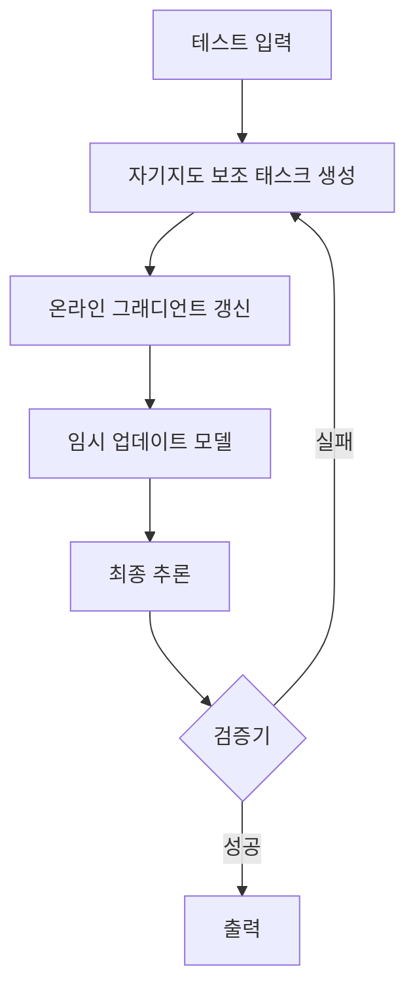

# Test-Time Training & Self-Improvement

추론 시점에 모델 파라미터를 실시간으로 업데이트해 성능을 높이는 기법. 오프라인 파인튜닝(fine-tuning) 없이 테스트 분포(test distribution)에 즉시 적응하는 것이 핵심 목표다.

## 왜 중요한가

기존 사전학습(pre-training) + 파인튜닝(fine-tuning) 패러다임은 모델이 배포된 이후 분포 이동(distribution shift)에 적응하지 못하는 정적 특성을 가진다. TTT(Test-Time Training)는 입력 데이터 자체를 일시적 학습 신호로 삼아 파라미터를 갱신함으로써 이 한계를 극복한다.

2026년 초 In-Place TTT가 메모리 오버헤드 없이 배치 단위 가중치 갱신을 구현하면서, 에이전트(agent) 태스크와 장기 컨텍스트(long-context) 추론 양쪽에서 검증됐다.

## 핵심 메커니즘

위 루프는 **검증기(verifier) 기반 자기개선** 패턴의 전형이다. 검증 가능한 태스크(코드 실행, 수학 풀이)에서 특히 효과가 크다.

## 주요 변형

| 변형 | 설명 | 비고 |
|------|------|------|
| In-Place TTT | 배치 내에서 임시 가중치 갱신 후 폐기. 메모리 최소화 | 2026-04 기준 최신 |
| Self-Improving LLM Agents | 에이전트가 실행 궤적(trajectory)을 보상 신호로 삼아 자기개선 | 멀티 턴 루프 |
| Verifier-Driven TTT | 외부 검증기 피드백으로 가중치 갱신 샘플 필터링 | 품질 보장에 유리 |
| 연속 자기개선 | 추론 중 검증기가 거른 고품질 롤아웃(rollout)으로 지속 업데이트 | 배포 후 드리프트 방지 |

## 기술적 고려사항

- **수렴 안정성**: 온라인 갱신은 학습률(learning rate)이 너무 크면 기존 지식을 망각(catastrophic forgetting). 소규모 LoRA(Low-Rank Adaptation) 어댑터에만 적용하는 방식이 실용적
- **연산 오버헤드**: 역전파(backpropagation)가 추론 지연(latency)을 수 배 증가시킬 수 있음. 스텝 수 제한 필수
- **보조 태스크 설계**: 마스킹(masking)·재구성(reconstruction) 같은 자기지도(self-supervised) 태스크가 공통으로 사용됨

## 실무 적용 관점

- **추론 비용이 민감한 서비스**: 온라인 그래디언트 갱신 비용 대비 성능 향상 ROI 사전 측정 필수
- **에이전트 루프**: 검증 가능한 보상이 있는 코드 생성·수학 풀이 에이전트에서 TTT 효과 극대화
- **장기 컨텍스트**: 수십만 토큰 입력에서 어텐션(attention) 분포가 달라질 때 입력 적응 TTT가 효과적

## 대표 레퍼런스

- [Self-Improving LLM Agents at Test-Time](https://arxiv.org/abs/2510.07841)
- [In-Place Test-Time Training](https://arxiv.org/abs/2604.06169)
- [Test-Time Learning for Large Language Models](https://arxiv.org/abs/2505.20633)
- [Continuous Self-Improvement of LLMs by Test-time Training with Verifier-Driven Sample Selection](https://arxiv.org/abs/2505.19475)
- [Why We Think (Lilian Weng, Lil'Log)](https://lilianweng.github.io/posts/2025-05-01-thinking/)

## 관련 문서

- [[ai-hot-topics-2026-04|2026년 4월 AI 개발 핫토픽 100선]]
- [[agentic-rl|Agentic RL (Tool-Integrated Reasoning 학습)]]
- [[open-post-training-recipes|Open Post-Training Recipes (Tülu 3 / OLMo 3)]]
- [[corpus-grounded-self-play|Corpus-Grounded Self-Play (SPICE 계열)]]
- [[rl-scaling-laws|RL Scaling Laws (ScaleRL)]]
