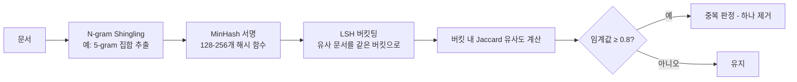

# 텍스트 중복 제거 전략 (Text Deduplication)

## 개념 요약

텍스트 중복 제거(deduplication)는 사전학습 데이터에서 동일하거나 유사한 문서를 제거하는 작업이다. 중복 데이터는 특정 내용을 과잉 학습(memorization)시키고, 모델이 테스트 데이터와 유사한 내용을 학습 중 이미 보았을 가능성을 높인다. Lee et al. (2022) 연구에서 중복 제거만으로 perplexity를 크게 낮추고 모델 품질을 향상시킴을 확인했다.

## 중복 제거 방식 분류

### 1. Exact Deduplication (완전 중복 제거)

완전히 동일한 문서나 URL을 제거한다.

- **URL 기반**: 동일 URL에서 수집된 문서 제거 (웹 크롤 중복 방지)
- **해시 기반**: MD5/SHA256으로 문서 전체 해시 후 동일 해시 제거
- 처리 비용이 매우 낮음
- 문자 하나만 달라도 중복으로 탐지하지 못하는 한계

### 2. Fuzzy Deduplication (유사 중복 제거)

거의 동일하지만 약간 다른 문서(near-duplicate)를 탐지한다.

#### MinHash LSH (Locality-Sensitive Hashing)

가장 널리 사용되는 near-dedup 방법.

- **Jaccard 유사도**: 두 문서의 n-gram 집합 교집합 / 합집합
- **MinHash**: 대규모 집합의 Jaccard를 빠르게 추정하는 확률적 기법
- **LSH**: MinHash 서명을 버킷으로 나눠 후보 쌍만 비교 - `O(N^2)` -> `O(N)` 근사

#### SimHash

- 문서를 고정 크기 비트 벡터로 해싱
- 해밍 거리(Hamming distance)가 낮으면 유사한 문서로 판단
- MinHash LSH보다 빠르지만 짧은 문서에 불안정

### 3. N-gram Overlap 기반

평가 데이터셋과의 오염 탐지에도 사용. 문서 간 13-gram 이상 겹치면 near-duplicate로 분류.

### 4. Suffix Array 기반 Substring 제거

Manber & Myers (1993) 알고리즘 적용. 문서 내에서도 반복되는 긴 부분 문자열을 탐지해 제거.

- 같은 문서 내 반복 섹션 제거
- 학습 코퍼스 전체에서 빈번히 등장하는 문자열 제거
- Lee et al. (2022) "Deduplicating Training Data Makes Language Models Better"에서 사용

### 5. SemDeDup (의미론적 중복 제거)

Abbas et al. (2023)이 제안. 임베딩 유사도 기반으로 **의미론적으로** 유사한 문서를 제거.

- 문자열이 달라도 내용이 같으면 탐지
- 임베딩 계산 비용이 높아 대규모 적용 어려움
- 데이터 효율성 측면에서 독창적 기여

## 방법 비교표

| 방법 | 탐지 수준 | 처리 속도 | 정밀도 | 적용 규모 |
|------|----------|-----------|--------|----------|
| Exact (Hash) | 완전 동일 | 매우 빠름 | 완벽 | 수백억 문서 |
| MinHash LSH | 문자 유사도 | 빠름 | 높음 | 수십억 문서 |
| SimHash | 문자 유사도 | 매우 빠름 | 중간 | 수백억 문서 |
| Suffix Array | 부분 문자열 | 중간 | 높음 | 수억 문서 |
| SemDeDup | 의미 유사도 | 느림 | 매우 높음 | 수천만 문서 |

## 과도한 Dedup의 역효과

중복 제거는 데이터 다양성(diversity)과 트레이드오프가 있다:

- 특정 도메인의 문서가 반복되는 것이 자연스럽다면(예: 법률 조항, 라이센스 텍스트), 과잉 제거 시 해당 도메인 성능 저하
- 의도적 반복 학습(curriculum repeat)이 효과적인 경우도 있음
- FineWeb 실험에서 과도한 dedup은 다양성을 희생해 일부 벤치마크 성능을 저하시킴

## 관련 문서

- [[data-quality-scoring]] - 품질 필터링과의 연계
- [[pretraining-data-curation]] - 데이터 큐레이션 전반
- [[data-contamination-detection]] - 평가 오염 탐지
- [[commoncrawl]] - 중복 제거가 필수인 원시 데이터
- [[fineweb-dataset]] - FineWeb의 dedup 전략
