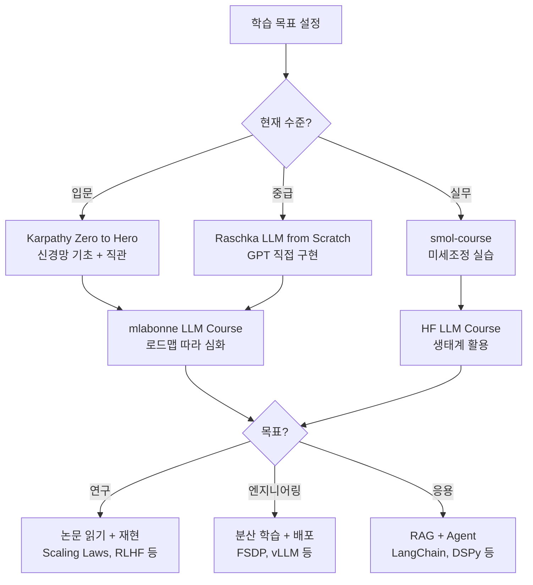

# LLM 학습 가이드 모음

## 개요

LLM(대규모 언어 모델) 분야에 입문하거나 심화 학습을 진행할 때 활용할 수 있는 주요 오픈소스 강좌, 도서, 커리큘럼을 정리한다. 각 리소스는 다루는 범위, 난이도, 실습 환경이 다르므로 학습 목표에 따라 선택적으로 조합하는 것이 효과적이다. 아래 리소스들은 모두 무료로 접근 가능하거나(오픈소스 강좌) 저비용(도서)이며, 2025-2026년 기준으로 활발히 유지보수되고 있다.

## 주요 학습 리소스

### 1. mlabonne/llm-course

**GitHub**: github.com/mlabonne/llm-course | **저자**: Maxime Labonne (Hugging Face)

LLM 분야 진입을 위한 종합 로드맵과 Colab 노트북 모음이다. 40,000개 이상의 GitHub 스타를 보유한 대표적 오픈소스 LLM 커리큘럼으로, 2025년 에디션에서 대폭 업데이트되었다.

**구성**:

| 트랙 | 내용 | 대상 |
|------|------|------|
| LLM Scientist | 사전학습, 데이터셋, 평가, 양자화, 트렌드 | 연구/개발자 |
| LLM Engineer | RAG, 추론 최적화, 배포, 보안 | 엔지니어 |

**2025 에디션 주요 추가 내용**:
- [[mixed-precision-training]]과 양자화(quantization) 심화
- 테스트 타임 연산 스케일링(test-time compute scaling) 트렌드
- 최신 데이터셋 및 평가 벤치마크 업데이트

**학습 경로**: 수학 기초(선형대수, 확률) -> 파이썬/PyTorch -> Transformer 아키텍처 -> 사전학습/미세조정 -> 평가 -> 배포

### 2. Hugging Face smol-course

**사이트**: huggingface.co/learn/smol-course | **저자**: Hugging Face 팀

소규모 언어 모델(SmolLM3, 3B 파라미터)을 활용한 실습 중심 미세조정 강좌다. 이론보다 실전 코드에 집중하며, 소프트웨어 개발자나 엔지니어가 빠르게 LLM 미세조정 역량을 확보하는 데 최적화되어 있다.

**커리큘럼 구성**:

| 유닛 | 주제 | 관련 위키 |
|------|------|----------|
| Unit 1 | Instruction Tuning (SFT) | [[supervised-fine-tuning]] |
| Unit 2 | Preference Alignment (DPO) | [[direct-preference-optimization]] |
| Unit 3 | Evaluation | [[evaluation-during-training]] |
| Unit 4 | Vision Language Models | -- |

**특징**:
- TRL(Transformer Reinforcement Learning) 라이브러리 실습
- Hugging Face Hub에 직접 모델 업로드
- 과제 제출 및 수료증 발급
- 커뮤니티 챌린지를 통한 모델 비교

### 3. Sebastian Raschka -- Build a Large Language Model (From Scratch)

**GitHub**: github.com/rasbt/LLMs-from-scratch | **도서**: Manning Publications (2024)

LLM의 내부 동작을 처음부터 직접 구현하며 이해하는 도서 겸 코드 리포지토리다. 외부 라이브러리(Hugging Face Transformers 등)에 의존하지 않고 순수 PyTorch로 GPT-2급 모델을 구축한다.

**다루는 범위**:
1. 토크나이저 구현과 텍스트 전처리
2. 어텐션 메커니즘 (셀프 어텐션, 멀티헤드 어텐션)
3. GPT 아키텍처 구축 (임베딩, 레이어, 디코딩)
4. 사전학습 파이프라인 구현
5. 텍스트 분류 미세조정
6. RLHF를 통한 지시 따르기 미세조정

**장점**: 블랙박스 없이 모든 구성요소를 직접 구현하므로, [[mixed-precision-training]], [[optimizer-selection]], [[learning-rate-scheduling]] 등의 개념을 코드 수준에서 체감할 수 있다.

**후속 저작**: "Build a Reasoning Model (From Scratch)" (Manning, 2026년 출간 예정)이 추론 특화 모델 구축을 다룰 예정이다.

### 4. Hugging Face NLP/LLM Course

**사이트**: huggingface.co/learn | **저자**: Hugging Face 팀

기존 NLP Course가 LLM Course로 확장 개편되었다. Hugging Face 생태계(Transformers, Datasets, Tokenizers, Accelerate)를 중심으로 한 실무 중심 강좌로, 가장 넓은 범위를 다룬다.

**다루는 주제**: 토크나이저, Transformer 모델, 미세조정, 데이터셋 처리, 추론 최적화, 분산 학습, 배포

### 5. Andrej Karpathy -- Neural Networks: Zero to Hero

**YouTube**: youtube.com/@AndrejKarpathy | **저자**: Andrej Karpathy (전 Tesla AI, OpenAI)

신경망의 기초부터 GPT 수준까지 단계적으로 구축하는 비디오 강좌 시리즈다. 수학적 직관과 코드를 동시에 제공하며, 특히 역전파(backpropagation)와 언어 모델의 동작 원리를 깊이 있게 다룬다.

**시리즈 구성**:
- micrograd: 역전파 엔진 직접 구현
- makemore: 문자 단위 언어 모델 (bigram -> MLP -> RNN -> Transformer)
- nanoGPT: GPT-2 재현 프로젝트 (사전학습부터 미세조정까지)
- Tokenization: BPE 토크나이저 심층 해부

## 학습 경로 제안

### 목표별 권장 순서

| 목표 | 1단계 | 2단계 | 3단계 |
|------|-------|-------|-------|
| LLM 원리 이해 | Karpathy (비디오) | Raschka (도서/코드) | 논문 읽기 |
| 빠른 미세조정 역량 | smol-course | mlabonne (LLM Engineer) | HF Course (심화) |
| 연구 입문 | mlabonne (LLM Scientist) | Raschka | 관련 논문 재현 |
| 프로덕션 배포 | HF LLM Course | mlabonne (LLM Engineer) | 분산 학습/서빙 실습 |

## 보충 리소스

### 분산 학습/인프라

대규모 모델 학습의 인프라 측면은 위 강좌들에서 깊이 다루지 않으므로, 별도 학습이 필요하다:

- [[data-parallelism-fsdp]] -- FSDP를 통한 데이터 병렬화
- [[deepspeed-zero]] -- DeepSpeed ZeRO 최적화 단계
- [[tensor-pipeline-parallelism]] -- 텐서/파이프라인 병렬화
- [[distributed-communication]] -- 분산 통신 백엔드

### 학습 안정성/디버깅

실전 학습에서 마주치는 문제에 대해서는:

- [[nan-inf-debugging]] -- NaN/Inf 디버깅과 수치 안정성
- [[training-resumption]] -- 체크포인트에서의 안전한 학습 재개
- [[training-profiling]] -- 학습 성능 프로파일링과 병목 분석

### 수학 기초

LLM 학습을 깊이 이해하려면 다음 수학적 기초가 필요하다:
- **선형대수**: 행렬 곱셈, 고유값 분해, SVD (모델 구조와 LoRA의 수학적 기반)
- **확률/통계**: 확률 분포, 베이즈 정리, 최대우도 추정 (언어 모델의 확률론적 기반)
- **최적화**: 경사 하강법, 볼록 최적화, 학습률 스케줄링 ([[learning-rate-scheduling]], [[optimizer-selection]])
- **정보 이론**: 엔트로피, KL 발산, 크로스 엔트로피 (손실 함수와 평가 지표)

## 관련 페이지

- [[supervised-fine-tuning]] -- SFT 방법론 상세
- [[direct-preference-optimization]] -- DPO 알고리즘
- [[evaluation-during-training]] -- 학습 중 모델 평가 전략
- [[lora-qlora-finetuning]] -- 파라미터 효율적 미세조정
- [[mixed-precision-training]] -- 혼합 정밀도 학습 기법
- [[learning-rate-scheduling]] -- 학습률 스케줄링 전략
