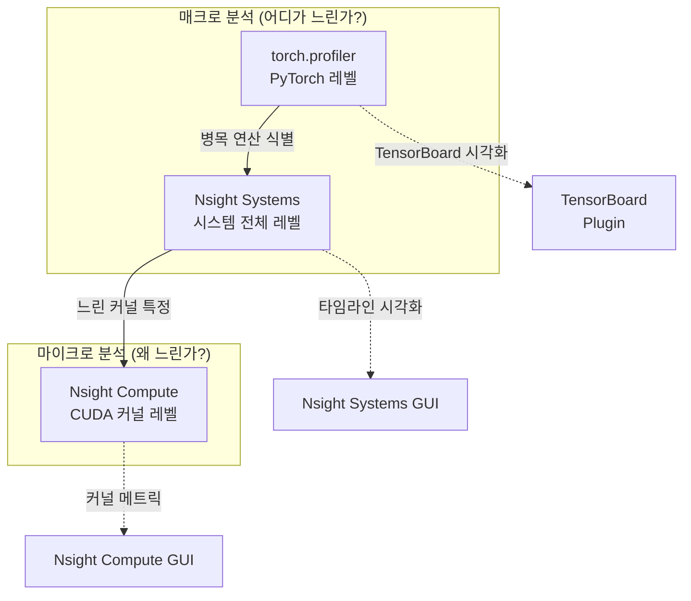
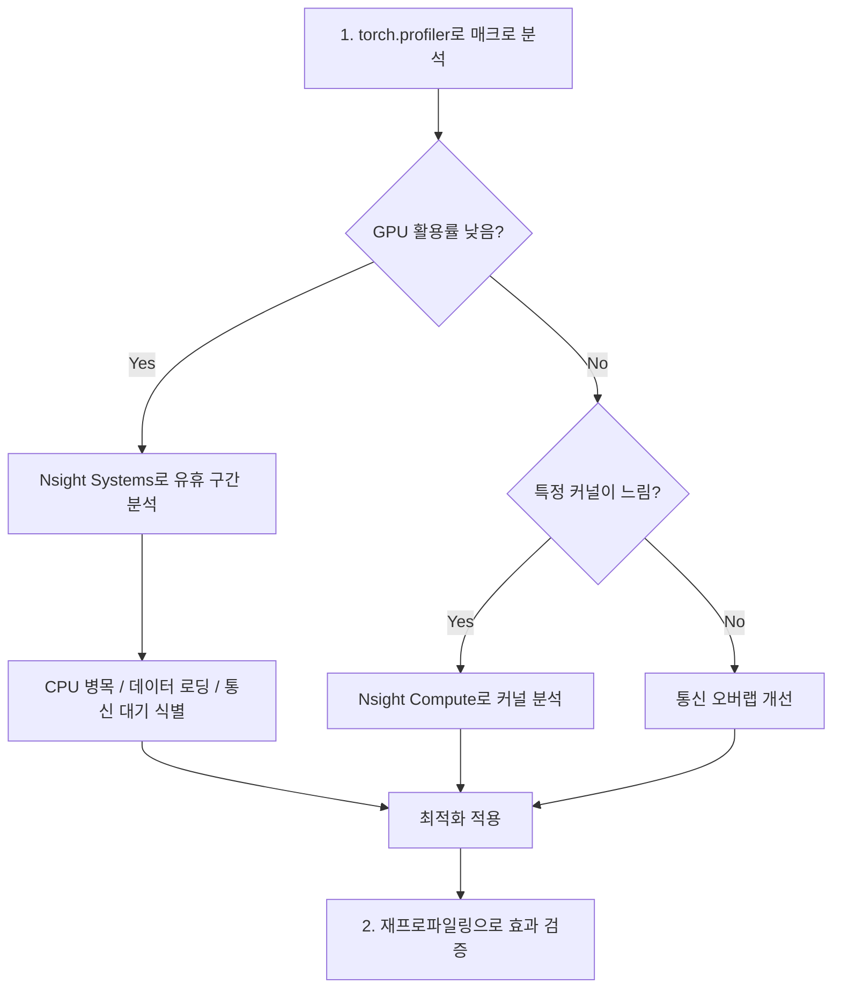

# 학습 프로파일링 (Training Profiling)

## 개요

학습 프로파일링은 모델 학습 과정에서 시간이 어디에 소비되는지를 분석하여 병목 지점을 식별하고 최적화 방향을 결정하는 체계적 성능 분석 과정이다. GPU 연산, CPU 처리, 메모리 사용, 통신 오버헤드가 복합적으로 얽힌 대규모 학습에서는 직관만으로 병목을 파악하기 어렵다. PyTorch의 `torch.profiler`, NVIDIA의 Nsight Systems/Nsight Compute가 핵심 도구이며, 이들의 조합으로 매크로(전체 학습 스텝)부터 마이크로(개별 CUDA 커널) 수준까지 분석할 수 있다.

## 프로파일링 도구 계층



| 도구 | 분석 범위 | 핵심 질문 | 오버헤드 |
|------|----------|----------|---------|
| torch.profiler | PyTorch 연산자 수준 | 어떤 연산이 시간을 많이 쓰는가? | 낮음 |
| Nsight Systems | CPU + GPU + 통신 전체 | CPU와 GPU가 언제 유휴인가? | 낮음-중간 |
| Nsight Compute | 개별 CUDA 커널 | 커널이 왜 느린가? (대역폭, 점유율) | 높음 |

## torch.profiler

PyTorch 내장 프로파일러로, 파이썬 코드 수준에서 연산자별 CPU/CUDA 시간, 메모리 할당, 스택 트레이스를 수집한다.

### 기본 사용법

```python
from torch.profiler import profile, ProfilerActivity, schedule

with profile(
    activities=[ProfilerActivity.CPU, ProfilerActivity.CUDA],
    schedule=schedule(
        wait=1,    # 1 스텝 대기 (웜업 전)
        warmup=1,  # 1 스텝 웜업 (기록하되 분석 제외)
        active=3,  # 3 스텝 실제 프로파일링
        repeat=1   # 1회 반복
    ),
    on_trace_ready=torch.profiler.tensorboard_trace_handler("./log"),
    record_shapes=True,
    profile_memory=True,
    with_stack=True,
) as prof:
    for step, batch in enumerate(dataloader):
        train_step(model, batch)
        prof.step()
```

### schedule 파라미터 설계

프로파일링은 오버헤드를 수반하므로, 전체 학습을 프로파일링하는 대신 대표적인 몇 스텝만 캡처한다:

- **wait**: 학습 시작 직후의 불안정한 구간을 건너뛴다
- **warmup**: CUDA 커널 캐시, cuDNN 벤치마크 등이 안정화되는 구간
- **active**: 실제로 분석에 사용할 스텝
- **repeat**: 반복 횟수. 여러 구간을 샘플링할 때 활용

### 출력 분석

```python
# 키 메트릭 테이블 출력
print(prof.key_averages().table(
    sort_by="cuda_time_total", row_limit=20
))

# Chrome Trace 형식 내보내기
prof.export_chrome_trace("trace.json")
```

`key_averages()` 테이블에서 주목할 지표:
- **Self CUDA Time**: 해당 연산 자체의 GPU 실행 시간 (하위 연산 제외)
- **CUDA Time Total**: 하위 연산 포함 총 GPU 시간
- **CPU Time**: CPU 측 디스패치 시간 (CUDA 커널 대기 포함)
- **Memory**: 텐서 메모리 할당량

## NVIDIA Nsight Systems

시스템 전체의 CPU-GPU 상호작용을 타임라인으로 시각화하는 프로파일러다. torch.profiler보다 낮은 수준에서 CUDA API 호출, 커널 실행, 메모리 전송, NCCL 통신을 모두 포착한다.

### 수집 방법

```bash
# 기본 프로파일링
nsys profile -o training_report python train.py

# NVTX 마커 + CUDA + cuDNN 포함
nsys profile \
    -t cuda,nvtx,osrt,cudnn \
    --capture-range=cudaProfilerApi \
    --capture-range-end=stop \
    -o training_profile \
    python train.py
```

### PyTorch NVTX 마커 활용

NVTX(NVIDIA Tools Extension) 마커를 사용하면 Nsight Systems 타임라인에 사용자 정의 구간을 표시할 수 있다:

```python
# 수동 마커
with torch.cuda.nvtx.range("forward_pass"):
    output = model(input)

with torch.cuda.nvtx.range("backward_pass"):
    loss.backward()

with torch.cuda.nvtx.range("optimizer_step"):
    optimizer.step()
```

`torch.profiler`에서 `emit_nvtx()`를 활성화하면 PyTorch 연산자 이름이 자동으로 NVTX 마커로 변환되어 Nsight Systems에서 확인할 수 있다.

### 타임라인 분석 핵심 패턴

Nsight Systems GUI에서 타임라인을 분석할 때 주목해야 할 패턴:

1. **GPU 유휴 간격(idle gaps)**: CPU의 데이터 전처리, 텐서 생성, 파이썬 오버헤드 등으로 GPU가 놀고 있는 구간
2. **커널 간 간격**: 작은 커널이 많으면 런치 오버헤드가 누적된다. `torch.compile()`로 커널 퓨전을 적용
3. **통신-연산 겹침(overlap)**: [[distributed-communication]]의 all-reduce와 다음 레이어의 연산이 동시에 진행되는지 확인
4. **메모리 전송(HtoD/DtoH)**: CPU-GPU 간 불필요한 데이터 전송 식별

## NVIDIA Nsight Compute

개별 CUDA 커널의 상세 성능 메트릭을 분석하는 도구다. Nsight Systems에서 느린 커널을 식별한 후, Nsight Compute로 해당 커널이 왜 느린지 진단한다.

| 메트릭 | 의미 | 최적화 방향 |
|--------|------|-----------|
| Achieved Occupancy | SM의 활성 워프 비율 | 블록 크기, 공유 메모리 조정 |
| Memory Throughput | 메모리 대역폭 활용률 | 메모리 접근 패턴 개선 |
| Compute Throughput | 연산 유닛 활용률 | 연산 밀도 증가 |
| Warp Stall Reasons | 워프 정지 원인 분류 | 메모리 지연, 동기화 등 특정 |

## 통신/연산 오버랩 분석

대규모 [[data-parallelism-fsdp]]나 [[tensor-pipeline-parallelism]]에서는 통신과 연산을 중첩(overlap)시켜 전체 학습 시간을 단축하는 것이 핵심이다.

### 오버랩 패턴

```mermaid
gantt
    title 통신/연산 오버랩 비교
    dateFormat X
    axisFormat %s
    
    section 순차 실행
    연산 Layer N     :a1, 0, 4
    All-Reduce       :a2, after a1, 3
    연산 Layer N+1   :a3, after a2, 4
    
    section 오버랩 실행
    연산 Layer N     :b1, 0, 4
    All-Reduce (비동기):b2, 2, 5
    연산 Layer N+1   :b3, 4, 8
```



**오버랩 달성 조건**:
- NCCL의 비동기 집합 연산 사용
- 역전파에서 그래디언트가 계산된 레이어부터 즉시 all-reduce 시작
- GPU 연산 스트림과 통신 스트림의 분리

Nsight Systems 타임라인에서 NCCL 커널(예: `ncclAllReduceRingLLKernel`)과 학습 커널(예: `ampere_sgemm`)이 시간적으로 겹치는지 확인하면 오버랩 효과를 직접 검증할 수 있다.

## 프로파일링 워크플로우



## 일반적 병목과 해결책

| 병목 유형 | 진단 신호 | 해결 방향 |
|----------|----------|----------|
| 데이터 로딩 | GPU 유휴, CPU 100% | num_workers 증가, pin_memory, 사전 페치 |
| 작은 커널 다수 | 잦은 커널 런치, 낮은 GPU 점유율 | torch.compile(), 수동 커널 퓨전 |
| 통신 병목 | all-reduce가 전체 스텝의 30%+ | 오버랩 최적화, [[distributed-communication]] 토폴로지 개선 |
| 메모리 부족 | OOM 또는 잦은 GC | [[gradient-accumulation-checkpointing]], 활성화 체크포인팅 |
| CPU-GPU 동기화 | `cudaStreamSynchronize` 빈번 | `.item()`, `print(tensor)` 등 암묵적 동기화 제거 |

## 관련 페이지

- [[distributed-communication]] -- NCCL 통신 패턴과 오버랩 최적화
- [[data-parallelism-fsdp]] -- FSDP의 통신/연산 스케줄링
- [[tensor-pipeline-parallelism]] -- 파이프라인 병렬화의 버블 분석
- [[mixed-precision-training]] -- 정밀도별 연산 성능 차이와 Tensor Core 활용
- [[gradient-accumulation-checkpointing]] -- 메모리 병목 해결을 위한 활성화 체크포인팅
- [[gpu-cluster-scheduling]] -- 클러스터 수준의 자원 활용 최적화
