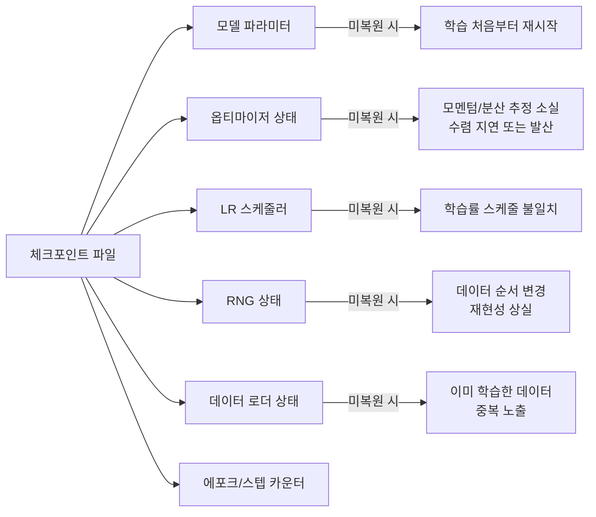
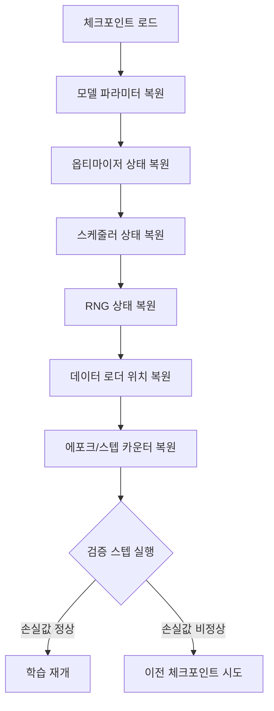

# 학습 재개와 재현성

## 개요

학습 재개(Training Resumption)는 [[model-checkpointing-sharding]]에서 저장한 체크포인트로부터 학습을 정확히 이어서 진행하는 과정이다. 체크포인트 저장은 "스냅샷 찍기"이고, 재개는 "스냅샷에서 정확히 복원하기"에 해당한다. 단순히 모델 가중치만 복원하는 것으로는 충분하지 않다 -- 옵티마이저 상태, 학습률 스케줄러, 난수 생성기(RNG) 상태, 데이터 로더 위치까지 모두 복원해야 학습이 중단되지 않았을 때와 동일한 결과(비트 단위 재현성)를 얻을 수 있다. 수백 GPU에서 수주간 진행되는 LLM 사전학습에서는 장비 장애가 불가피하므로, 안전한 재개 메커니즘이 학습 파이프라인의 핵심 요소다.

## 복원해야 할 상태 구성요소

### 상태별 중요도와 영향



| 상태 | 크기 (7B 모델 기준) | 미복원 시 영향 |
|------|-------------------|--------------|
| 모델 파라미터 | ~14 GB (BF16) | 학습 완전 실패 |
| 옵티마이저 상태 (AdamW) | ~56 GB (FP32 모멘트 2개) | 수렴 속도 크게 저하 |
| LR 스케줄러 | 수 KB | 학습률 불연속 |
| RNG 상태 | 수 KB (GPU당) | 재현성 상실 |
| 데이터 로더 | 수 MB | 데이터 중복/누락 |

### 옵티마이저 상태 복원의 중요성

AdamW 옵티마이저는 파라미터당 1차 모멘트(이동 평균)와 2차 모멘트(제곱 이동 평균)를 유지한다. 이 값들은 학습 전체 과정에 걸쳐 누적되며, 옵티마이저의 적응적 학습률 조정에 직접 사용된다. 상태를 복원하지 않으면:

- **1차 모멘트(m)**: 그래디언트 방향의 이력이 사라져 업데이트 방향이 불안정해진다
- **2차 모멘트(v)**: 파라미터별 스케일링 정보가 소실되어 학습률이 부적절해진다
- **bias correction 카운터**: 스텝 수(t)가 0으로 초기화되어 웜업 단계가 반복된다

```python
# 올바른 체크포인트 저장
checkpoint = {
    "model_state_dict": model.state_dict(),
    "optimizer_state_dict": optimizer.state_dict(),
    "scheduler_state_dict": scheduler.state_dict(),
    "epoch": epoch,
    "global_step": global_step,
    "loss": loss.item(),
}
torch.save(checkpoint, path)
```

### RNG 상태 복원

재현성을 위해 모든 난수 생성기의 상태를 저장해야 한다:

```python
# 저장
rng_states = {
    "python": random.getstate(),
    "numpy": numpy.random.get_state(),
    "torch_cpu": torch.random.get_rng_state(),
    "torch_cuda": torch.cuda.get_rng_state_all(),  # 모든 GPU
}

# 복원
random.setstate(rng_states["python"])
numpy.random.set_state(rng_states["numpy"])
torch.random.set_rng_state(rng_states["torch_cpu"])
torch.cuda.set_rng_state_all(rng_states["torch_cuda"])
```

분산 학습에서는 각 GPU(rank)마다 독립적인 CUDA RNG 상태를 가지므로, `get_rng_state_all()`로 모든 GPU의 상태를 한 번에 저장한다.

### 데이터 로더 상태 복원

데이터 로더의 상태 복원은 두 가지 측면이 있다:

1. **셔플 순서**: 동일한 시드로 동일한 에포크의 셔플 순서를 재현
2. **현재 위치**: 에포크 중간에서 중단된 경우, 이미 소비한 배치를 건너뛰기

```python
# Hugging Face Accelerate 방식 -- skip_first_batches 활용
from accelerate import skip_first_batches

dataloader = skip_first_batches(dataloader, num_batches_to_skip)
```

LLM 사전학습에서는 일반적으로 셔플된 데이터 인덱스 목록과 현재 오프셋을 체크포인트에 포함시켜 정확한 복원을 보장한다.

## 분산 학습에서의 재개

### FSDP/DeepSpeed 환경

[[data-parallelism-fsdp]]와 [[deepspeed-zero]]에서는 모델과 옵티마이저 상태가 여러 GPU에 샤딩되어 있다. 재개 시 주의사항:

- **GPU 수 변경**: 동일 GPU 수로 재개하는 것이 가장 안전하다. GPU 수가 변경되면 재샤딩이 필요하며, 이는 PyTorch DCP(Distributed Checkpoint)나 DeepSpeed의 유니버셜 체크포인트를 통해 처리된다
- **순서 보장**: 모든 rank가 동일한 체크포인트를 로드하고, barrier로 동기화한 후 학습을 재개해야 한다
- **메모리 관리**: 체크포인트 로드 과정에서 일시적으로 메모리 사용량이 급증할 수 있으므로, CPU 오프로딩이나 비동기 로드를 고려한다

```python
# PyTorch DCP를 이용한 분산 체크포인트 로드
from torch.distributed.checkpoint import load

state_dict = {
    "model": model.state_dict(),
    "optimizer": optimizer.state_dict(),
}
load(state_dict, checkpoint_id=path)
model.load_state_dict(state_dict["model"])
optimizer.load_state_dict(state_dict["optimizer"])
```

### Elastic 환경에서의 재개

[[elastic-training]] 환경에서는 노드 수가 동적으로 변할 수 있으므로, 재개 시 월드 사이즈(world size)가 달라질 수 있다. 이를 위해:

1. 체크포인트를 재샤딩 가능한 형식(예: 전체 상태 또는 DCP 형식)으로 저장
2. 새 월드 사이즈에 맞게 상태를 재분배
3. 데이터 로더의 샘플러를 새 rank/world_size에 맞게 재설정

## 재현성 수준

### 비트 단위 재현성 (Bitwise Reproducibility)

중단 지점에서 재개한 학습 결과가 중단 없이 진행한 학습 결과와 비트 단위로 동일한 것을 의미한다. 달성 조건:

- 모든 상태 구성요소의 완벽한 복원
- 결정론적 CUDA 연산 (`torch.use_deterministic_algorithms(True)`)
- cuDNN 벤치마크 비활성화 (`torch.backends.cudnn.benchmark = False`)
- 동일 하드웨어, 동일 드라이버 버전

**실전에서의 한계**: NCCL의 비결정론적 all-reduce, cuDNN의 휴리스틱 커널 선택 등으로 인해 대규모 분산 학습에서 비트 단위 재현성은 달성하기 어렵다. 대부분의 프로젝트에서는 "통계적 동등성" 수준을 목표로 한다.

### 통계적 재현성 (Statistical Reproducibility)

동일한 체크포인트에서 재개한 여러 실행이 유사한 손실 곡선과 최종 성능을 보이는 것을 의미한다. 이는 실전에서 달성 가능한 현실적 목표이며, 다음을 통해 검증한다:

- 재개 전후의 손실 곡선 연속성
- 검증 성능 지표의 일관성
- [[evaluation-during-training]]을 통한 주기적 성능 점검

## 안전한 재개를 위한 체크리스트



| 단계 | 검증 항목 |
|------|----------|
| 체크포인트 무결성 | 파일 크기, 해시 비교 |
| 파라미터 복원 | 파라미터 노름 비교 |
| 옵티마이저 복원 | 모멘트 통계 비교 |
| 학습률 | 저장된 스텝에 맞는 LR 값 확인 |
| 검증 손실 | 첫 검증 스텝의 손실이 저장 시점과 유사 |
| 그래디언트 | 첫 학습 스텝의 그래디언트 노름이 정상 범위 |

## Hugging Face Accelerate/Trainer 활용

Hugging Face의 Accelerate 라이브러리는 `save_state()`와 `load_state()`를 통해 모델, 옵티마이저, RNG, GradScaler 상태를 일괄 저장/복원하는 편의 기능을 제공한다. Trainer API는 `resume_from_checkpoint` 인자로 체크포인트 디렉토리를 지정하면 자동으로 모든 상태를 복원한다.

## 관련 페이지

- [[model-checkpointing-sharding]] -- 체크포인트 저장 형식, 샤딩, 분산 체크포인트
- [[elastic-training]] -- 탄력적 학습 환경에서의 동적 재개
- [[data-parallelism-fsdp]] -- FSDP 환경의 분산 상태 관리
- [[deepspeed-zero]] -- DeepSpeed ZeRO의 체크포인트 메커니즘
- [[optimizer-selection]] -- 옵티마이저별 상태 구성과 메모리 요구량
- [[evaluation-during-training]] -- 재개 후 성능 일관성 검증
