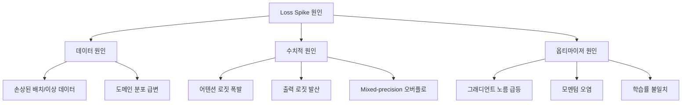

# 학습 안정성 (Training Stability)

## 개요

대규모 언어 모델의 사전학습에서 학습 안정성(training stability)은 수천만 달러 규모의 학습 비용을 보호하는 핵심 요소다. Loss spike(손실 급등)는 학습 중 갑작스러운 손실 값 상승 현상으로, 모델 성능을 영구적으로 저하시키거나 학습을 발산시킬 수 있다. 체크포인트 롤백과 재시작은 수일~수주의 연산을 낭비하므로, 사전 예방이 사후 대응보다 훨씬 비용 효율적이다. 이 페이지에서는 loss spike의 원인, z-loss 정규화, QK-Norm, SPAM 옵티마이저 등 주요 안정화 기법을 다룬다.

## Loss Spike의 원인

Loss spike는 크게 세 가지 원인으로 분류할 수 있다.



### 데이터 원인

- **이상 배치**: 손상된 문서, 반복 패턴, 극단적으로 긴/짧은 시퀀스가 포함된 배치
- **도메인 분포 변화**: 학습 중 데이터 소스의 비율이 급격히 변할 때 발생
- **대응**: 데이터 품질 필터링 강화, [[pretraining-data-curation]]의 사전 정제 파이프라인

### 수치적 원인

- **어텐션 로짓 폭발**: 학습이 진행될수록 query-key 내적 값이 비정상적으로 커져서 softmax 출력이 원-핫(one-hot)에 수렴. 정규화 없이는 어텐션 로짓 크기가 50,000 이상까지 증가할 수 있다
- **출력 로짓 발산**: 모델의 최종 출력 로짓이 로그 확률에서 이탈하여 발산
- **Mixed-precision 오버플로**: BF16/FP16 표현 범위 초과. [[mixed-precision-training]]에서 정밀도 관리 방안을 다룸

### 옵티마이저 원인

- **그래디언트 스파이크**: 통상 그래디언트 노름의 1000배 이상 급등. Adam의 모멘텀에 전파되어 수백 스텝 동안 영향 지속
- **모멘텀 오염**: 스파이크 그래디언트가 1차/2차 모멘트 추정에 흡수되면, 정상 그래디언트가 돌아온 이후에도 왜곡된 업데이트가 계속됨

## z-loss 정규화

z-loss는 softmax 정규화 상수(log-partition function)를 0에 가깝게 유지하도록 하는 보조 손실 항이다. PaLM(Chowdhery et al., 2022)에서 채택되어 널리 알려졌다.

### 작동 원리

표준 cross-entropy 손실에 z-loss 항을 추가한다:

```
L_total = L_CE + alpha * log(sum(exp(z_i)))^2
```

여기서 z_i는 모델의 출력 로짓이고, alpha는 z-loss 가중치(통상 1e-4 수준)다.

### 효과

| 항목 | z-loss 없음 | z-loss 적용 |
|------|-----------|-----------|
| 출력 로짓 크기 | 무제한 증가 가능 | 유한 범위로 제한 |
| 학습 후반 안정성 | 로짓 발산 위험 | 안정적 수렴 |
| 연산 비용 | 기준 | 무시할 수준의 추가 비용 |

z-loss는 이동/스케일 불변(shift- and scale-invariant)이며, 출력 로짓의 무한 성장을 방지하여 cross-entropy 계산의 수치적 안정성을 보장한다.

## QK-Norm (Query-Key Normalization)

QK-Norm은 어텐션 메커니즘 내에서 query와 key 벡터를 정규화하여 어텐션 로짓의 폭발을 방지하는 기법이다. Henry et al.(2020, EMNLP Findings)이 제안하였다.

### 구현 방식

기존 어텐션:
```
Attention(Q, K, V) = softmax(QK^T / sqrt(d_k)) V
```

QK-Norm 적용:
```
Q_norm = L2Norm(Q) * gamma
K_norm = L2Norm(K) * gamma
Attention = softmax(Q_norm * K_norm^T) V
```

head 차원을 따라 L2 정규화를 수행한 후, sqrt(d_k)로 나누는 대신 학습 가능한 스케일링 파라미터 gamma를 곱한다.

### 핵심 효과

- **어텐션 엔트로피 붕괴 방지**: 정규화 없이는 어텐션이 점차 소수 위치에 집중(엔트로피 감소)하여 학습 불안정 유발. QK-Norm이 이를 억제
- **학습률 강건성**: QK-Norm 적용 시 학습률을 3자릿수(orders of magnitude) 범위에서 변경해도 안정적 학습이 가능
- **대규모 모델 필수 요소**: Gemma 2, Cohere Command R 등 최근 대형 모델에서 채택

### 제한 사항

QK-Norm은 추론 시 query와 key의 완전한 물질화(materialization)를 요구하므로, DeepSeek-V3의 Multi-Latent Attention(MLA)과는 호환되지 않는다. MLA 환경에서는 QuacK 등 대안적 최적화 기법이 사용된다.

## SPAM 옵티마이저

SPAM(Spike-Aware Adam with Momentum Reset)은 Huang et al.(2025)이 제안한 옵티마이저로, 그래디언트 스파이크에 대한 적응적 대응을 핵심으로 한다.

### 두 가지 핵심 메커니즘


1. **스파이크 인식 그래디언트 클리핑(Spike-Aware Gradient Clipping)**: 그래디언트 노름을 모니터링하여 이상치를 탐지하고, 적응적으로 클리핑 임계값을 조정
2. **모멘텀 리셋(Momentum Reset)**: 스파이크 발생 시 Adam의 1차 모멘트(m)와 2차 모멘트(v)를 주기적으로 초기화하여 오염된 모멘텀이 이후 학습에 전파되는 것을 차단

### 성능

- 사전학습과 파인튜닝 모두에서 Adam 및 그 변형(AdamW, Adam-Mini)을 일관적으로 능가
- 메모리 제약 환경에서 GaLore, Adam-Mini 등 메모리 효율 옵티마이저보다 우수
- **Stable-SPAM**(2025): SPAM에 적응형 클리핑 임계값 업데이트와 L2-노름 기반 그래디언트 정규화를 추가한 후속 연구. 4-bit LLaMA-1B 모델이 BF16 Adam으로 학습한 모델보다 퍼플렉시티 2 포인트 우수한 성능 달성

## 통합 방어 전략

실무에서는 단일 기법이 아니라 여러 안정화 기법을 계층적으로 조합한다.

| 계층 | 기법 | 방어 대상 |
|------|------|----------|
| 데이터 | 품질 필터링, 이상 배치 탐지 | 데이터 원인 스파이크 |
| 아키텍처 | QK-Norm, Pre-LayerNorm | 어텐션 로짓 폭발 |
| 손실 함수 | z-loss | 출력 로짓 발산 |
| 옵티마이저 | SPAM, 그래디언트 클리핑 | 그래디언트 스파이크, 모멘텀 오염 |
| 정밀도 | Loss scaling, BF16 | 수치 오버플로 |
| 운영 | 체크포인트 롤백, 배치 스킵 | 사후 복구 |

[[optimizer-selection]]에서 Adam 변형들의 비교를, [[mixed-precision-training]]에서 정밀도 관련 안정성 기법을 다룬다.

## 최신 동향: ZClip

ZClip(2025)은 z-score 기반 이상 탐지를 그래디언트 클리핑에 적용한 적응적 기법이다. 그래디언트 노름의 지수 이동 평균(EMA)을 추적하여 통계적으로 비정상적인 그래디언트를 자동으로 탐지하고 클리핑한다. 수동 임계값 설정 없이 loss spike를 완화할 수 있어, 대규모 학습에서의 운영 부담을 줄인다.

## 관련 페이지

- [[optimizer-selection]] -- Adam, AdamW 및 변형 옵티마이저 비교
- [[mixed-precision-training]] -- BF16/FP16 혼합 정밀도 학습
- [[learning-rate-scheduling]] -- 학습률 스케줄과 안정성의 관계
- [[gradient-accumulation-checkpointing]] -- 그래디언트 축적과 체크포인트 전략
- [[pretraining-data-curation]] -- 데이터 품질이 안정성에 미치는 영향
- [[pretraining-pipeline-e2e]] -- 사전학습 파이프라인 전체 흐름
